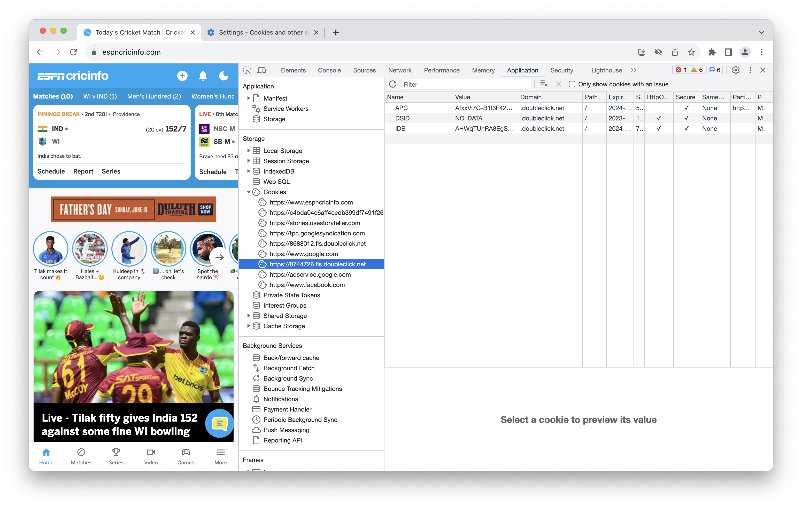
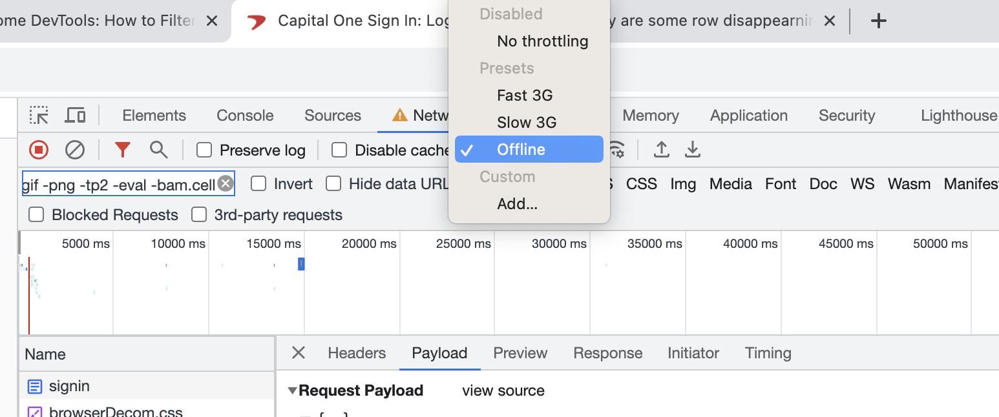
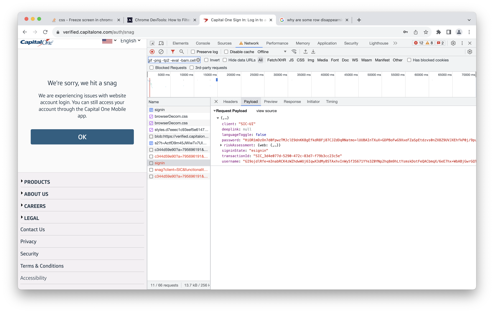

[toc]

##### Elements - Styles, Computed tabs

Understand the other things in Developer Tools better, i.e. how styles, computed properties, etc. work.<br>


##### Console

The logs, etc. can be seen in the console.


-----

##### Inspecting Elements (Chrome's dev tools)

Inspecting elements, this shows the HTML corresponding to every element. They can even be modified on the fly. This is what probably other browsers called DOM inspector too.


##### Viewing storages in Safari

In Safari -

There is a separate tab called Storage.


In Chrome - 

In a tab named 'Application'.



##### Network

In Chrome -

###### Negated filters

Can have negated filters in the textfield, i.e. not show records that have some text in the URL.

```
-js -woff2 -keymaster -formData -svg -jpg -retrievemessage -track -e.gif -png -tp2 -eval -bam.cell
```

###### Waterfall field (Start time of requests)

The waterfall field is what seems to indicate the request time. So to see the requests in chronological fashion, that is the field using which the view should be sorted.

###### Throttling requests



###### Some records disappear

Surprisngly, some records disappear. For example, when I try to login to capitalone.com, the record for POST API call is barely shown for a fraction of second and then disappears. I could get it to show only by getting the tab to be offline so that the request fails and I can then see what the request was.


