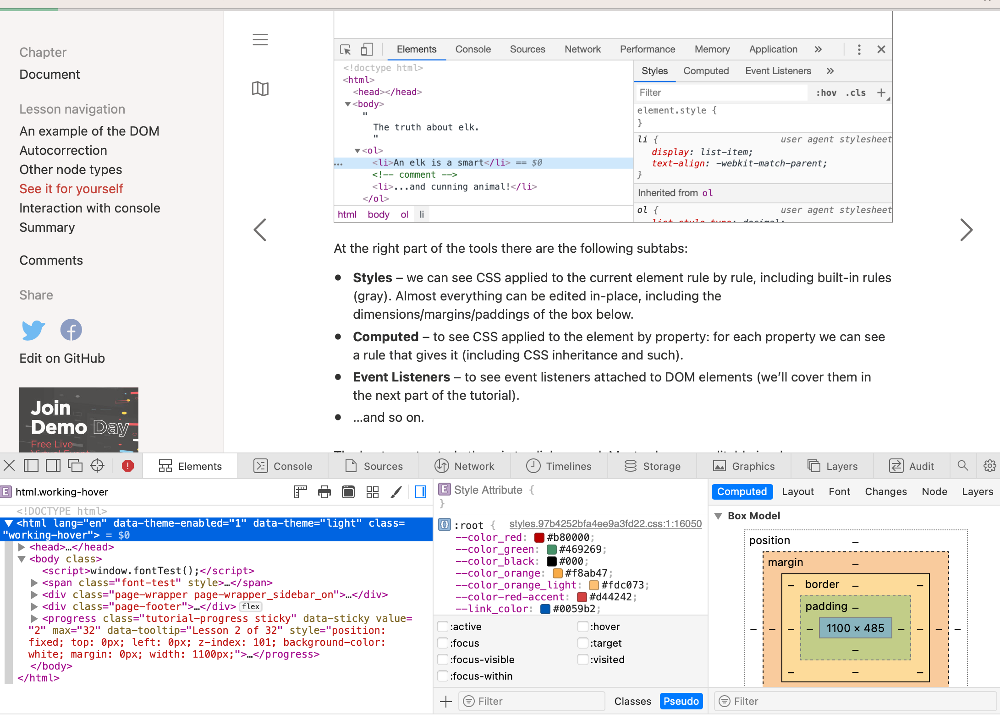
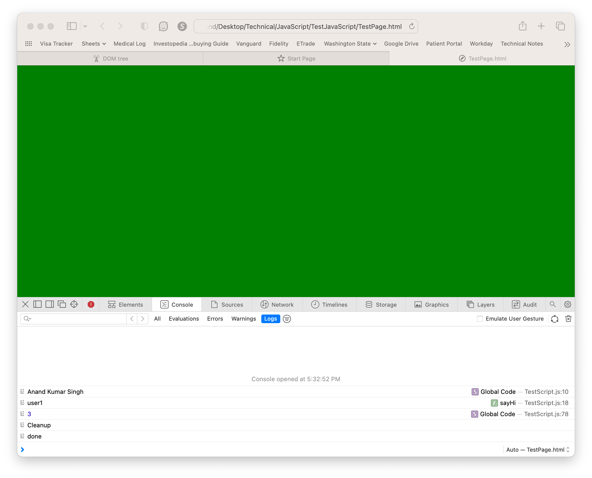
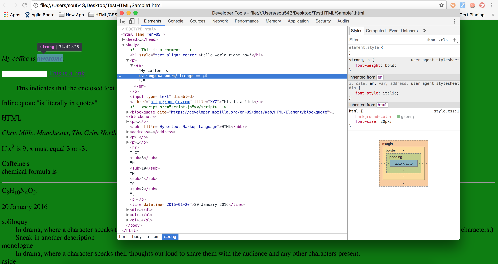
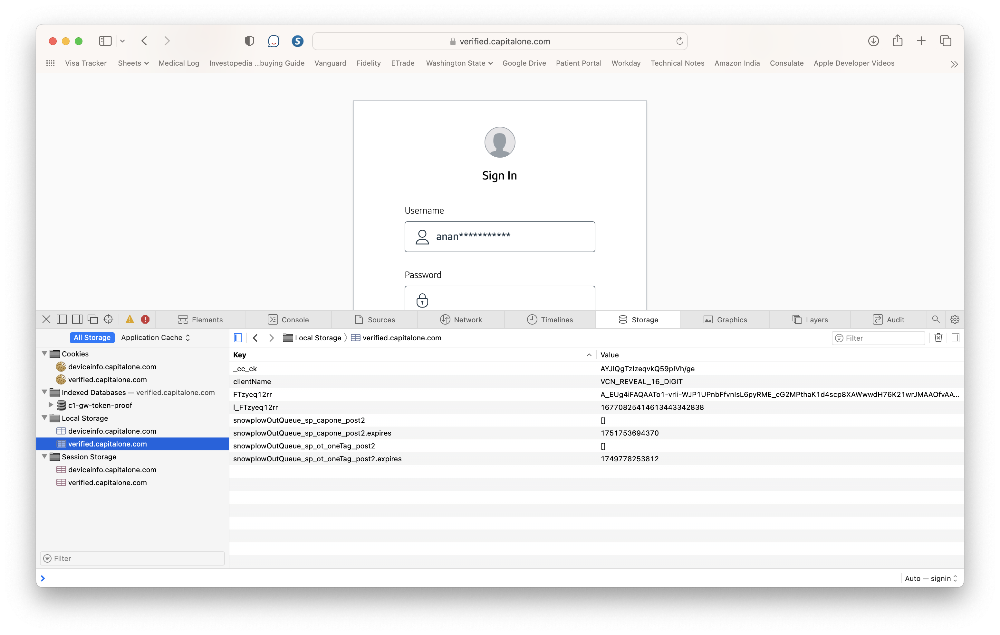

[toc]

##### Elements - Styles, Computed tabs

Understand the other things in Developer Tools better, i.e. how styles, computed properties, etc. work. 

##### Console

The logs, etc. can be seen in the console.

-----

##### Inspecting Elements (Chrome's dev tools)

Inspecting elements, this shows the HTML corresponding to every element. They can even be modified on the fly. This is what probably other browsers called DOM inspector too.

##### Viewing storages in Safari

