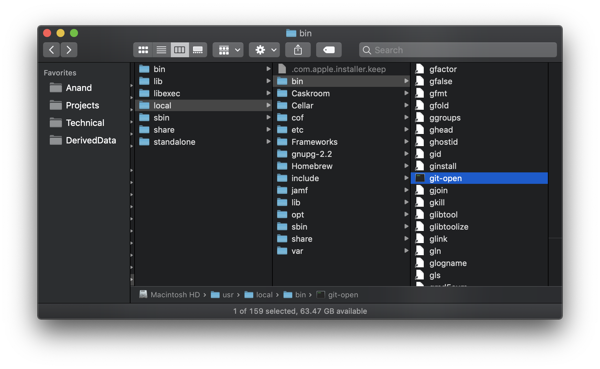
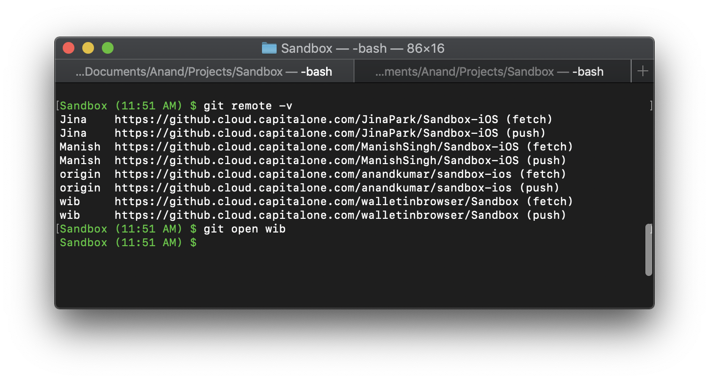

[toc]

###### Aliases

Creating alias
```
alias ll='ls -l'
```

Seeing an alias's definition.
```
sou543 $ alias ll
alias ll='ls -l'
```

`alias` alone shows all the current aliases.
```
sou543 $ alias
alias ll='ls -l'
alias rvm-restart='rvm_reload_flag=1 source '\''/Users/sou543/.rvm/scripts/rvm'\'''
```

`unalias` is the command used to remove an alias.

###### Console codes need to be delimited

Each console code sequence must be delimited with `\[` and `\]` in the PS1 variable. They tell bash that whatever is in there doesn't move the cursor position. Not quote sure what exactly code sequence means but this is indeed needed, without it the customized color scheme in PS1 got all messed up (an example below).

###### Changing the color scheme in `PS1` -

The syntax is `'\[\e[0;32m\W (\@)\] TheActualPS1 \[\e[m\]'` <br>
`\[` and `\]` - Indicate the necessary delimiting. Present for the chunk on either side of  ` TheActualPS1 `. <br>
`\e[` - Indicates the start of color scheme <br>
`x;ym `- Color pair to use (Various colors have specific predefined 'x,y' values) <br>
`TheActualPS1` - The actual prompt to be used <br>
`\e[m` - Indicates the end of color scheme <br>

```
/Users/sou543/Desktop/Notes $ PS1="\e[0;32m\W $ \e[m"
Desktop $
```

[Here](https://misc.flogisoft.com/bash/tip_colors_and_formatting) is the link to various color schemes.

###### Accessing command history

`history` gives the command history, showing the event number and entire command of every previously executed command.

Bash stores the previous commands in `$HOME/.bash_history`.

`!!` repeats the previous command. <br>
`!n` executes event (i.e. command) number 'n' in the history. <br>
`!-n` executes the command that was executed 'n' times prior to current one. <br>
`!x` executes the last command which started with the character 'v'. <br>

`$_` substitutes with the last argument to the previous command.

`vi` like text editing controls can be used even in command line by activating the vi mode. It is activated with `set -o vi`.

`set` command when used with `-o` flag and certain keywords after that as argument can do some special things as well. For example, `set - noclobber` deactivates the behavior where using `>` with `cat` causes an existing file to be overwritten. This can be turned off using `set +o` followed by the relevant keyword.

`~` followed by a username refers to the home directory of that user. `~` followed by a `/` refers to the current user's home directory.

The previous working directory can be switched to very easily using just `~-` or `-`.
```
38f9d3e3f3f5:Desktop sou543$ cd Notes/
38f9d3e3f3f5:Notes sou543$ cd ~-
38f9d3e3f3f5:Desktop sou543$
```

###### Persisting configurations across sessions

To make changes in environment variables, aliases, `set` options to be permanent or persist across sessions, they need to be made in startup scripts.

Here are some of the common startup scripts in UNIX. They are located in home directory (or is it root directory?). <br>
`.profile` <br>
`.bash_profile` <br>
`.bashrc` <br>

Bash has two types of startup files, 'profile' and 'rc'. Profiles are executed only once, upon login. rc files are executed every time a new shell is started.

`.profile` file typically contains modifications to `$PATH` environment variable and `stty` settings.

`.bashrc` file is executed every time a second shell is created. If the login shell also has to execute this, then the following line needs to be added to `.profile` file.
```
. ~/.bashrc
```
Usually bash specific features only should be kept in rc files, this way even if the shell has to be changed the profile file should still remain the same and not need any changes.

###### Common environment variables

`$PATH` - Has the list of paths that the shell should follow to find any executable command. Delimited by `:`.

```
echo $PATH | tr ":" "\n" | cat
/Users/sou543/.rvm/gems/ruby-2.6.3/bin
/Users/sou543/.rvm/gems/ruby-2.6.3@global/bin
/Users/sou543/.rvm/rubies/ruby-2.6.3/bin
/usr/local/bin
/usr/bin
/bin
/usr/sbin
/sbin
/Users/sou543/.rvm/bin
```

`$HOME` - The directory where UNIX treats as the working directory to begin with. It's actually stored in the penultimate field in `/etc/passwd` file.

`$MAILCHECK` - Tells how often the shell checks for the arrival of a new mail. It's typically '60' seconds.

`$PS1` and `$PS2` - Has the two prompts used by the shell. Prompts are what are seen in a shell session. `$PS1` is typically `\h:\W \u\$` which looks like `38f9d3e3f3f5:Desktop sou543$`. `$PS2`
is typically `>`.<br>
[Here](https://bneijt.nl/blog/post/add-a-timestamp-to-your-bash-prompt/) is a link with different escape sequences that are allowed (at least in `PS1`).
Note that there is also a `PS3` and `PS4` (https://ss64.com/bash/syntax-prompt.html).

`$SHELL` - Gives the shell being used. Typically `/bin/bash` on Macs. This is stored in `/etc/passwd`.

`$LOGNAME` - Gives the current user's username.

`$IFS` - The internal field separators, i.e. what delimits fields for filtering commands such as `cut`, `tr`, etc. By default its supposed to be space, tab and newline. It's better to view its value in octal system (understand the below output).
```
echo $IFS | od -bc
0000000 012                                                            
          \n                                                            
0000001
```

`$PWD` - Gives the present working directory. (Available in Bash and Korn)

UNIX (at least Bash and Korn) also maintain a history of commands (treated as 'events'). `!` indicates the current event number. Event number is command sequence number.
> `!` does not seem to be working.

Both `PWD` and `!` can be assigned to variables, and are always refreshed.

An environment variable (such as `PS1`) can of course also be changed during a session.
```
sou543$ PS1='[$PWD] '
[/Users/sou543] cd Desktop/
[/Users/sou543/Desktop]
```

`env` displays all the environment variables.

```
sou543$ env
rvm_bin_path=/Users/sou543/.rvm/bin
TERM_PROGRAM=Apple_Terminal
GEM_HOME=/Users/sou543/.rvm/gems/ruby-2.6.3
SHELL=/bin/bash
TERM=xterm-256color
IRBRC=/Users/sou543/.rvm/rubies/ruby-2.6.3/.irbrc
TMPDIR=/var/folders/v5/t2pml90x4hjdscl5v1yvnh4c0000gq/T/
Apple_PubSub_Socket_Render=/private/tmp/com.apple.launchd.cWlT7Z5U9g/Render
TERM_PROGRAM_VERSION=421.2
OLDPWD=/Users/sou543
MY_RUBY_HOME=/Users/sou543/.rvm/rubies/ruby-2.6.3
TERM_SESSION_ID=054EC63E-7355-477C-B39C-2F0F53804948
USER=sou543
rvm_path=/Users/sou543/.rvm
SSH_AUTH_SOCK=/private/tmp/com.apple.launchd.AJaBOOlE0O/Listeners
rvm_prefix=/Users/sou543
PATH=/Users/sou543/.rvm/gems/ruby-2.6.3/bin:/Users/sou543/.rvm/gems/ruby-2.6.3@global/bin:/Users/sou543/.rvm/rubies/ruby-2.6.3/bin:/usr/local/bin:/usr/bin:/bin:/usr/sbin:/sbin:/Users/sou543/.rvm/bin
PWD=/Users/sou543/Desktop
LANG=en_US.UTF-8
XPC_FLAGS=0x0
XPC_SERVICE_NAME=0
rvm_version=1.29.8 (latest)
SHLVL=1
HOME=/Users/sou543
LOGNAME=sou543
GEM_PATH=/Users/sou543/.rvm/gems/ruby-2.6.3:/Users/sou543/.rvm/gems/ruby-2.6.3@global
RUBY_VERSION=ruby-2.6.3
_=/usr/bin/env
```

###### Putting custom commands

Custom commands can be put in `/usr/local/bin`. What I have seen is that if you put a shell script here with the name `abc-xyz`, then you can invoke it from shell with the command `abc xyz`.

<span style="font-weight:normal"> Put script in `/usr/local/bin` </span> | <span style="font-weight:normal"> Invoke from command line </span>
--- | ---
 | 
