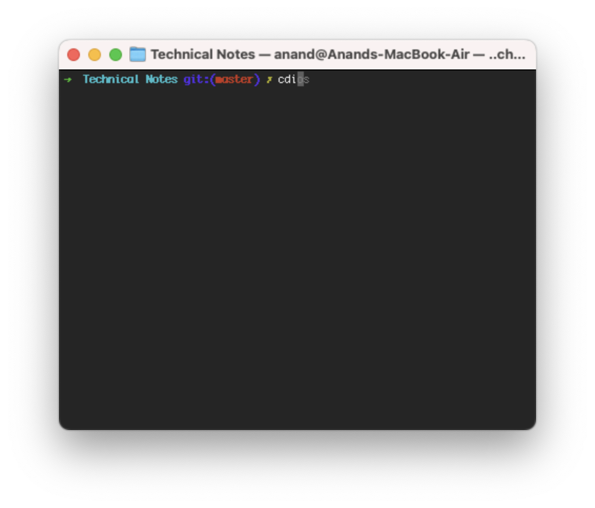

[toc]

##### oh-my-zsh

Its an open source framework for managing your custom Zsh configuration ([link](https://ohmyz.sh/#install)). It comes bundled with several helpful functions, helpers, plugins, themes.

###### How to install/uninstall

zsh can be installed using this command.

```
sh -c "$(curl -fsSL https://raw.githubusercontent.com/ohmyzsh/ohmyzsh/master/tools/install.sh)"
```

Upon installation, it writes content into the `.zshrc` file (after moving the existing `.zshrc` contents to a new file named `~/.zshrc.pre-oh-my-zsh`). 

It can be uninstalled using the command `uninstall_oh_my_zsh`.

###### Changing theme

I think any configuration is activated by editing the `.zshrc` file. For example, for changing the theme a line like below needs to be modified.

```
ZSH_THEME="robbyrussell"
```

###### Using plugins

The standard plugins are located in `$ZSH/plugins` (i.e. `~/.oh-my-zsh/plugins`) and custom plugins in  `$ZSH_CUSTOM/plugins` (i.e. `~/.oh-my-zsh/custom/plugins`). They can probably be turned on, etc. by editing this line in `.zshrc` (here 'git' is a plugin with plenty of git related aliases).

```
plugins=(git)
```

A [list](https://cult.honeypot.io/reads/great-zsh-terminal-plugins/) of common oh_my_zsh plugins.

###### zsh-autosuggestions plugin

[zsh-autosuggestions](https://github.com/zsh-users/zsh-autosuggestions) is a custom plugin which basicslly auto-suggests command completion on the same line based on the history of commands previously used. A normal auto-completion, (in case of multiple possible completions) suggests possible completions on press of tab and you then have to chose one of them and press enter. This is however simpler, the moment autosuggestion shows up the right key can be pressed followed by enter. You wouldn't need to choose through all the options.



For [installing](https://github.com/zsh-users/zsh-autosuggestions) it, its repo has to be cloned in '~/.oh-my-zsh/custom/plugins' directory and the plugin name should then be added in the list of plugins in `.zshrc`. The plugin is then active with new shell sessions.

```
plugins=(
    git
    zsh-autosuggestions
)
```


