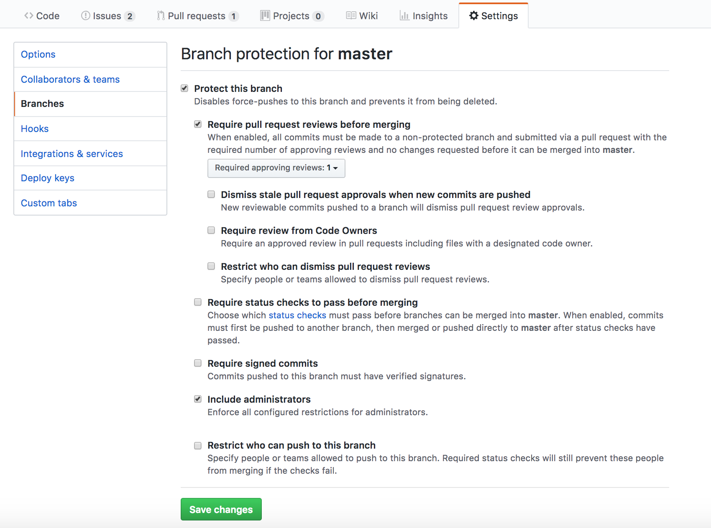
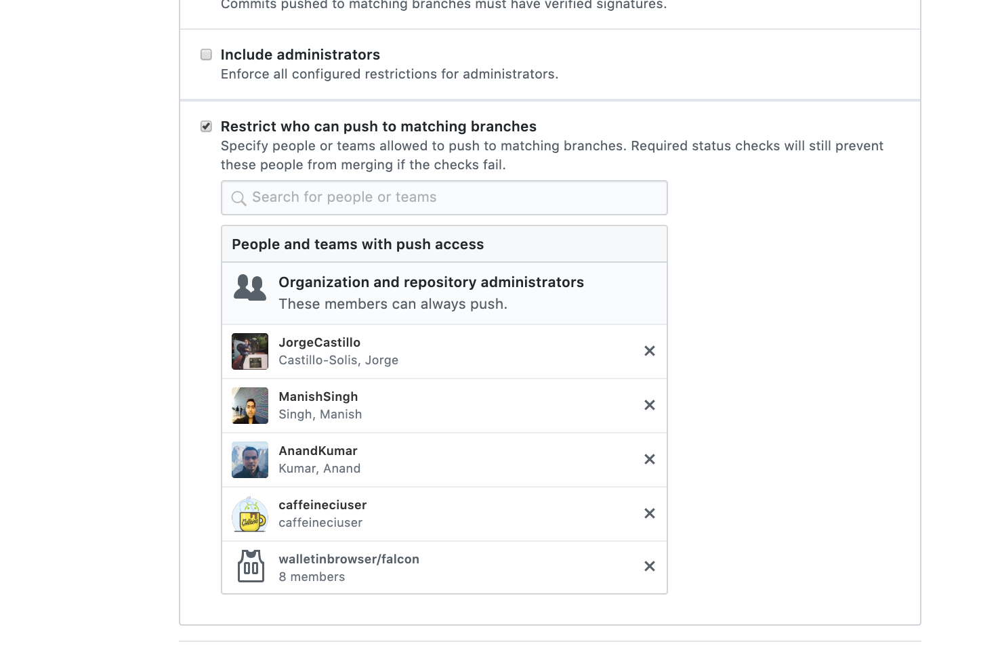

###### Highlighting lines in a file link

It's possible to highlight lines in a file on GitHub with a URL like this.

https: //github.com/apple/swift-corelibs-foundation/blob/master/Foundation/NSNotification.swift`#L11-L24`


###### Protecting a branch

A branch can be protected (i.e. force push on it disabled, etc.) from Settings > Branches.



This restricts all users (other than admins?) from force pushing. It's also possible to set who can push commits to a branch (and hence also merge PRs to that branch).



###### Advanced searches

For even slightly advanced searches, usually the thing to use is `github.com/search` instead of `github.com/xyzRepo/pulls`. For example, for searching for all PRs in a certain repo raised by any of two particular authors this is the query.

```
is:pr repo:ConsumerIdentityMobile/ease-signin-ios author:username1 author:username2
```

###### Codeowners

This can be used to automatically request reviews from the right set of people/teams for specific files in the PR. <br>
[Link](https://github.blog/2017-07-06-introducing-code-owners/)

A file named `CODEOWNERS` should be put in `.github/` folder (or in root directory of the repository).

For instance this means that any changes in `FriendlyFraud` folder would need to be reviewed by `ease-ios-card/bb8` team.

```
/Enterprise/MobileUI/Features/FriendlyFraud/ @ease-ios-card/bb8
```
