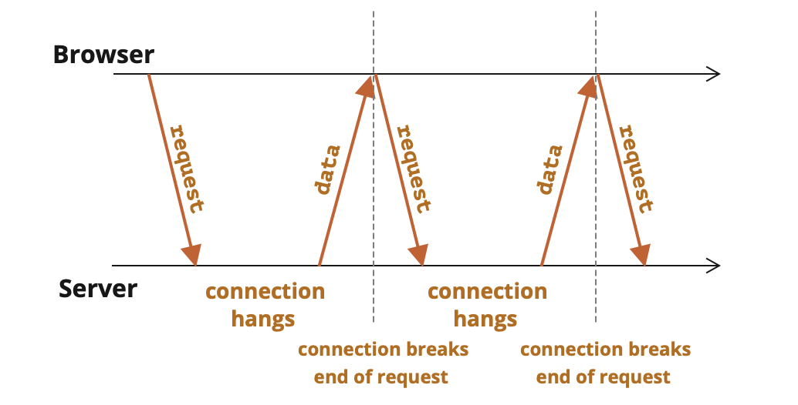

[toc]

`Long polling` is the simplest way of having persistent connection with server, that doesn’t use any specific protocol like WebSocket or Server Sent Events.

##### Regular/Periodic polling

 The simplest way to get new information from the server is `regular/periodic polling`. That is, regular requests to the server: “Hello, I’m here, do you have any information for me?”. For example, once every 10 seconds. In response, the server first takes a notice to itself that the client is online, and second – sends a packet of messages it got till that moment. The downside with this is that messages can take upto 10 seconds (when the new message is available only just after the request is received by server) to be received by the client, and the server is regularly polled even when it may not have anything to send.

##### Long polling

With `long polling` however what happens is -

1. A request is sent to the server.

2. The server doesn’t close the connection until it has a message to send.

3. When a message appears – the server responds to the request with it.
4. The browser makes a new request immediately.

So the browser sends a request and keeps a pending connection with the server. Only when a message is delivered, the connection is closed and reestablished.



If the connection is lost, because of, say, a network error, the browser immediately sends a new request.

> However, note that the server should be ok with many pending connections

##### Sample code

```
async function subscribe() {
  let response = await fetch("/subscribe");

  if (response.status == 502) {
    // Status 502 is a connection timeout error,
    // may happen when the connection was pending for too long,
    // and the remote server or a proxy closed it
    // let's reconnect
    await subscribe();
  } else if (response.status != 200) {
    // An error - let's show it
    showMessage(response.statusText);
    // Reconnect in one second
    await new Promise(resolve => setTimeout(resolve, 1000));
    await subscribe();
  } else {
    // Get and show the message
    let message = await response.text();
    showMessage(message);
    // Call subscribe() again to get the next message
    await subscribe();
  }
}

subscribe();
```

##### When it long polling useful

Long polling works great in situations when messages are rare. If messages come very often, then the chart of requesting-receiving messages, painted above, becomes saw-like. Every message is a separate request, supplied with headers, authentication overhead, and so on.

##### Misc.

[JavaScript.info link](https://javascript.info/long-polling)

