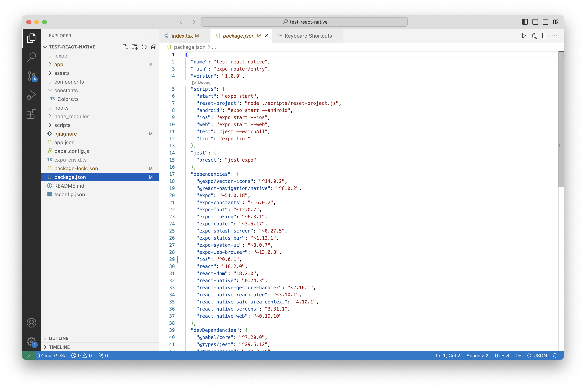
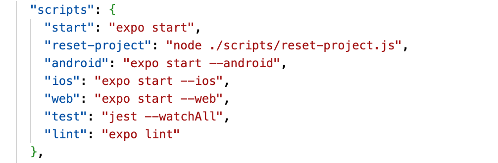

[TOC]

##### What is npm

To put it simply, `npm` is the commonly used package manager in web and (in general) JS development. 

It has a website ([npmjs.com](https://npmjs.com/)) where all the packages are listed, a [registry](https://docs.npmjs.com/cli/v10/using-npm/registry) where all the packages are actually hosted, and a bunch of [CLI tools](https://docs.npmjs.com/cli/v10/commands/npm) to actually work with the packages locally.

> The packages can public as well as private (hosting private packages is charged). Its also possible to host npm packages in `GitHub Packages` ([link](https://github.com/features/packages)) or `Verdaccio` ([link](https://verdaccio.org)). GitHub Packages is a solution from GitHub that can serve as package registry for several different kinds of packages, i.e. npm, Gradle, Maven, Docker, and more.

([Intro](https://docs.npmjs.com/about-npm))

> But is npm more than just a dependency manager, does it also perform builds?

##### package.json file

A file named `package.json` at project root is where all the dependencies are specified. There is a standard format to it. It does need to have some project details like project name, etc. too. The development environment dependencies are listed in a key named 'devDependencies' and the production dependencies are listed in a key named 'dependencies'.

A sample package.json file from a ReactNative project.

##### Packages and Modules

package.json file describes a package, which can be a file or a directory. 

The `package` can in fact be one of several things - a folder containing a program, a zipped tarball containing that, a URL that resolves to that tarball, and more. ([reference](https://docs.npmjs.com/about-packages-and-modules#about-package-formats))

A `module` whereas is any file or directory in the `node_modules` directory that can be loaded by the Node.js `require()` function. 

To be loaded by the Node.js require() function, a module must be one of the following - a folder with a package.json file containing a "main" field, A JavaScript file.

> Since modules are not required to have a package.json file, not all modules are packages. Only modules that have a package.json file are also packages.

##### Where are the packages stored

Local install (default): puts stuff in `./node_modules` of the current package root. Global install puts stuff in `/usr/local` or wherever node is installed. 

Install it locally if you're going to require() it. Install it globally if you're going to run it on the command line. If you need both, then install it in both places, or use npm link

([Reference](https://docs.npmjs.com/cli/v7/configuring-npm/folders))

##### npm CLI - Comman commands

([Reference](https://docs.npmjs.com/cli/v10/commands))

> A sample `scripts` key in `package.json`.   

`npm install npm@latest -g` - Updates npm to its latest version, when already installed

`npm init` - Creates a package.json file and prompts questions to populate some basic key. Essentially, a shorthand for creating the json file yourself. 'npm init --yes' causes the command to take default values and not prompt any questions.

`npm install` or `npm i` - Installs all the packages listed in package.json. 'npm i moduleXYZ' can be used to install a specific module. 

Using '--save' flag here also saves the module in package.json (so apparently a module can be installed even if its not listed in package.json). '--save-dev' saves it in package.json as a developerDependency.

A package can also be installed globally, i.e. in global directory (which unless changed is a system directory). This can be done using '--global' flag. '-g' is its alias. 

`npm run` - Packages have commands listed in a 'scripts' object. 'npm run scriptName' runs the specified command from a package's script object. ([Reference](https://docs.npmjs.com/cli/v10/commands/npm-run-script))

So 'npm run ios' will mean that there is some script named ios in a package and that script gets run.

`npm start` - Runs the command defined in 'start' property of package's 'scripts' object.

`npx` - A rather special command that runs any npm package even if its available only on remote (and not on local).