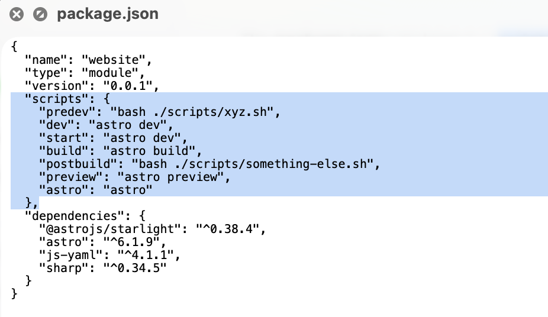

#### Scripts

The **package.json** can have a **scripts** property that looks smething like this

What's happening here is this. things like **dev**, **start**, **build** etc. aren't something inherent to npm. What it means is that when a `npm run xyz` is done then the the key which has the name xyz in `scripts` in package.json is located, and its corresponding value  run. So `npm run dev` will do a `astro build` and then astro build does what it actually will.

[Reference](https://docs.npmjs.com/cli/v10/using-npm/scripts), [ChatGPT](https://chatgpt.com/g/g-p-69eba4f755888191bad700affa6982bb-static-website-with-astro/c/69f64dcc-e690-83ea-a9f1-4ade7735ba58)

##### Pre & Post Scripts

Now the thing about the scripts keys **predev**, **postbuild**, etc. is that these run before/after the script name. So `predev` will run just before `npm run dev` starts and `postbuild` will run just after `npm run build` gets done. These are called [pre & post scripts](https://docs.npmjs.com/cli/v10/using-npm/scripts#pre--post-scripts).

##### Life Cycle Scripts

There are certain special scripts that are keyword-ed and run in specific situations. These are things **prepare**, **prepublish**, **prepublishOnly**, **prepack**, **postpack**, **dependencies** . For example, `prepare` is run just before package is packed, i.e.  `npm publish` and `npm pack`. [Reference](https://docs.npmjs.com/cli/v10/using-npm/scripts#life-cycle-scripts)