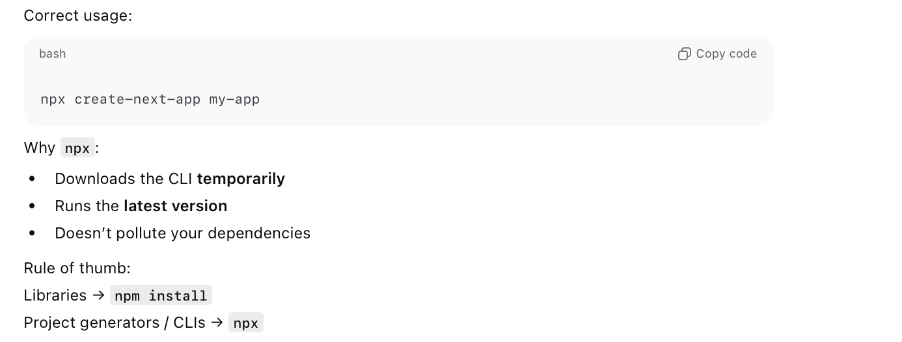

> Being a JS based thing, it heavily uses **npm**. npm basics' notes are in `07. Web Development/5. Node and NPM/'.

#### What is next.js

**next.js** is a JS framework that simplifies static website creation, among other things it also uses **React** (a JS library for UI web dev where components are rendered based on state). Technically both of them are npm packages.

#### How to install next

The prescribed way is to use **npx**, which downloads the command temporarily and sets up all the dependencies.



#### Creating a next app

Done using **npx create-next-app**. 

```
npx create-next-app@latest my-app
```

It can also take arguments such as `--ts --app --eslint`, whch mean various things. `ts` meaning generate using TypeScript, `eslint` meaning install ESLint npm package (a linting tool). `app` argument means App Router should be used instead of the older Pages Router.


#### Relevant npm packages

**create-next-app** - The primary project generator for any next.js app.<br>**eslint** - A linting tool, does static anal	ysis. <br>

#### Basic commands

**npx create-next-app** - Creates a new next.js project <br>**npm run dev** - Starts local dev server (i.e. can access website through localhost) <br>**npm run build** - In case of a static site, generates `/.next` or `/out` <br>**npm run build** - Does a production build <br>**npm run lint** - Runs ESLint

#### Resources

next.js npm basics ([ChatGPT link](https://chatgpt.com/g/g-p-69543090ebc88191ad0a65f028115010-static-website/c/696c2ee9-9028-832c-aac7-a6d3c13cce30))

