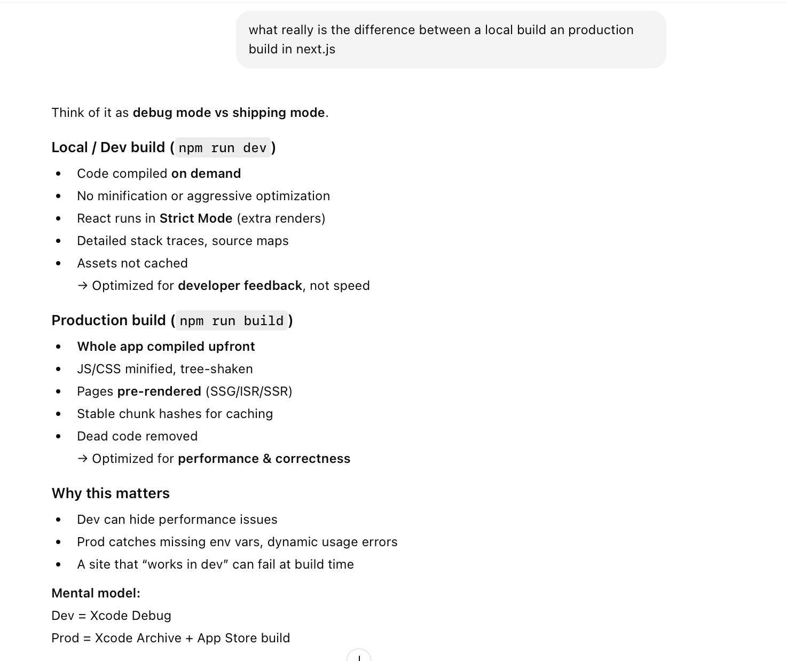
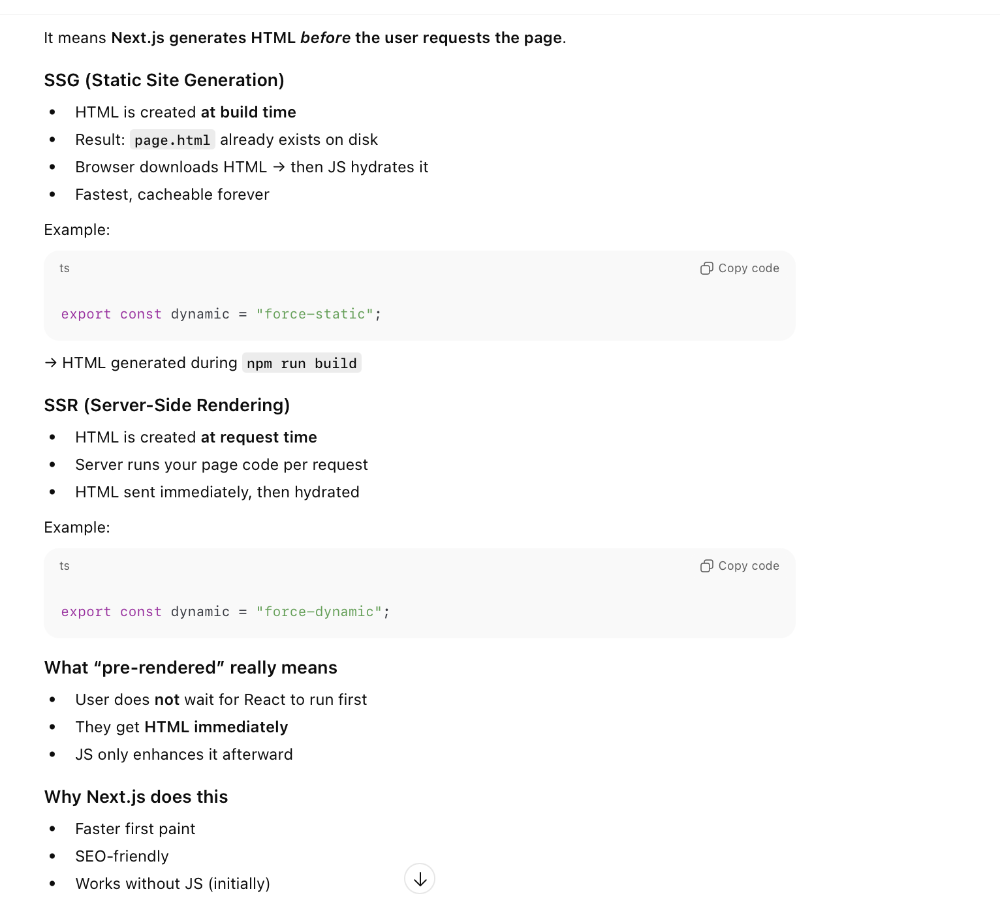
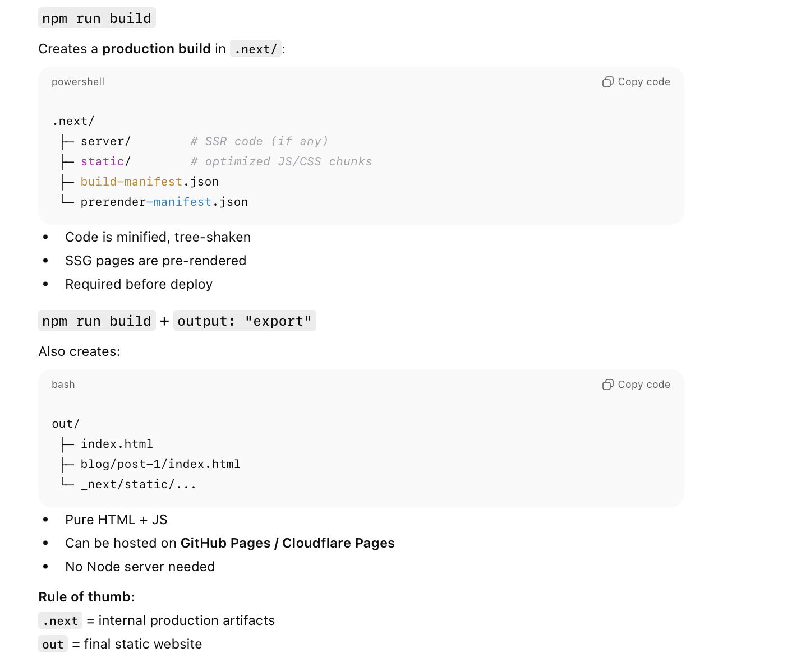

##### Dev vs Production Builds

There is a difference betwene dev and production builds. The former compiles code on demand and has detailed stack traces whereas the latter compiles code upfront, pre-renders pages, and has code optimization with more minifications.

##### Pre-rendering of pages in Prod builds

In prod builds, HTML is generated before the user requests the page.

##### Build output location

In case of local builds, there is no definite build location and pages are compiled on demand.

With prod builds, the output (i.e. HTML, etc.) is mostly produced in **out/** folder.

