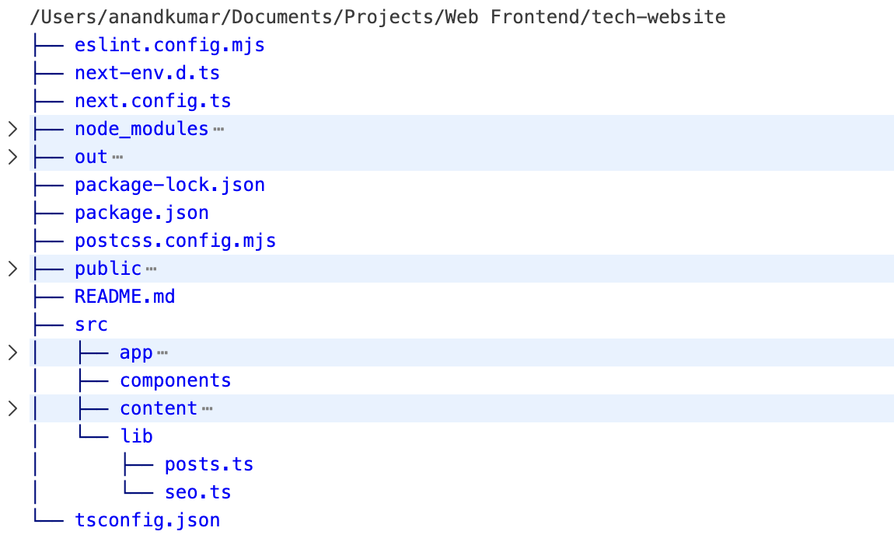
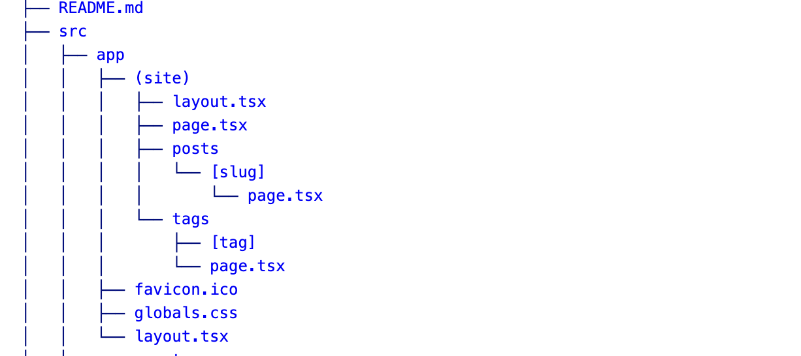
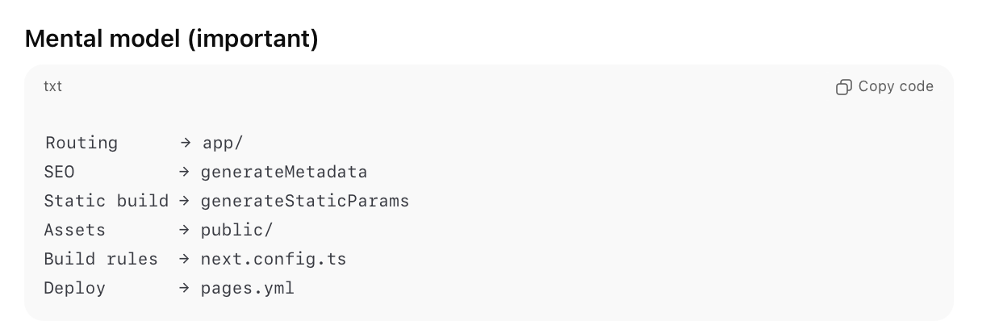

[toc]

##### High level structure

##### /src/app/(site) folder

`src/app/(site)` is a **route group**, pages inside behave as if they were directly under `app/`.

##### Common files

**page.tsx** - Homepage, serves `/`  **layout.tsx** - Root layout for public site pages, wraps all routes inside `(site)`, and typically defines `<html>`, `<body>`, and other high level HTML tags  **posts/[slug]/page.tsx** - A blog post page, `[slug]` is a URL parameter.  **/tags/page.tsx** - All tags index page

##### Misc.

[ChatGPT link](https://chatgpt.com/g/g-p-69543090ebc88191ad0a65f028115010-static-website/c/69681db2-90dc-8332-970b-774f0df3f9b0)