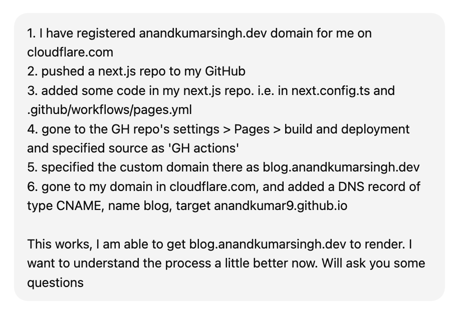
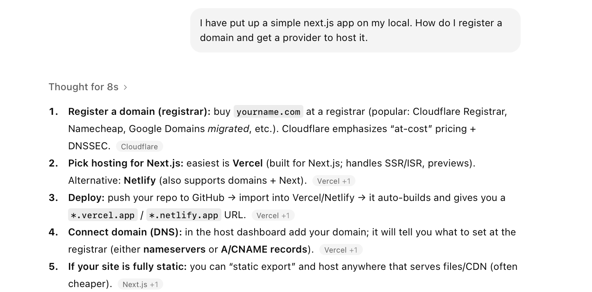
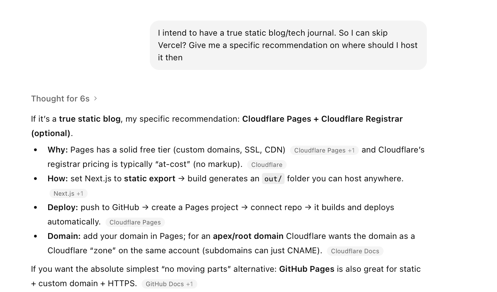
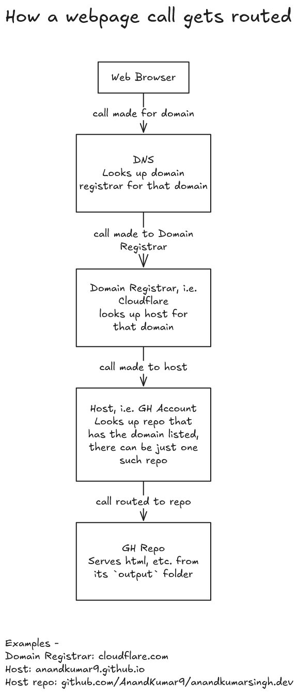
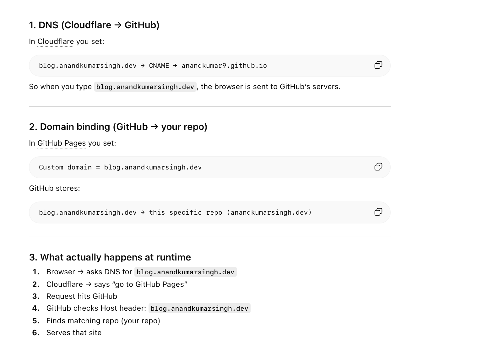

[toc]

#### High Level Steps

1. **Registered a new domain** through a registrar (i.e. cloudflare.com)
2. Created a **next.js repo** with some specific Pages related files (next.config.ts, .github/workflows/pages.yml)
3. **Published** it to my GitHub (a special kind of GH repo like pages?).
4. Went to GH repo settings > Pages > Build and Deployment > Source : **GH Actions**
5. Specified the **custom domain in GH** repo settings > Pages as the CNAME (blog.anandkumar.singh.dev) I will specify in my cloudflare domain
6. Added a **new CNAME record** in my domain in cloudflare, the same as what I specified above as custom domain in GH Pages

#### Basic Terms

**Registrar** - The thing that registers a domain (xyz.com, etc.) with global domain system overseen by ICANN (Internet Corporation for Assigned Names and Numbers). Cloudflare, GoDaddy, Namecheap, etc. 

**DNS** - Domain Name System, basically a collection of servers worldwide that is a phoenbook of sorts,  i.e. what URL or domain should be routed to what IP/system.

**CNAME** - Cannonical Name, i.e. something which makes one domain name alias another domain name. So if I can have blog.anandkumarsingh.dev as a CNAME with the target being anandkumar9.github.io

**Host** - The system that actually hosts the website code and files. CNAMES for a domain in resgistrar usually point to these. GitHub Pages, Vercel, Cloudflare Pages, Netlify, etc.

> The default host configured in cloudflare is Cloudflare Pages, default host configured for a next.js generated app is Vercel, but you can ofcourse use GH Pages for hosting and do the necessary setup in your next.js code and then in Cloudflare.

#### Resources

[ChatGPT link 1](https://chatgpt.com/g/g-p-69543090ebc88191ad0a65f028115010-static-website/c/695b2d7a-f27c-832e-b797-baa77dd35ff0),  [ChatGPT link 2](https://chatgpt.com/g/g-p-69543090ebc88191ad0a65f028115010/c/69543273-97c4-8325-8064-d73e3141e4c5)

##### Gist - How routing works

In Clouflare, I have specified blog.anandkumarsingh.dev should go to anandkumar9.github.io  When request reaches anandkumar9.github.io, GH looks at Host header which is blog.anandkumarsingh.dev and tries to see which repo there has that as its custom domain name, and then forwards to that.

> Multiple repos in a GH account can't have the same custom domain name in their Settings > Pages.

