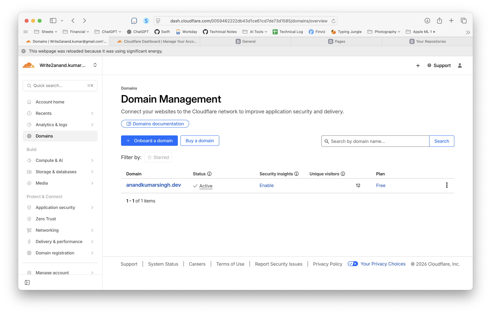
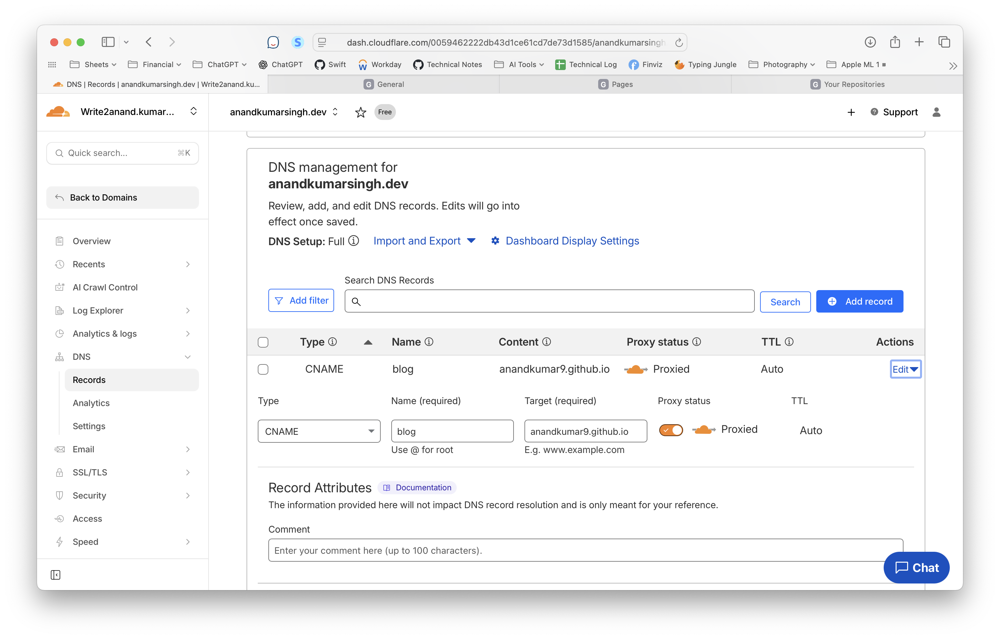

[toc]

#### Registering a domain

Go to cloudflare.com > Buy a domain > Register. As simple as that.

#### Adding a CNAME record

Go to Cloudflare > Domain Management > Select domain > DNS > Records > Add a CNAME record. That's it

