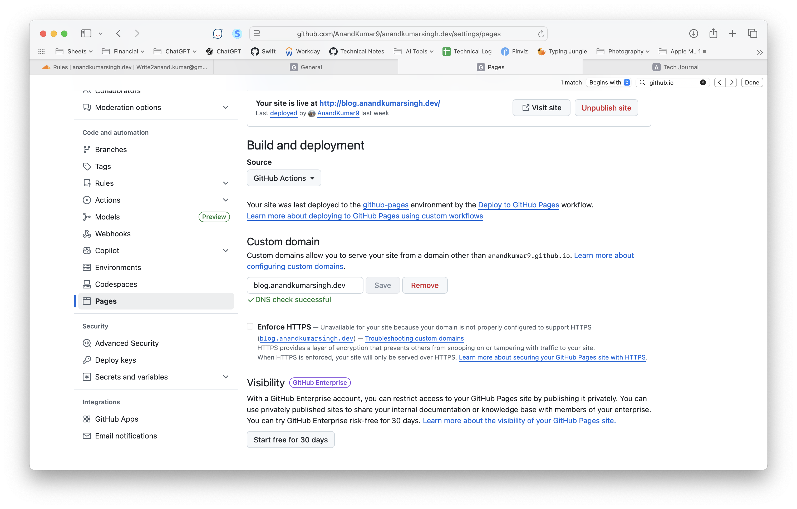

[toc]

#### Pages > Build and deployment

Go to GH Repo > GH Pages > Build and deployment, and set Source > GH Actions

#### Pages > Custom domain

Go to GH Repo > GH Pages > Custom domain and enter the full CNAME record specified for the domain in registrar website. Give it a few sec and wait for the 'DNS check successful' message to appear.

> So essentially what happens is this way just because some GH URL gets specified at registrar, that's not marked as enough. Some registration happens at GH too to confirm what domain should be able to use that GH repo. Basically, a mutual consent of sorts. 

Even if a single GH account has multiple repos that have pages enabled, they all need to have unique custom domains. When in cloudflare, a simple 'username'.github.io is specified as the CNAME destination for a certain domain, in real time traffic reaches GH and GH then decides which repo to route it to (i.e. which repo had that specific domain specified in its custom domain).

#### .github/workflows

The GH repo needs to have a file such as `.github/workflows/pages.yml`, this is where the action is defined and this is what actually specifies the commands to run that will generate the output which the static website will actually use.. Here is how the file looks like for my `next.js` web app. Explained more in next.js markdown note.

