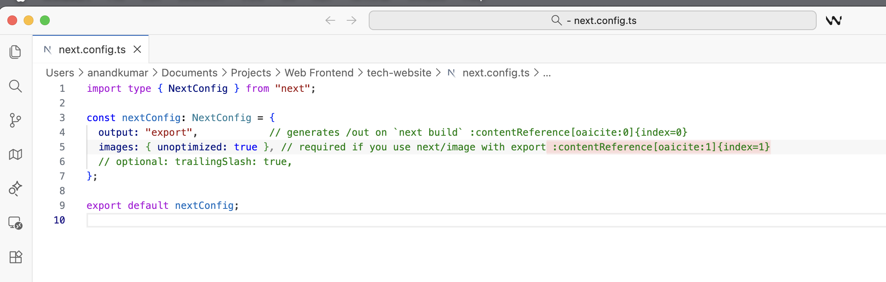
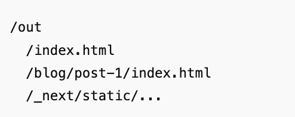
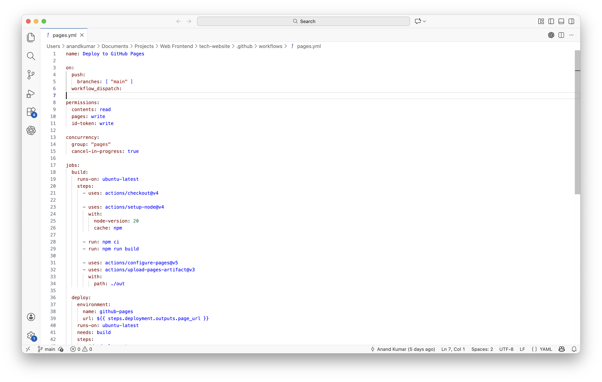
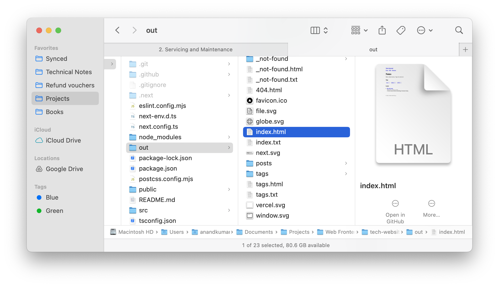

[toc]

#### next.config.ts

**next.config.ts** is a compile-time configuration file for Next.js. It needs to be configured to specify that this app should build a static website.

`output: "export"` means that the build should produce a fully static site, which consequently disables server features (SSR, API routes, etc.) and gets the builds to generate a standard static website structure.

#### .github/workflows

This is where the GH repo's action is described. The file is named as `.github/workflows/pages.yml`, this is where the action is defined. Here is how the file looks like for my `next.js` web app.

Its basically creating a new GH action named 'Deploy to GH Pages', which will run anytime a new 'push' is made to 'main' branch. It checks out the repo, runs 'npm ci' and 'npm build' and uploads the contents at `./out` as the Pages artifact. It can't be viewed in GH, but will be the same thing as what is in your local if you run `npm run build`. You'd see the precise html files, etc. there.

