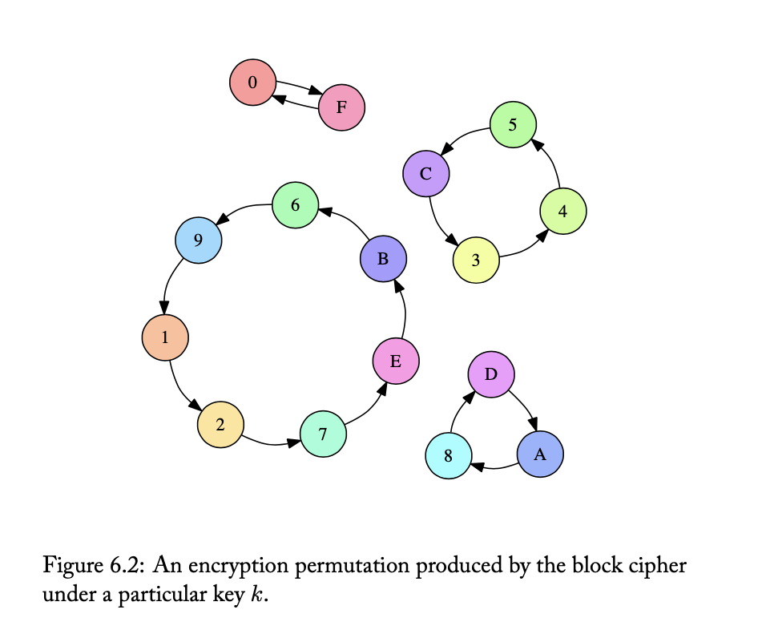
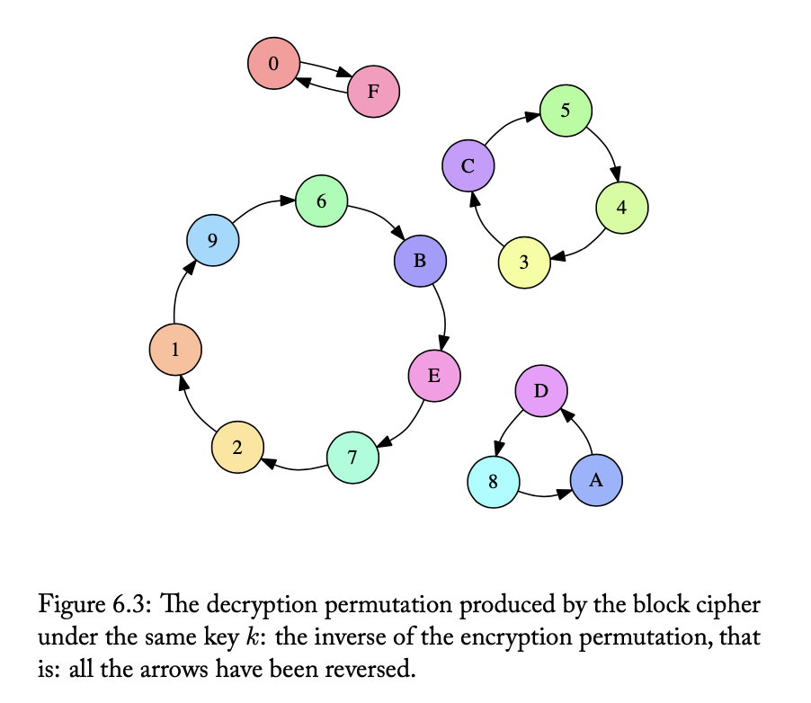

#### Block cipher

A `block cipher` is an algorithm that can encrypt blocks of fixed length. Here `E` is the cipher block, `C` is the ecnrypted text, `P` is the plain text, and `k` is the secret key.

Plain text and cipher text have the same size known as the `block size`, and it is a property of the block cipher.

```
C = E(k, P)
```

> So it probably is not a simple XOR-ing but something else.

`Keyspace` is the set of all possible keys (so is it that a block cipher also has a limited keyspace even though many more combinations for its block size may have been possible).

`Symmetric key encryption scheme (or Secret key encryption scheme)` is when the same key gets used for encryption as well as decryption. `Public key encryption` whereas os when different keys get used for encryption and decryption.

Block cipher too is an example of symmetric key encryption. In fact, block cipher is also known as a `Keyed permutation` as every possible `P` maps back to a certain `C` based on `k` (a block can in fact even encrypt back to itself). And also because the block cipher maps every possible block to some other block.

Encryption permutation produced by the block cipher under a particular key k | Decryption permutation produced by the block cipher under the same key k
--- | ---
 | 

If perfectly designed there is no way to figure it out other than a 'brute force' on the key.

Real life block ciphers are at least 128 bits long.

##### Different kinds of block ciphers

`AES (Advanced Encryption Standard)` is a family of block ciphers, with block size being 128 bits and key size being 128, 192 or 256 bits. There are no known attacks against it, with the few that are actually there not being practical. It was previously known as `Rijndael` encryption.

`DES (Data Encryption Standard)` is an old block cipher that was in use before AES. It is considered insecure due to its tiny bit size of 56 bits. On modern hardware it can be brute forced in less than a day.

`3DES` was some improvement to DES. It first encrypted, then decrypted, and then encrypted again.
```
C = E-DES(k1, D-DES(k2, E-DES(k1, p)))
```
However it is still used a lot in the industry, esp. finance industry where even COBOL is still prevalent.

Even though AES is very secure, a vew issues exist with it. It can only work on limited message length (i.e. `block length`). And while key size has reduced a lot, exchanging it still remains a challenge.

#### Stream cipher

`Stream cipher` is another symmetric key encryption scheme, but unlike block cipher it can operate on a stream of any length. There are some known practical attacks (including bit flipping attack) against it, but its still considered to be reasonably secure.

It can be produces by using block cipher in various configurations (aka mode).

`ECB (Electronice Code Book) mode` - Breaks the plain text into chunks that can be block-ciphered. There are however issues in this approach and it should not be used as a replacement for a true stream cipher.

`CBC (Cipher Block Chaining) mode` - Plain text blocks are XOR-ed with the previous ciphertext block before being encrypted by block cipher. The first block is XOR-ed with a random number, known as `Initialization Vector (IV)`. In fact the IV need not even be kept secret and is typically just attached as a plaintext.

`CTR mode` - Counter mode. A mode of operation that profuces a synchronous stream cipher.

`Padding` is the process of padding extra bits if the message length is not a multiple of block size.

`Padding with zeroes` - If n bytes are short, then that many bytes are appended with all of them having the value 0 or some other value (1?). This method however does not allow to disntinguish if the last true byte is actually the same as the padding byte's value.

`PKCS#5 / PKCS#7 padding` - The missing bytes are padded with the same value as number of missing bytes, If there are no missing bytes, an entire block of padding is used.

##### Different kinds of stream ciphers

`Native stream cipher` - Stream cipher algorithms that are actually written in a ground-up fashion, without using block ciphers as some mode of operation.

`Synchronous stream cipher` - The most common type of stream cipher. Secret symmetric key is taken in and a pseudo-random text (called `keystream`) is generated. This is then XOR-ed with the plain text.

`Asynchronous (or self-synchronizing) stream cipher` - Previously produced ciphertext bits are used to produce current keystream bit.It is not used much now, even when it can recover incomplete messages.

`RC4` - The most commonly used native stream cipher. Also known as `ARCFOUR` or `ARC4`. A synchronous stream cipher. It is simple, fast, and easy to apply. Written by the security company RSA.

`Salsa 20` - A newly designed stream cipher. It comes in 2 variants, Salsa `20/12` and `Salsa 20/8` which have the same algorithm but with 12 and 8 rounds respectively. `Cha Cha` is another of its variants. It is state of art, pretty fast, and has no publicly known attacks.
