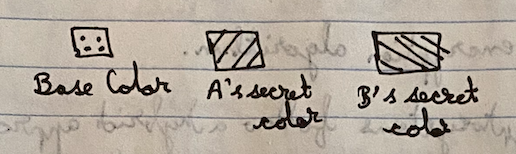
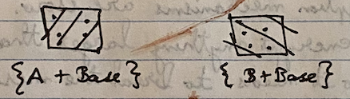
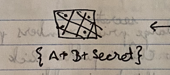

#### Key Exchange

This deals with how to exchange the secret key securely. Its done in a way that even if an eavesdropper gets part of it, they cannot use it to generate the full key. Its typically done using `Dieffe-Hellman` protocol, which is best explained using the mixing color analogy.

If you mix two colors, the resulting color does not indicate the actual color. Even one color and the result does not indicate what that second color might have been. The result is also same regardless of the order in which the colors are mixed.

Step 1 - Base color is exchanged. Lets assume the eavesdropper E gets it too.  
Step 2 - A and B mix colors and send across.  
Step 3 - A and B mix their secrets again with what they received. What now gets generated is the eventual secret to be used.  

Step 1 | Step 2 | Step 3
--- | --- | ---
 |  | 

So the actual key never gets sent, but is instead generated at both sides. E cannot generate this in any way as it does not have A or B's secret.

Mathematically, this is done using discerete algorithms and elliptic curves.

`MITM (Man In The Middle) attack` is when the eavesdropper actually becomes an attacker and pretends to be the actual recipient.  
A <-> M <-> B

This leads to a need for authenticating messages itself to ensure they are coming from the right source and have not been tampered with.
