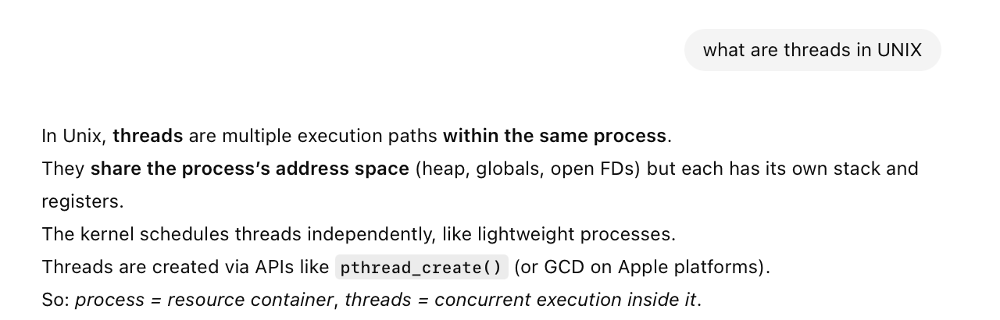

**Threads** are basically multiple execution paths in the same process. All the threads in a given process share the process's address space (heap, globals, open FDs) but get their own stack and registers.

[ChatGPT link](https://chatgpt.com/g/g-p-6934bcdfcafc819182baa9435e044320-swift-programs/c/694ee170-032c-832a-bdcf-8c5b89a5e6dd)