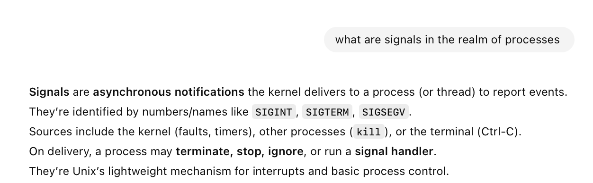
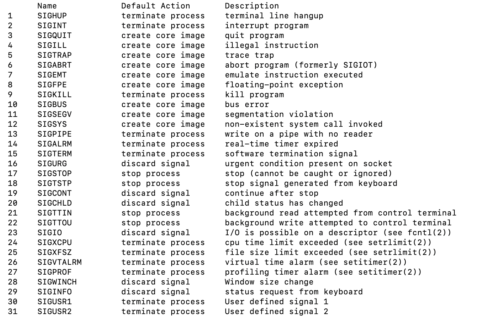
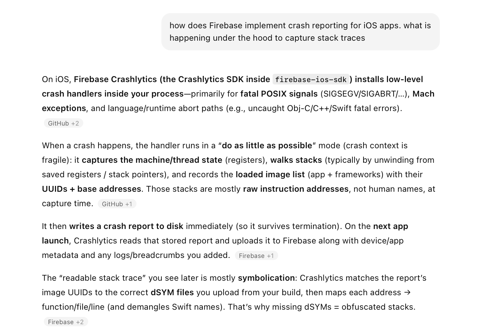

##### What are signals

**Signals** are basically asynchronous notifications the kernel delivers to a process (or thread) to report events. A process choses to do what it wants on getting those events. They are the simplest mechanism for interrupts.

##### Signals List

A list of all possible signals can be found by simply doing a **man signal**. These inlude things such as SIGABRT, etc.

##### Misc.

Perhaps these UNIX signal handling ways is how mobile crash reporting tools such as Firebase work under the hood. The apps ship with some Swift, etc. code that can handle process signals. (ChatGPT [link](https://chatgpt.com/c/6952ee6e-55f0-8325-89d0-0ebbdebd6f9e))

> Have some more notes in '03. iOS/03. Platform Specific/1. Concurrency/Misc.md - Bailing out of runtime errors, SIGABRT, etc.'