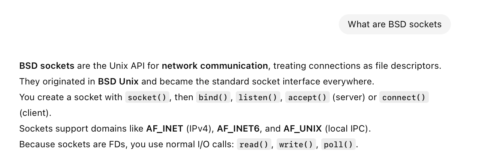
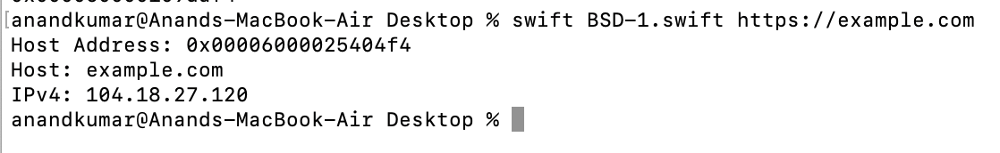

##### What are BSD Sockets

Simply put, they are a UNIX API for network communication that exposes connections through file descriptors. They were first developed in BSD (Berkeley Software Development) UNIX and gradually became the standard everywhere.

[ChatGPT link](https://chatgpt.com/g/g-p-6934bcdfcafc819182baa9435e044320-swift-programs/c/694ee170-032c-832a-bdcf-8c5b89a5e6dd)

##### Making raw BSD calls from Swift

> Shown in  'Swift Secrets' book > 'UNIX and I/O fundamentals' chapter > DNS, IP, and BSD sockets'

**Darwin** is the C library that needs to be used from Swift. It exposes things such as **gethostbyname2()** or **getaddrinfo()** to get IP address, and many more things for the rest.

> A part of the code will be able to print the IP address (given a URL).    And the rest can then actually make a connection and send a request and receive a response too.

[ChatGPT link](https://chatgpt.com/c/694f0bc1-f3cc-832c-a92e-7c35d3b21919)

The code for SSL connections is not there as a part of the system itself. It is instead provided by librarie such as **OpenSSL** (https://www.openssl.org/) that is used by then used by **libcurl** (https://curl.se/libcurl/) to implement the SSL connections. libcurl is infact what is used by Apple's Foundation framework's URLRequest.
