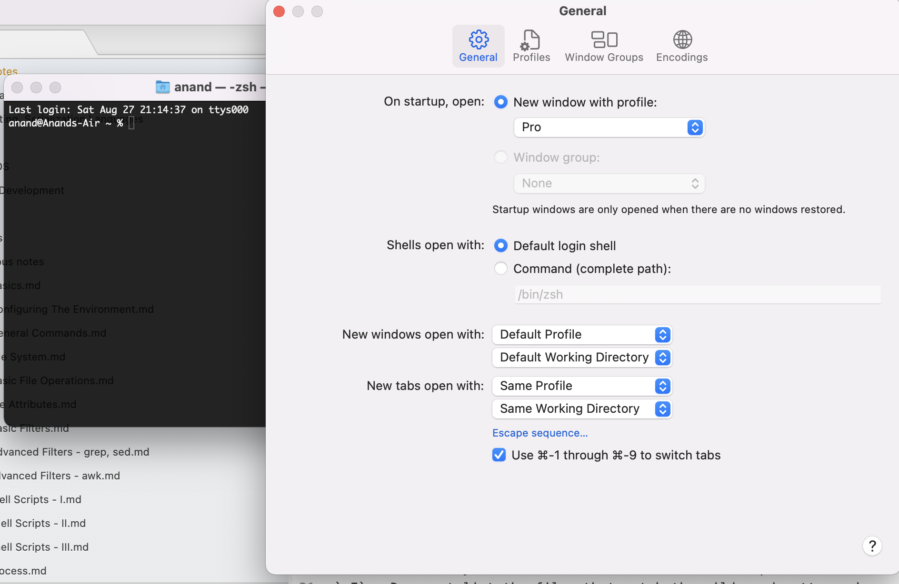

[toc]

##### Default shell

There might be multiple shells (`bash`, `zsh`, etc.) installed and while the shell used for current session can be changed, there exists a default shell too.

`echo $SHELL` prints the value of `SHELL` environment variable (which is I think the default shell). `echo $0` whereas prints the shell being used in the current session. In Mac, Terminal too has a default shell UI that can seemingly override the default shell that has otherwise been set so change that Terminal default shell too if needed.



One way to know that the desired shell is not active, is if any of the alias, variable, etc. being set in that shell's configuration files (like bashrc, zsrc, etc.) do not work.

However, reliably knowing the current shell is pretty complicated. Almost any way can have loopholes. [This](https://stackoverflow.com/a/3327022/1135417) stackoverflow link mentions various ways and also explains the shortcomings.

The most practical way may be to just print a variable that is usually supposed to exist only in the specific shell type and see if it prints anything at all. So something like `echo $BASH` for bash and `echo $ZSH_NAME` for zsh.

##### tree command

A custom commmand used to get a tree like listing of a folder's contents. It can be installed via Homebrew as well as MacPorts ([link](https://superuser.com/a/359727)).

```
brew install tree
port install tree
```

`-d` - Lists directories only <br>
`-L` - Specifies nesting depth of the tree to be listed <br>
`-P` - Lists only the files that match the wild-card pattern <br>
`-I` - Does not list the files that match the wild-card pattern <br>
`-h` - List the file size as well <br>

For specifying multiple patterns, club them in `()`.
```
tree -I '*png|*md'
```

##### Extracting WWDC videos list

Remove all empty lines.

```
sed -E '/^$/d' Temp.txt
```

Extract every 4th line. In below example, every 4th line beginning at line number 2 is extracted.

```
awk -v n=4 'NR%n==2' Temp.txt | pbcopy
```

##### Misc. tricks

Print all components of `$PATH` in new line.

`echo $PATH | tr ':' '\n' `

##### mdfind

This is actually a macOS command instead. `mdfind` allows to do a Spotlight search from terminal and as it uses Spotlight's pre-built file database, its quicker. ([Link](https://metaredux.com/posts/2019/12/22/mdfind.html)) Very handy for piping the results into another command, etc. too.

There are several flags, and it by default searches in the entire Mac.

```
mdfind -name "Basics"
```
