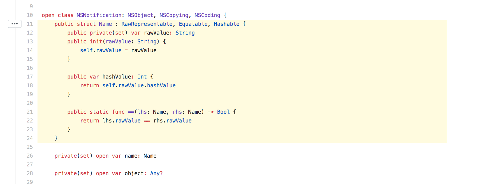
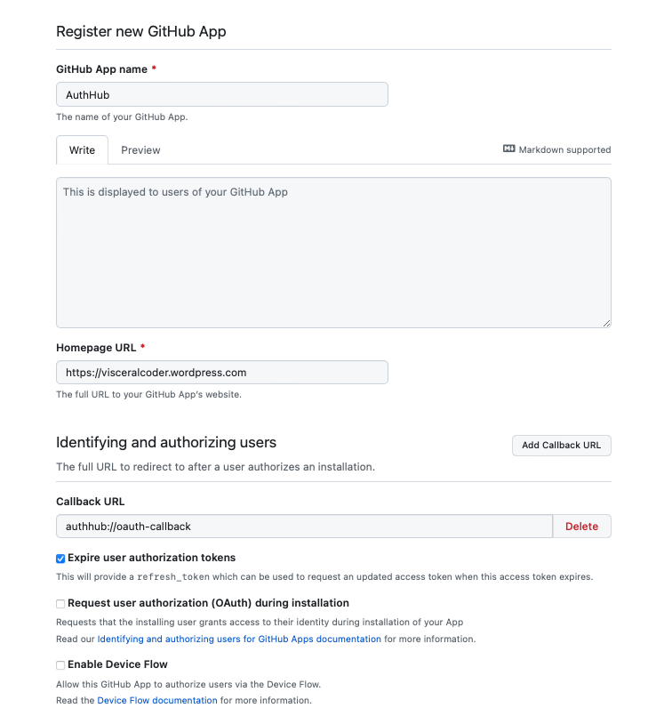
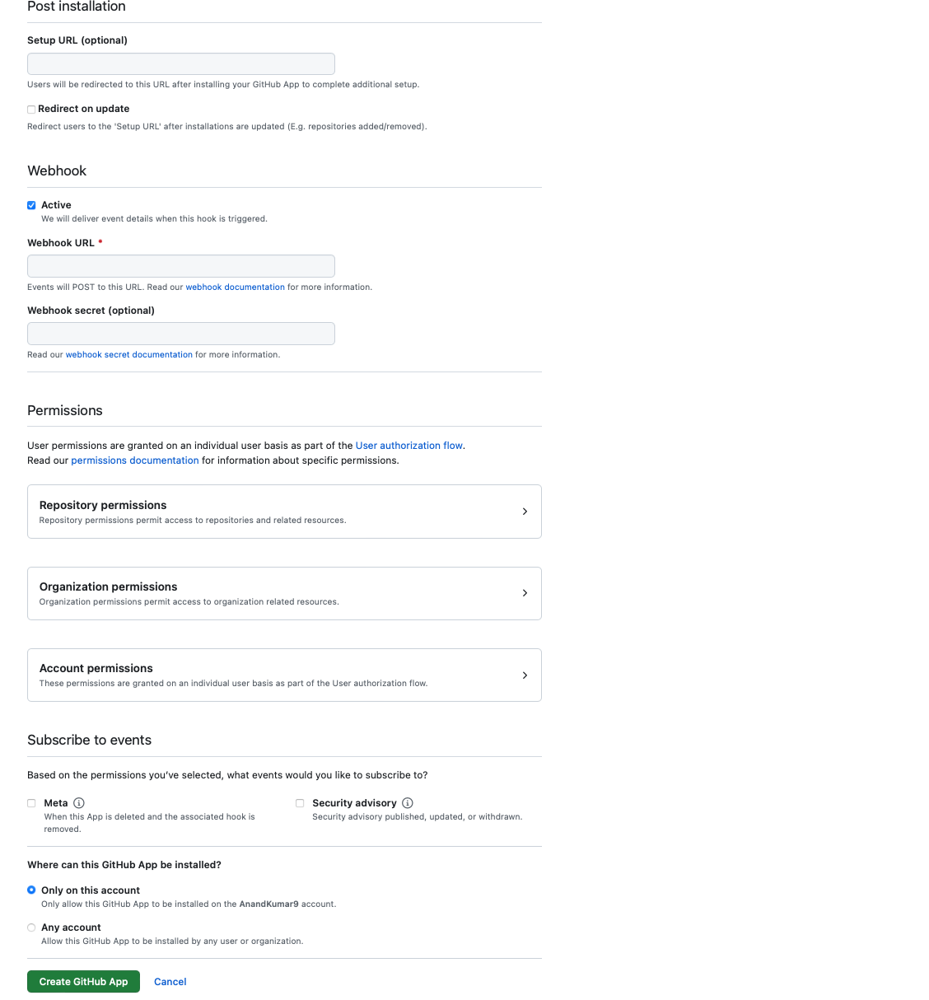
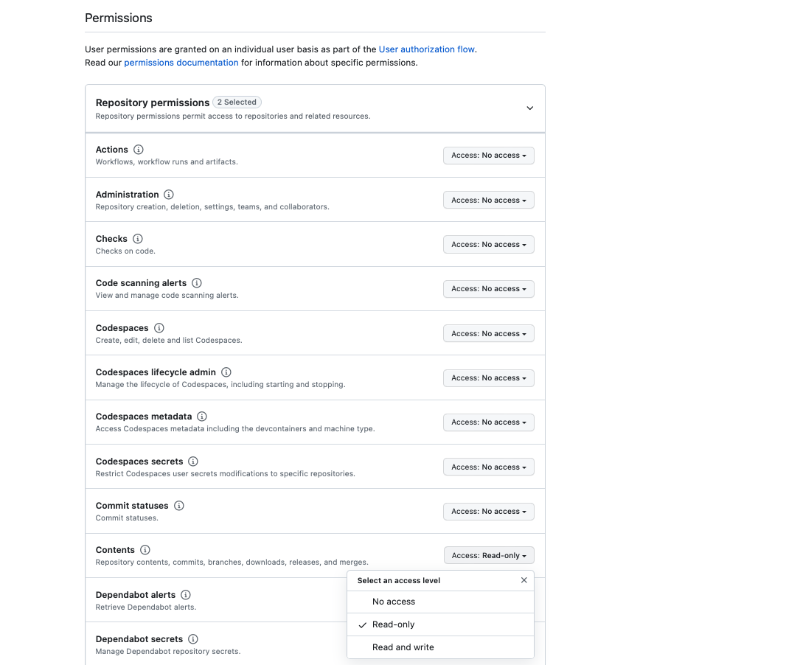
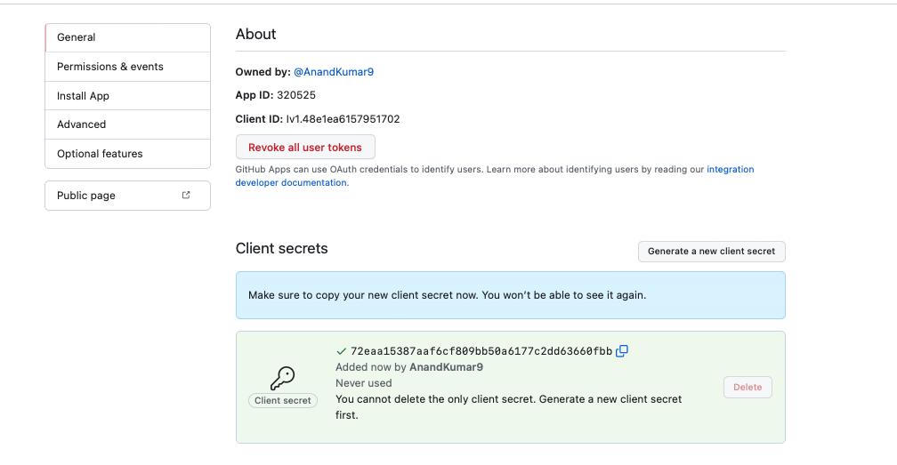

[toc]

##### Highlighting lines in a file link

It's possible to highlight lines in a file on GitHub with a URL like this.

https: //github.com/apple/swift-corelibs-foundation/blob/master/Foundation/NSNotification.swift`#L11-L24`



##### Protecting a branch

A branch can be protected (i.e. force push on it disabled, etc.) from Settings > Branches.


This restricts all users (other than admins?) from force pushing. It's also possible to set who can push commits to a branch (and hence also merge PRs to that branch).


##### Advanced searches

For even slightly advanced searches, usually the thing to use is `github.com/search` instead of `github.com/xyzRepo/pulls`. For example, for searching for all PRs in a certain repo raised by any of two particular authors this is the query.

```
is:pr repo:ConsumerIdentityMobile/ease-signin-ios involves:username1 involves:username2
```

Weirdly, `involves` is what needs to be used as `author` does not work in case of logical OR searches. GitHub's prescribed method of using commas to perform logical OR searches does not work either in case of searching based on PR authors.

`base:<destination_branch` is the filter for PRs for a sepcific destination branch.

##### Codeowners

This can be used to automatically request reviews from the right set of people/teams for specific files in the PR. <br>
[Link](https://github.blog/2017-07-06-introducing-code-owners/)

A file named `CODEOWNERS` should be put in `.github/` folder (or in root directory of the repository).

For instance this means that any changes in `FriendlyFraud` folder would need to be reviewed by `ease-ios-card/bb8` team.

```
/Enterprise/MobileUI/Features/FriendlyFraud/ @ease-ios-card/bb8
```

##### GitHub apps

[Link](https://docs.github.com/en/apps/creating-github-apps/creating-github-apps/about-apps#about-github-apps)

A GitHub App acts on its own behalf, taking actions via the API directly using its own identity, thereby not requiring a bot. (But isn't a bot a similar thing anyway.) They can be installed for any GH account and come with built-in web hooks and specific permissions (say restrict app's access to only certain repos, etc.).

| Step 1                        | Step 2                        |
| ----------------------------- | ----------------------------- |
|  |  |

Various kinds of permissions that can be granted.




It generates an AppID and a Client ID. New client secrets can then be generated.


