#### Identity Access Management (IAM)

`IAM` is the service used to set up users who can access dashboard for a given AWS account, and even have programmatic or console access. It is not tied to any specific AWS region and is universal.

There are a few more high level terms in this service.

1. `Users` - An entity that is created in AWS to represent the person or application that uses it to interact with AWS. Consists of a name and credentials. [(reference)](https://docs.aws.amazon.com/IAM/latest/UserGuide/id_users.html)

2. `Groups` - A collection of IAM users. They can be tied to certain permissions, which then become automatically available to the member users. [(reference)](https://docs.aws.amazon.com/IAM/latest/UserGuide/id_groups.html)

3. `Policies` - A set of permissions. When a policy is associated with an identity or resource, it defines their permissions. These policies are usually stored in AWS as JSON files, and there are several pre-defined policies that already exist. [(reference)](https://docs.aws.amazon.com/IAM/latest/UserGuide/access_policies.html)

4. `Roles` - A way to get special short duration access for users or resources in same or other accounts. They are typically granted to users from other AWS accounts, or users from same account to access resources they otherwise do not have access to. Roles do not have any long term credentials such as password or access keys associated with them. [(reference)](https://docs.aws.amazon.com/IAM/latest/UserGuide/id_roles.html)

Users, groups and roles are collectively known as `IAM identities`.

> What is an AWS resource?

###### Adding a new user

 1. Add user name, and specify access type  |  2. Assign a group  (group is tied to policies)  |  3. Add tags (optional) 
--- | --- | ---
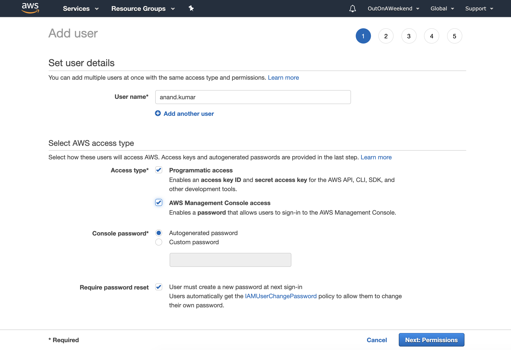 | 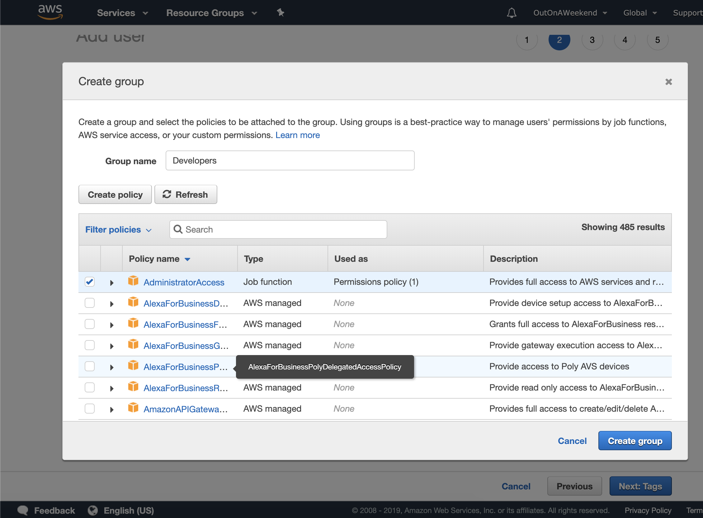 | 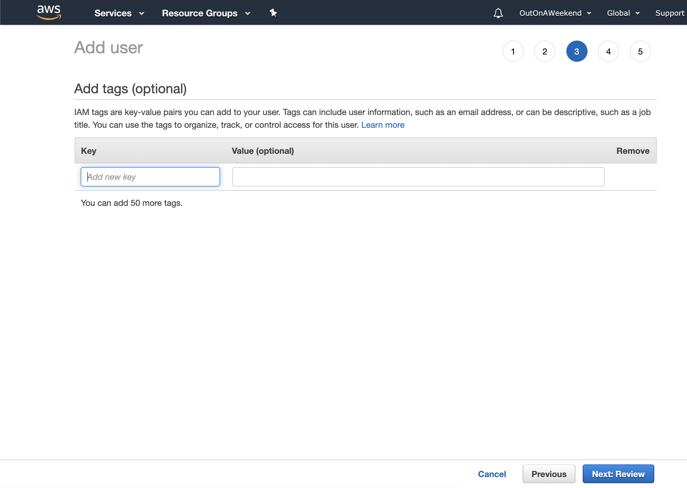

 4. Review |  5. Confirmation screen shows access key ID and secret access key 
--- | ---
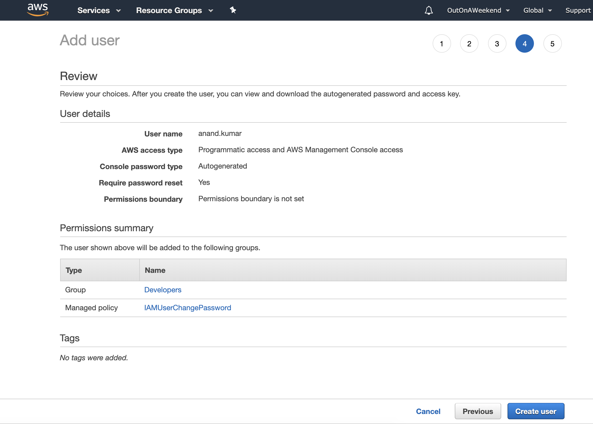 | 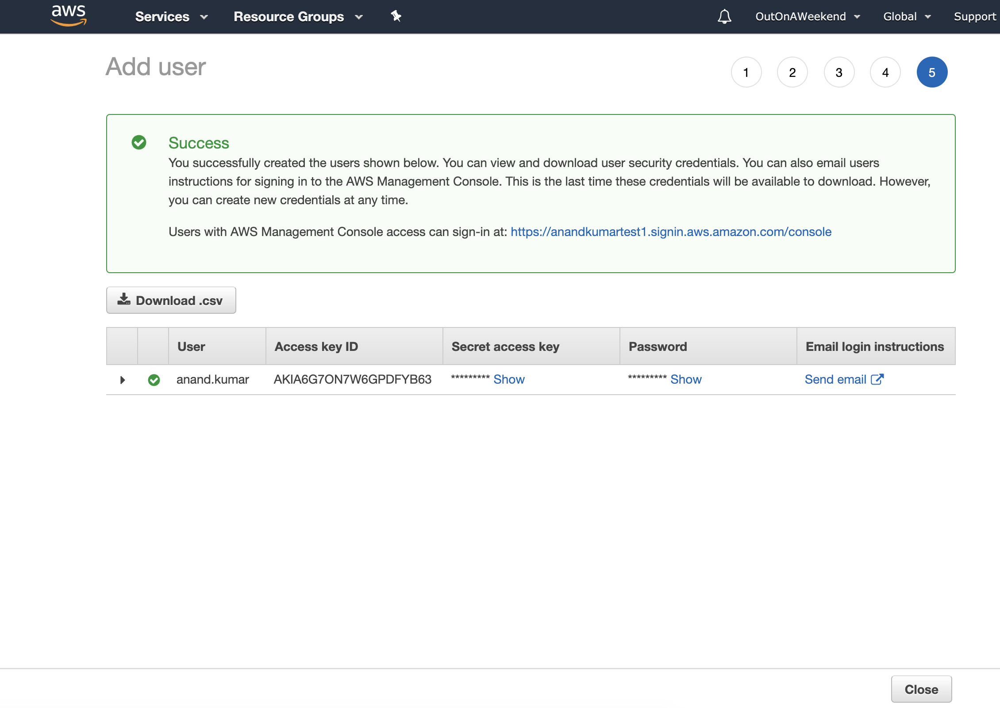

If a policy is not tied (via a group) to a user, the user does not have any permissions.  

Whether the user gets programmatic access and console access can be specified while creating the user. You get only once chance to download or see the secret access key of a user. If it's lost, a fresh set of secret access key and access ID has to be generated.

###### Maintaining a user

A user's accesses, keys, etc. can be managed from the user management console.

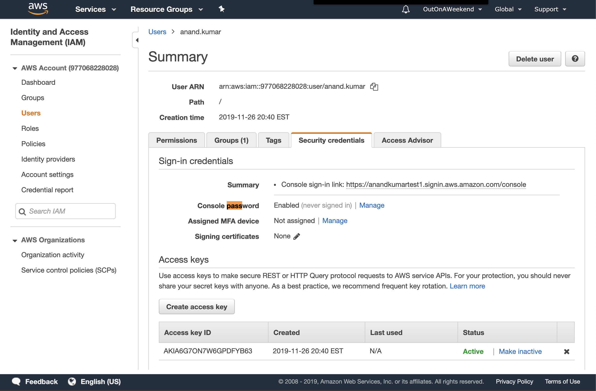

###### Password Policy

The password rules for a user are set by IAM password policy. This is probably tied to the entire AWS account, and is not a per-user thing.

 Password policy in account setting |  Password policy options 
--- | ---
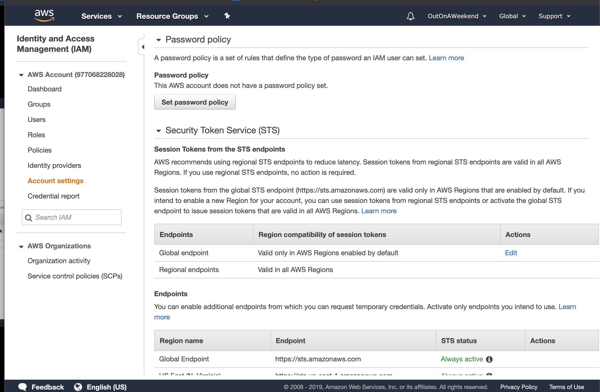 | 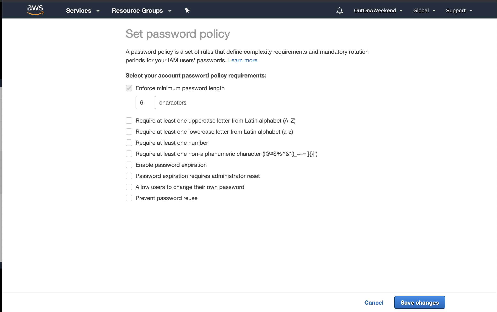

###### Creating Roles

 1. Select the entity/AWS services that the role is for  |  2. Attach policies (just as done in groups)   |  3. Review 
--- | --- | ---
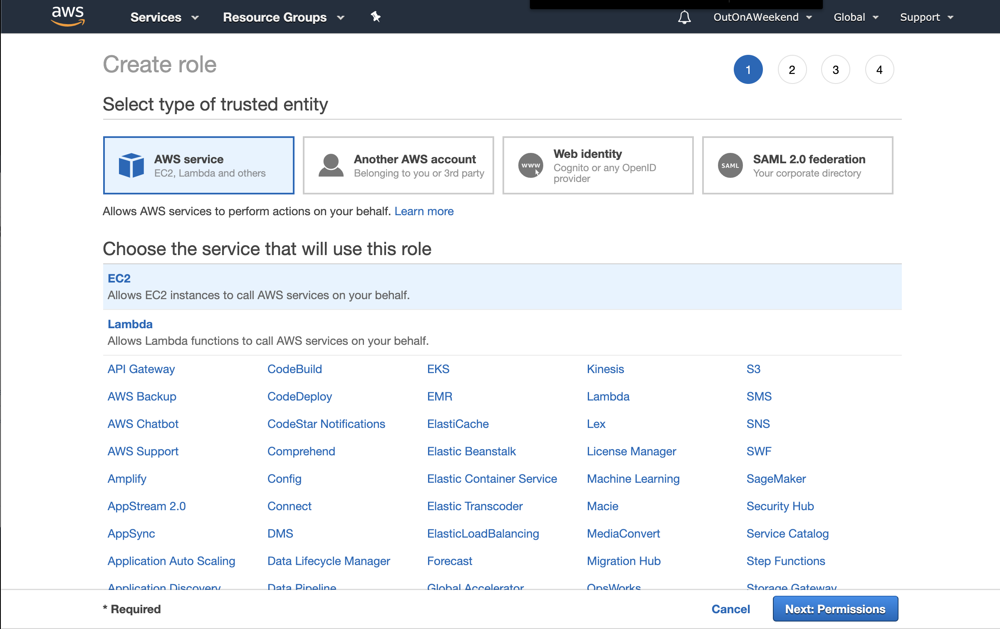 | 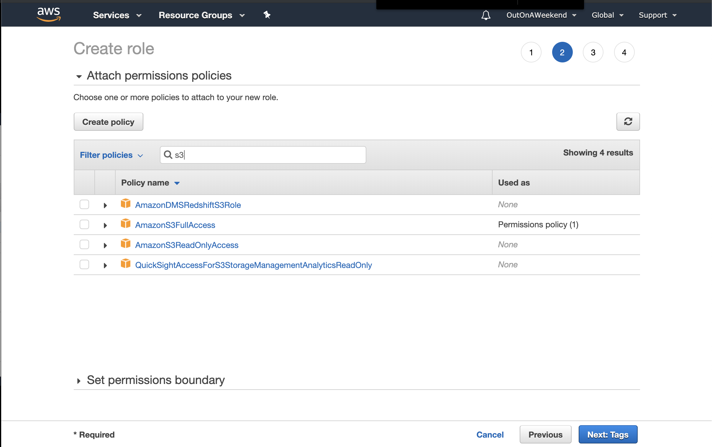 | 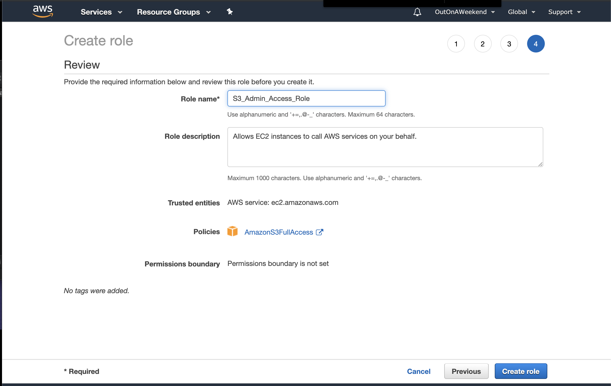

With roles too, tags can be attached (an optional step).
