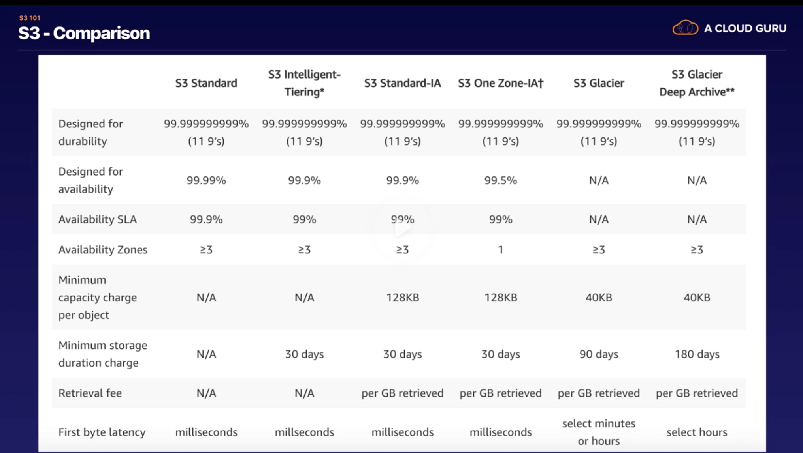

#### Simple Storage Service (S3)

`S3` is service to store your objects (i.e. files). The data is spread across multiple facilities. Files can be 0 bytes to 5 TB and they are stored in something referred to as `buckets`. It allows versioning of files as well and offers unlimited storage.

Typically, S3 promises 99.99% availability and 99.99+% durability. Durability meaning how likely it is that the object will be there once uploaded.

S3 can probably also be configured to have its objects deleted only via the added protection of MFA.

> Read S3 FAQs

###### Universal namespace
S3 namespaces are universal, and hence buckets must be named globally unique. Here is a typical URL of an object (file) uploaded in S3. There is no mention of a region in the URL.  
`https://anandkumar-test1.s3.amazonaws.com/TestFile1.txt`

 Typical properties of a S3 object

Key (filename), Value (data bytes), Version ID, Metadata, Sub-resources (i.e. access control lists, torrent).

###### Consistencies (`Read after Write` and `Eventual`)

S3 has `Read after write consistency` for PUTs of new objects. It means you can read it straight after uploading (writing) it.
And `Eventual consistency` for overwrite PUTs and DELETEs. What it means is that if an object is overwritten, you are guaranteed to get the latest version only eventually (and not right away). Typically this 'eventual'  only takes as long a second.

###### Storage classes
S3 offers tiered storage, i.e various degrees of storage that have different price levels. ([reference](https://aws.amazon.com/s3/storage-classes/))

1. `S3 Standard` - Stored redundant across multiple devices in multiple facilities, and is designed to sustain loss of 2 facilities concurrently.

2. `S3 IA (Infrequently Accessed)` - For data that is accessed less frequently, but when accesses should be accessible rapidly. Has lower fee than standard, but has a retrieval fee.

3. `S3 One Zone` - IA - Stored only ion one AZ. Is an even lower cost option to S3 IA.

4. `S3 Intelligent Tiering` - Automatically moves data across different storage classes based on how often data is being accessed and retrieved.

5. `S3 Glacier` - For data archiving. Hence takes lesser storage. Retrieval times are configurable from minutes to hours (the price that is?). Is very cheap.

6. `S3 Glacier Deep Archive` - Lowest cost storage class, where even a retrieval time of 12 hours is acceptable.

> Understand the various tiers very well, these seem to come a lot in the exams.

`First byte latency` indicates how quickly you can access your data.

`Cross region replication` means object gets replicated to a bucket in another region.

`Transfer acceleration` is a quick upload to S3 bucket. It is done through CloudFront's globally distributed edge locations. The file is not directly uploaded to S3 (which would be slower).
