###### Creating a S3 bucket

When you create a bucket, you do have to choose a region but when you view buckets its always in global.

Also, while creating the bucket more things can be configured for it, such as versioning, server access logging, tags, object level tagging, default encryption, etc.

'Block all public access' should be unchecked for the bucket to be accessible (its checked by default).

 1. Enter bucket name and region  |  2. Configure options  (versioning, server access logging, etc.)  |  3. Set permissions 
--- | --- | --- |
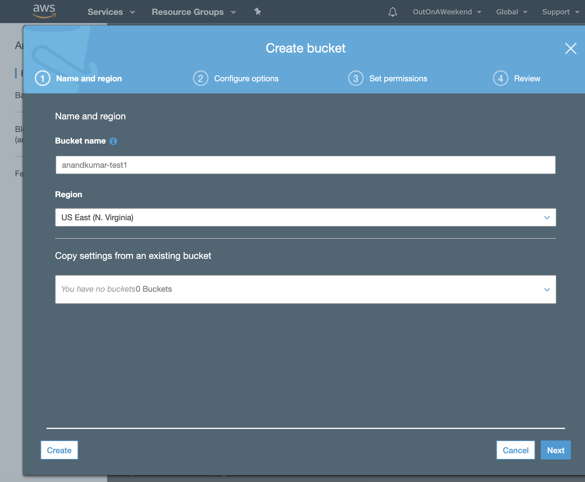 | 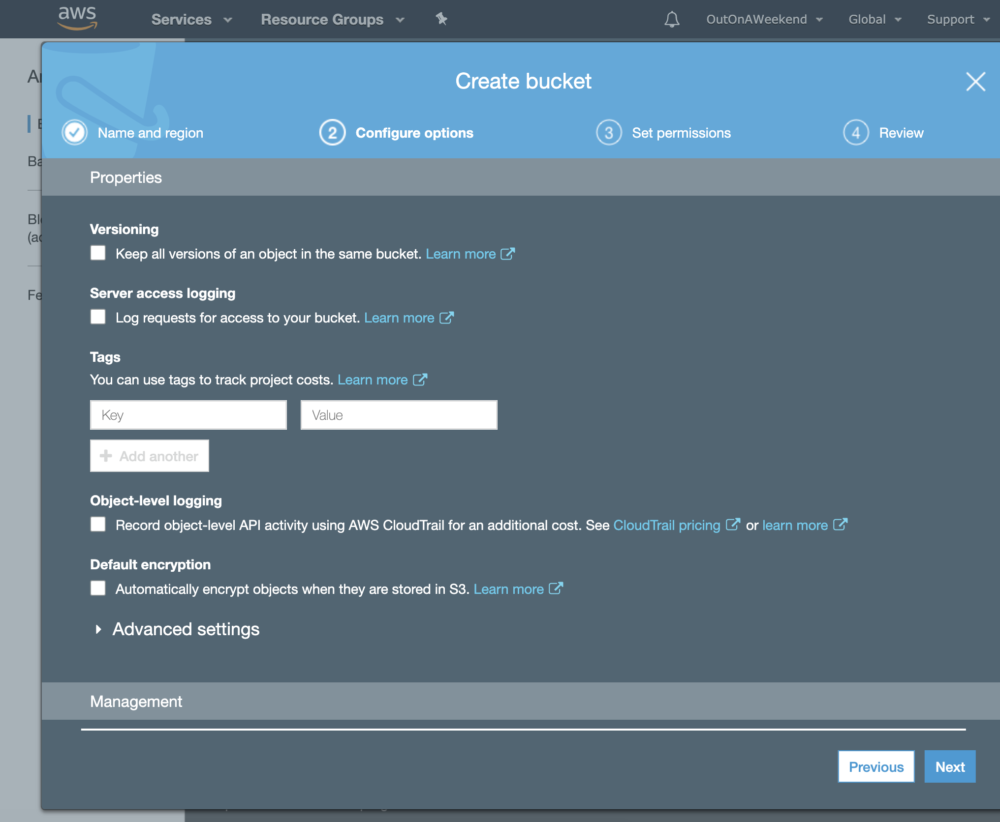 | 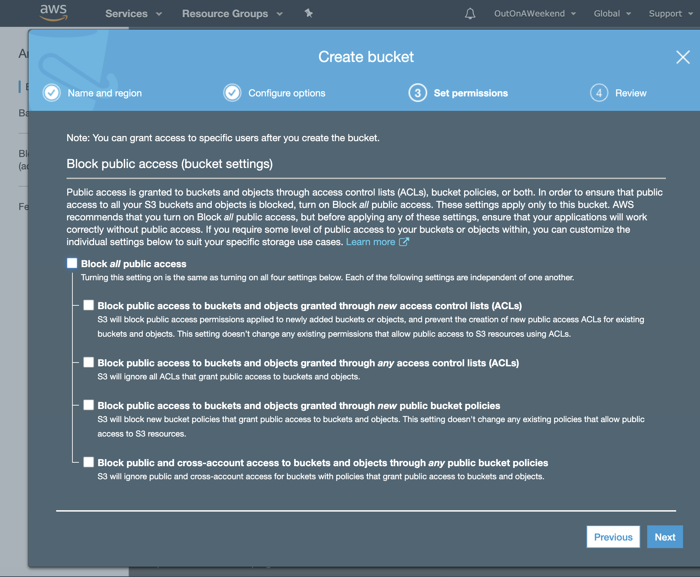

 4. Review  |  5. Bucket gets created  |
--- | ---
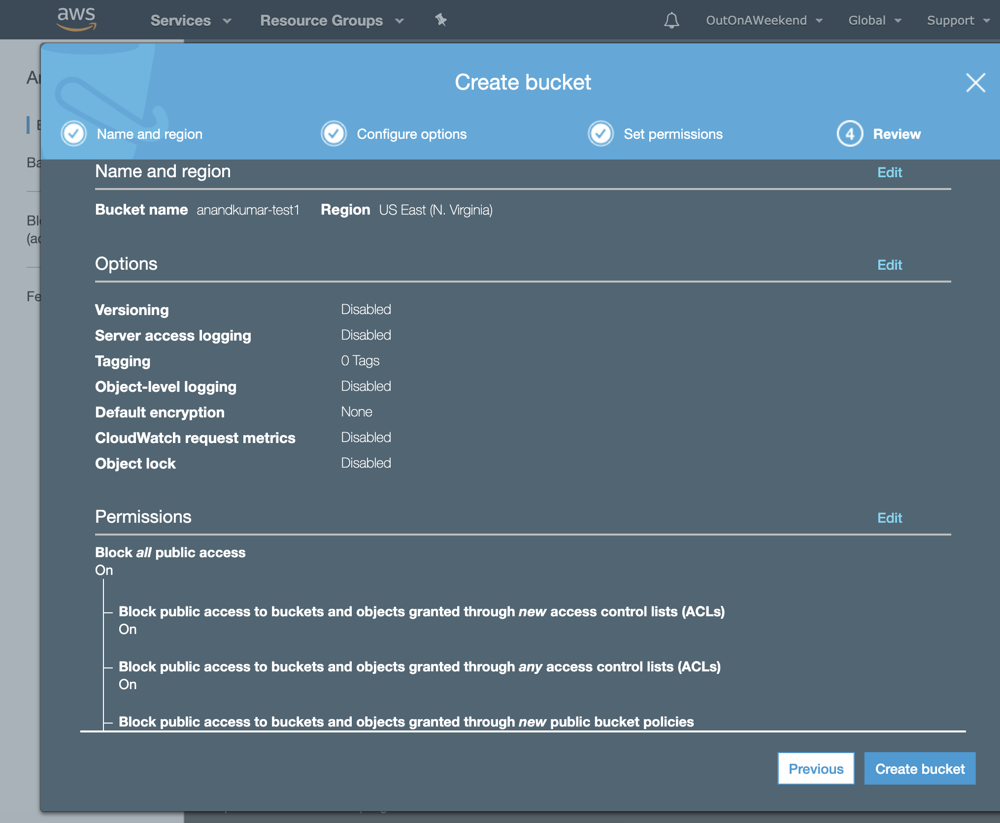 | 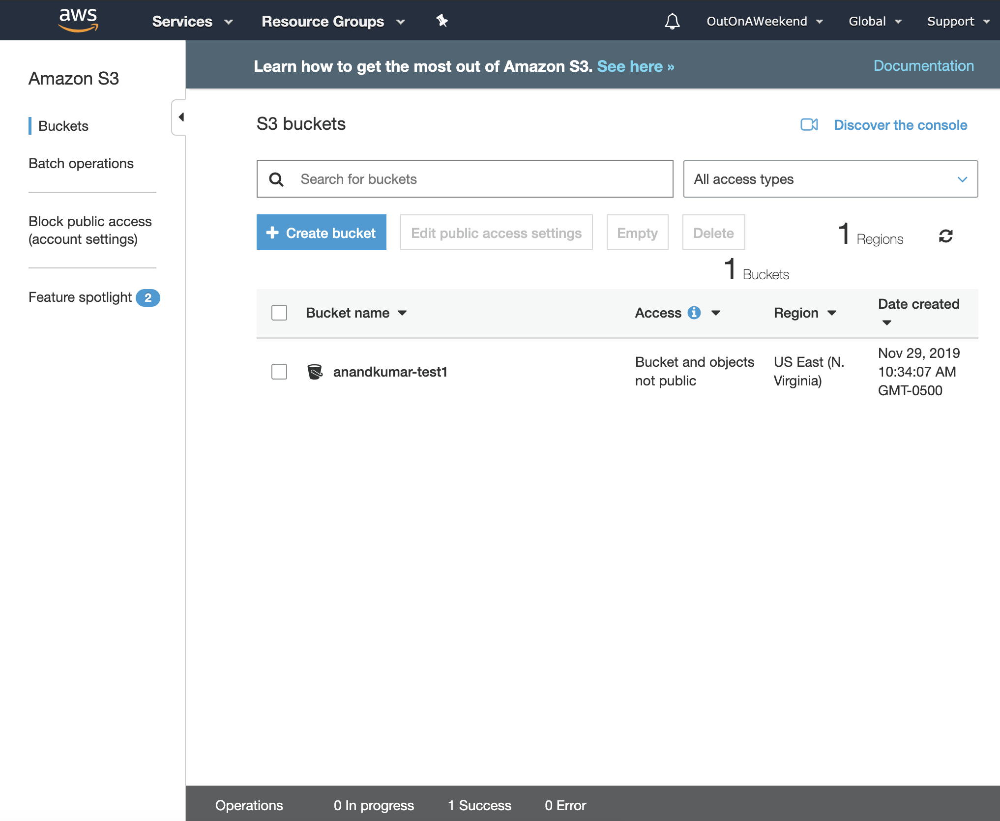

###### Uploading a file to a S3 bucket and making it accessible

Even if a bucket allows public access, files have to be made public individually.

When the file is uploaded, a 200 status code is received.

 1. Go to bucket and upload  |  2. Overview shows owner, storage class, etc.  |  3. Storage class can be changed in properties 
--- | --- | ---
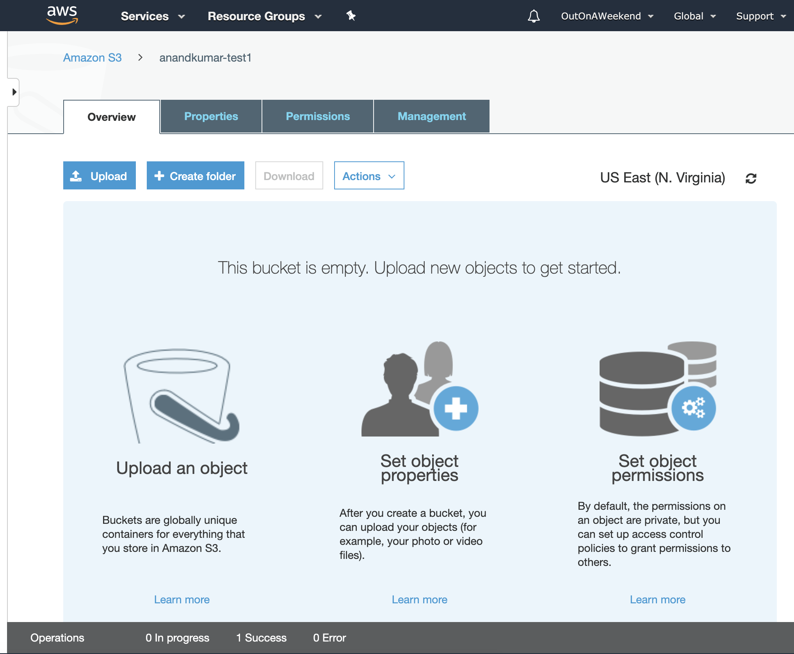 | 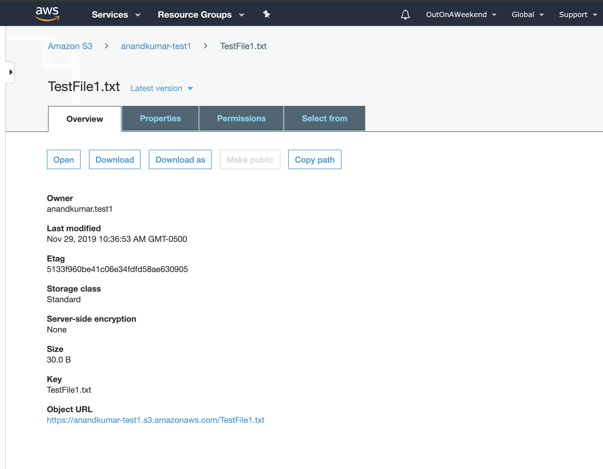 | 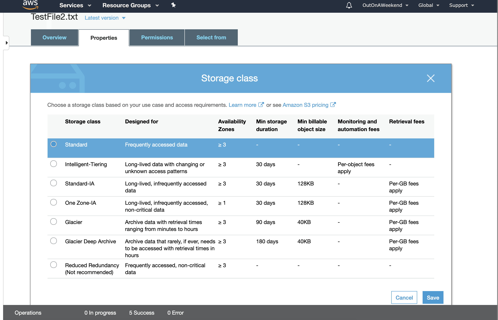

 4. Properties allows several things to be configured  |  5. Object is actually made public in Permissions 
--- | ---
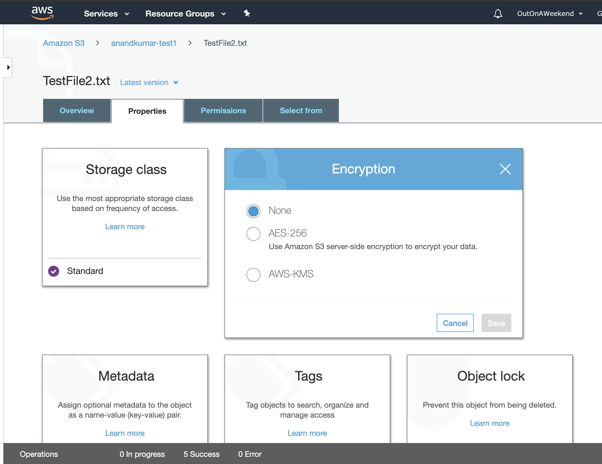 | 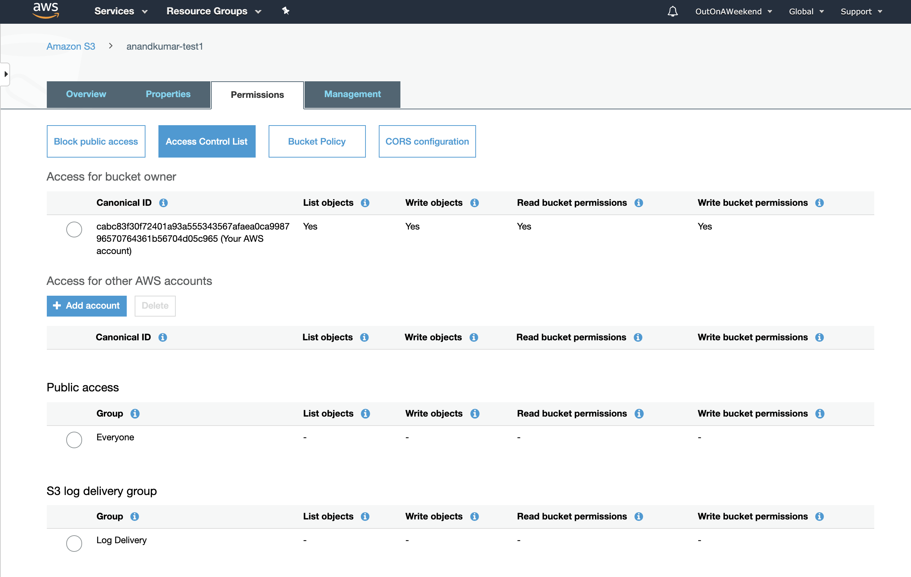

On a per object basis, things such as storage class, encryption, metadata, tags, object lock can be changed.

At a bucket level, things such as versioning, server access logging, static website hosting, object level logging and encryption can be changed.

Bucket permissions include configuring public access, access control list, bucket policy and CORS configuration.

> `Access Control List` allows to have fine grained control on access at a per object level. (need to see examples).  
> What really is `Permissions > Bucket Policy`.  

Management has more things like Lifecycle, replication and other configurations.

Lifecycle management probably means that objects can be moved across different tiers, for example once an object has reached a certain no. of days in age, etc.

###### Transfer Acceleration

`Transfer Acceleration` is a way to have quicker uploads to S3 (via edge locations). A dedicated URL like `xyz-s3.accelerate.amazonaws.com` is made available for it.
User uploads to edge location first.

There is even a website provided by Amazon which indicates how quick transfer acceleration will allow uploads to be compared to direct upload to S3 buckets.

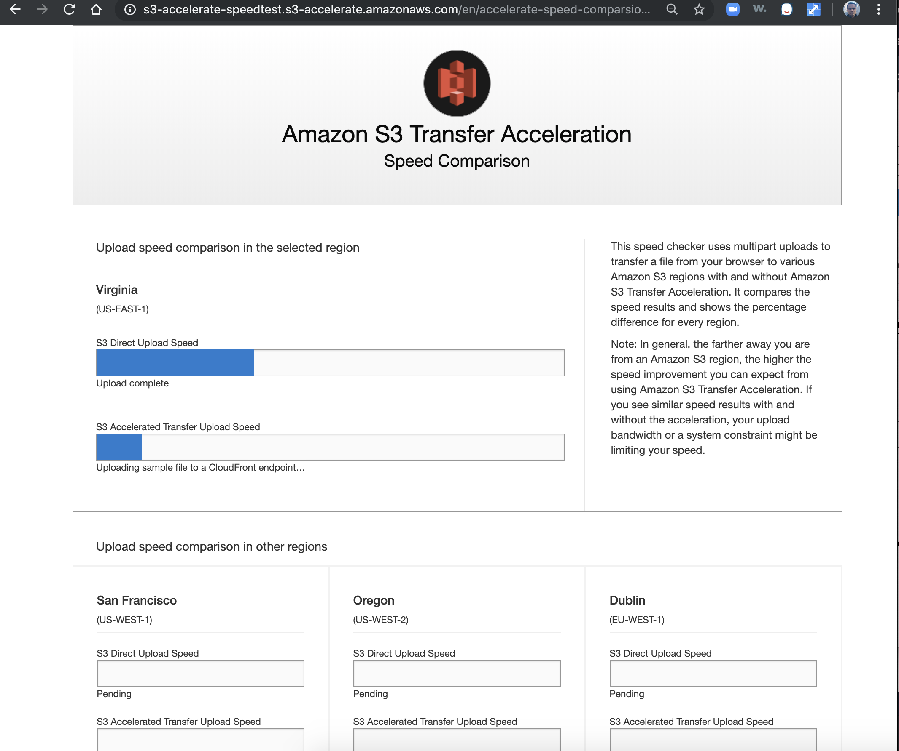
