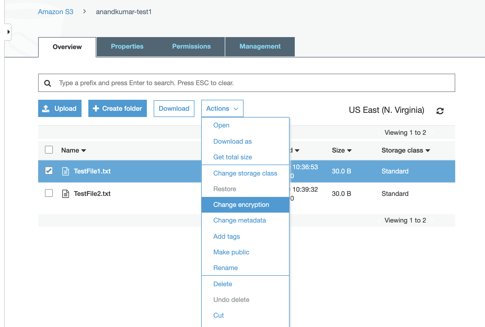
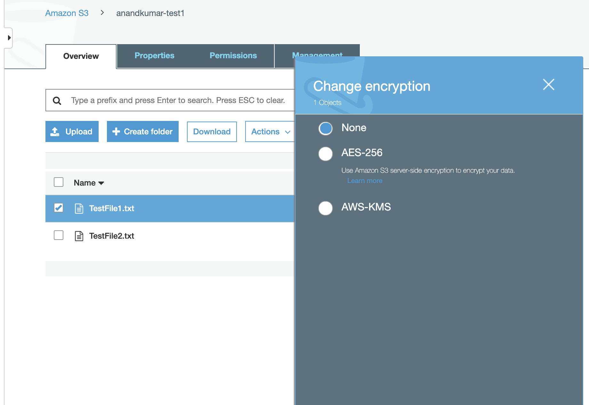
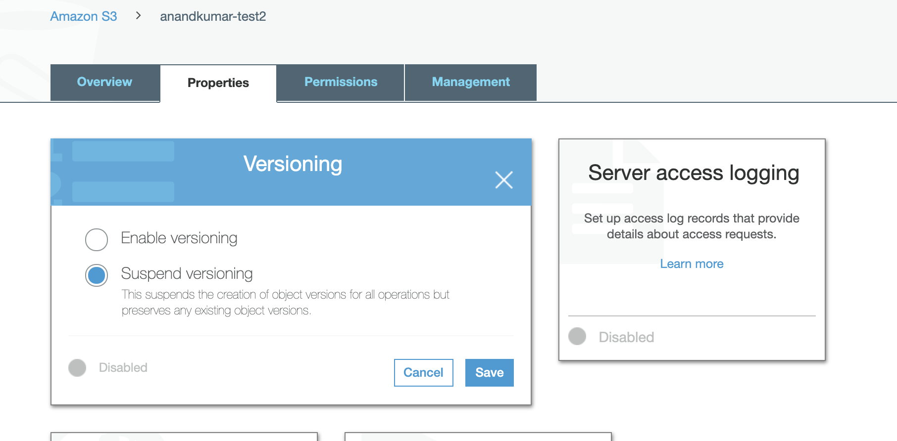
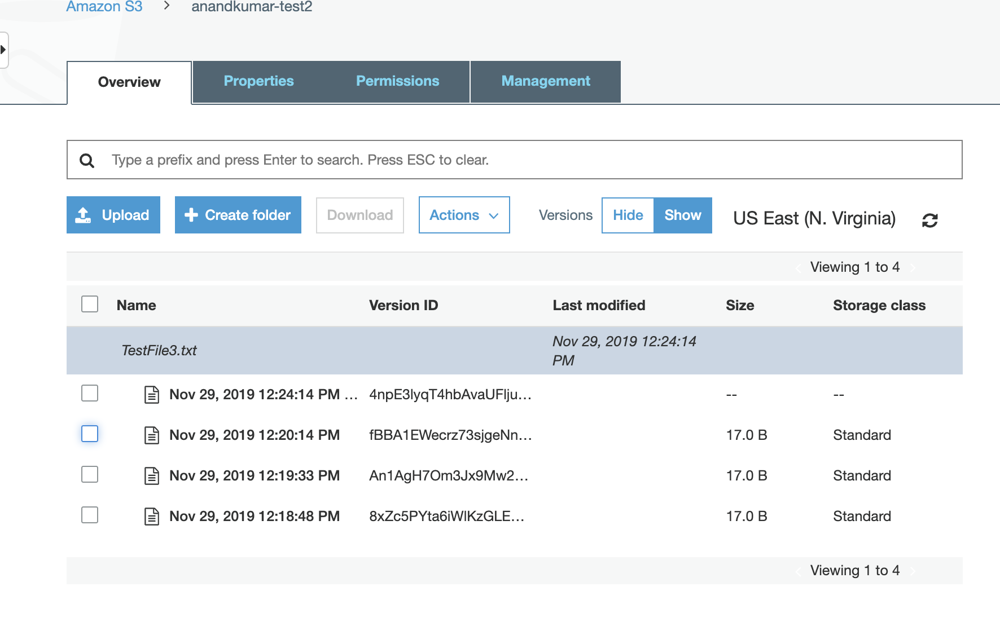

###### Enabling Encryption

`Encryption in Transit` is nothing but HTTPS/TLS calls and that is anyway there.

`Encryption at Rest` meaning the object itself being in an encrypted state. Server side encryption at rest can be done in 3 ways.
1. S3 managed keys (`SSE-S3`)

2. AWS key management service (`SSE-KMS`) (Keys managed by both AWS and user)

3. With customer provided keys (`SSE-C`) (User provides the keys)

Encryption of an object can be configured via `Actions > Change Encryption`.

 | 
--- | ---

###### Versioning

Once enabled versioning cannot be disabled, it can only be suspended.

Also keep in mind that if a file with same name is uploaded again, its public access is automatically reset to private. And it hence needs to be made public again.

 1. Enable versioning for the bucket  |  2. All versions showed in 'Versions > Show' 
--- | ---
 | 

If versioning is enabled and a file is deleted, the older versions still remain available. This is called as a `delete merker` being put on the file. If this marker is then deleted, the file gets restored. ([Delete marker reference](https://docs.aws.amazon.com/AmazonS3/latest/dev/DeleteMarker.html))
