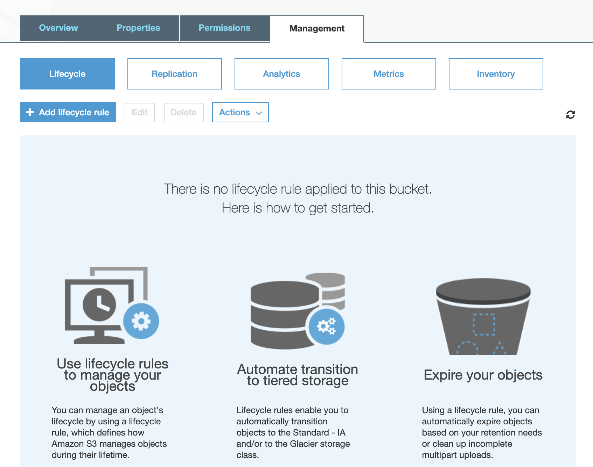
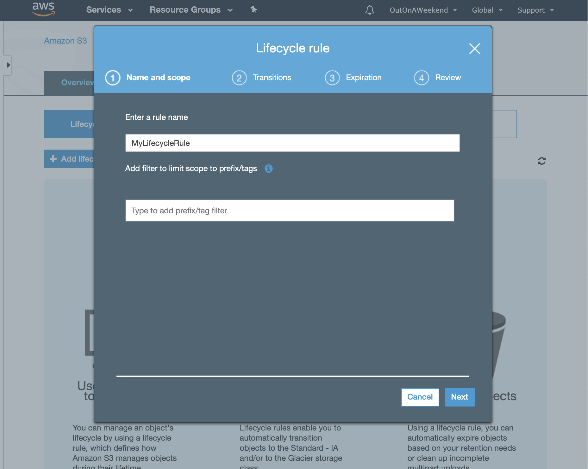
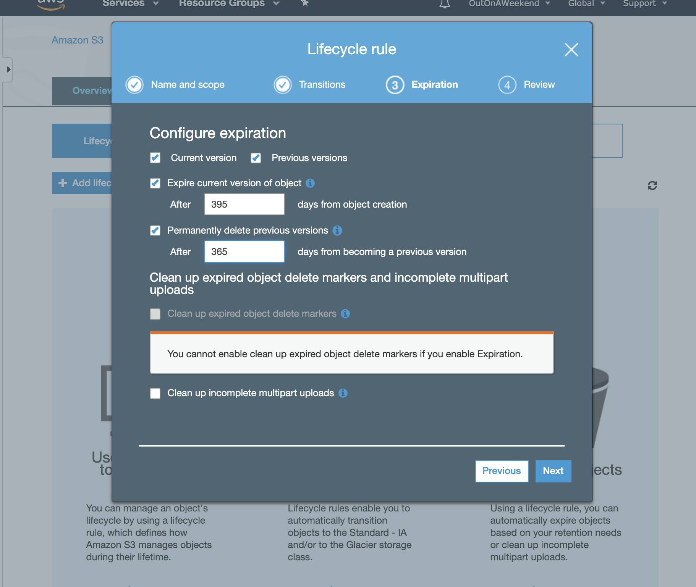
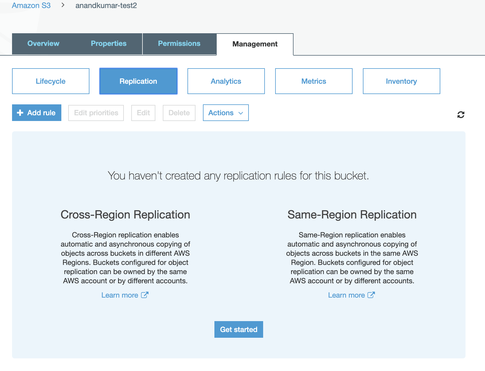
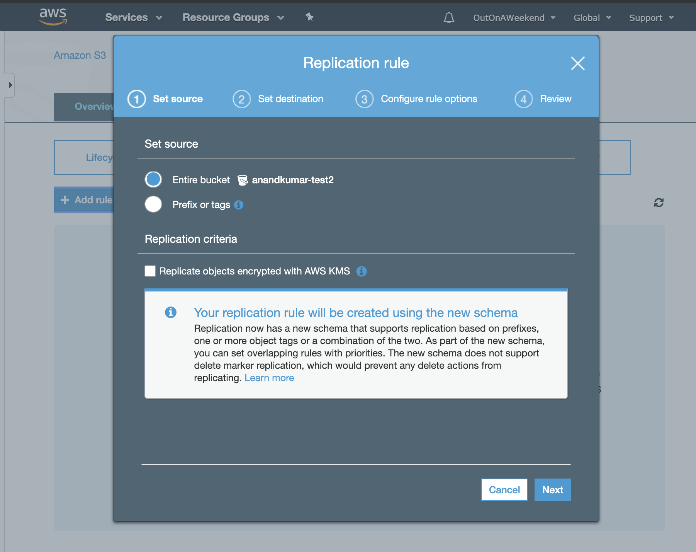
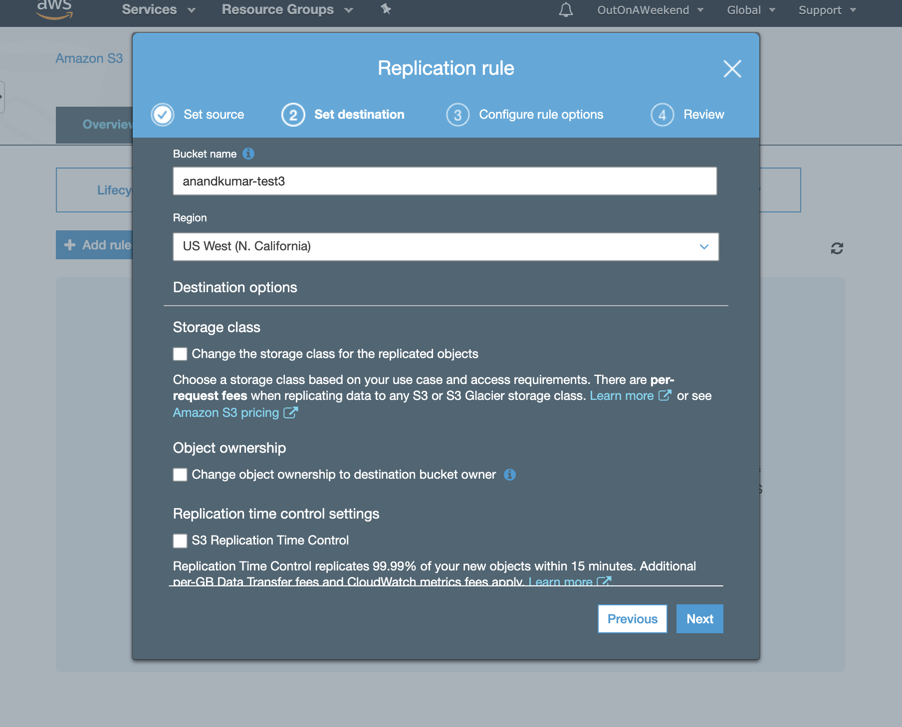
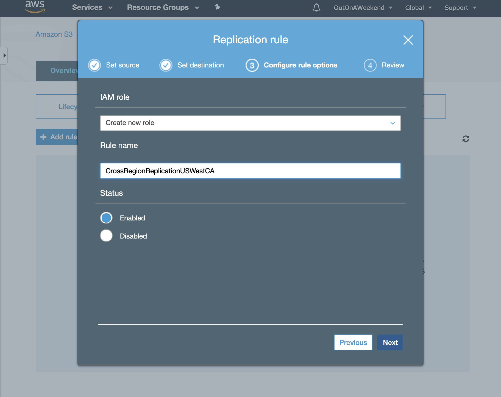
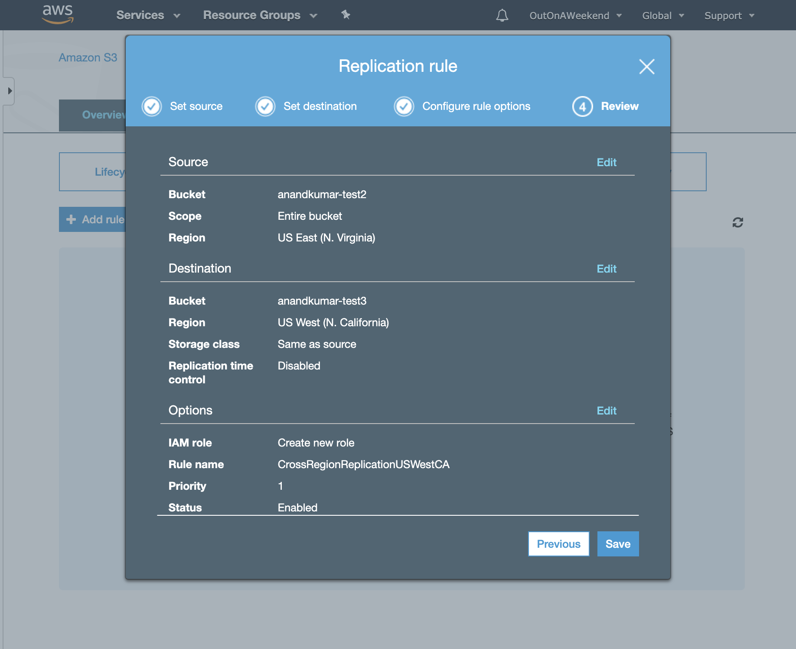
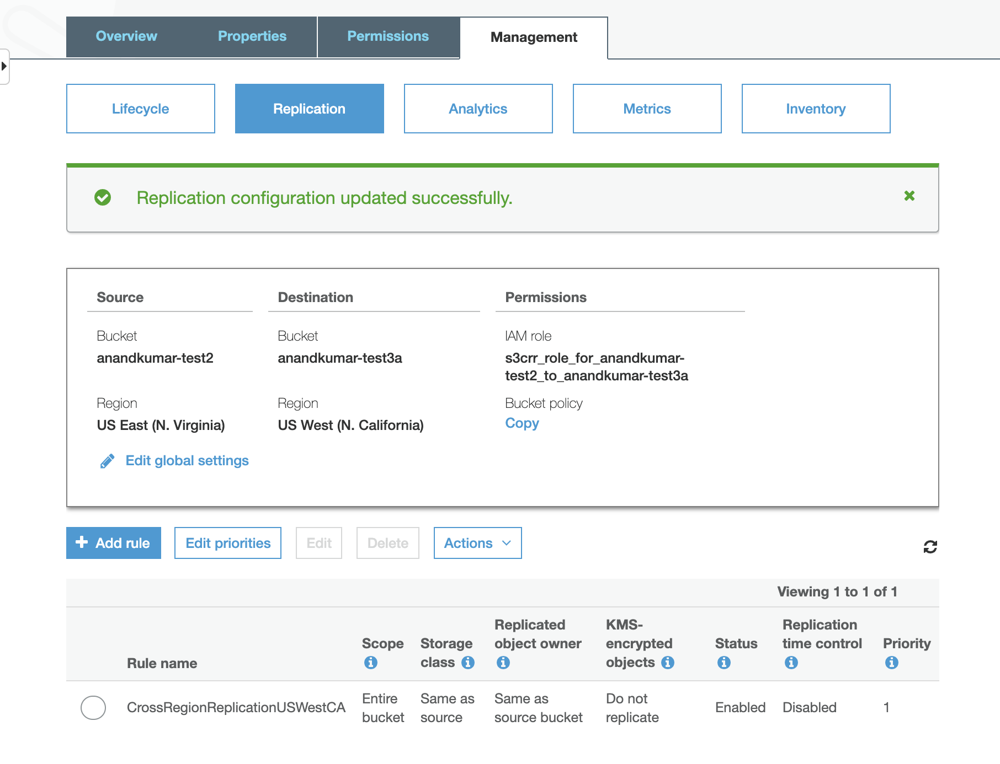

###### Lifecycle Management

Lifecycle rules are used to automatically move things between different storage tiers, and eventually even delete them. It is needed for effective cost management throughout an object's lifecycle. These are done by configuring `transitions` inside the lifecycle rules.

 1. Bucket > Management > Lifecycle  |  2. Enter Lifecycle Rule name  |  3. Enter Transitions and Review 
--- | --- | ---
 |  | 

###### Cross Region Replication

Cross Region replication enables new objects upload to a S3 bucket to be automatically uploaded to another S3 bucket in a different region.

It can only be done if versioning is enabled in both source and destination buckets.

Keep in mind that objects already in bucket do not get copied when the replication is set up. Also after that for new objects as well, delete markers are not replicated. If a file version is deleted, then that is not replicated either.

 1. Bucket > Management > Replication  |   2. Set source (entire bucket or just some tags, etc. ) |  3. Enter destination bucket and region 
--- | --- | ---
 |   | 

 4. Enter IAM Role  |  5. Review  |  6. Done 
--- | --- | ---
 |  | 

> `Cross region replication` is one place where `IAM Roles` come into play. An appropriate role has to be specified for the replication to work.
