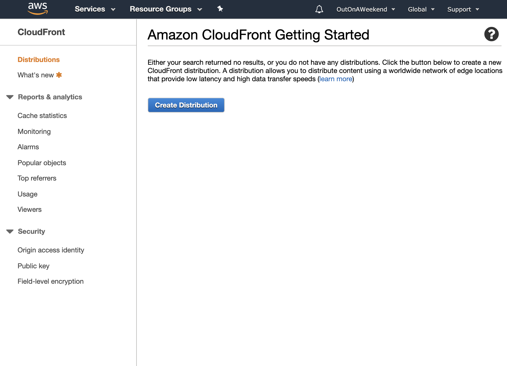
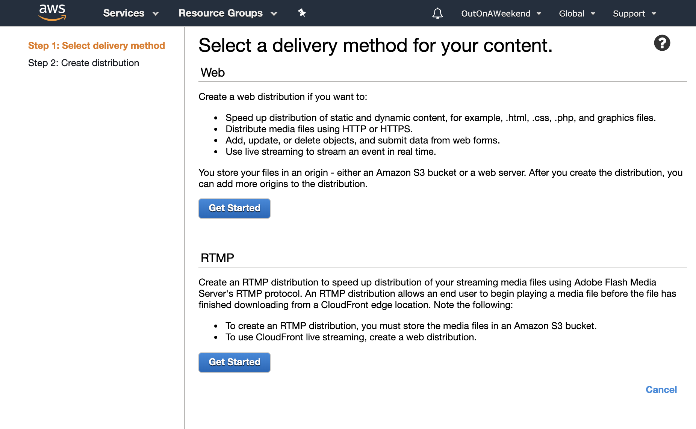
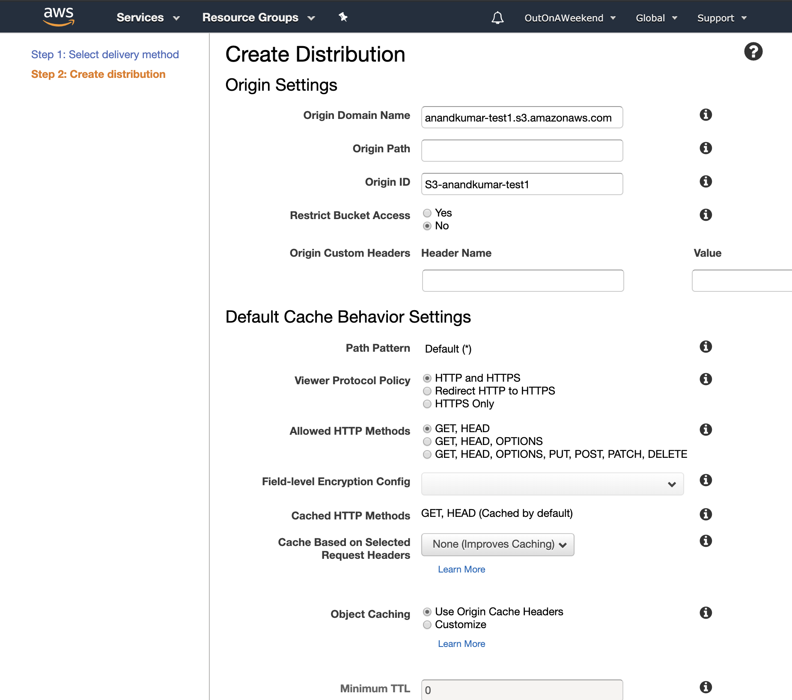
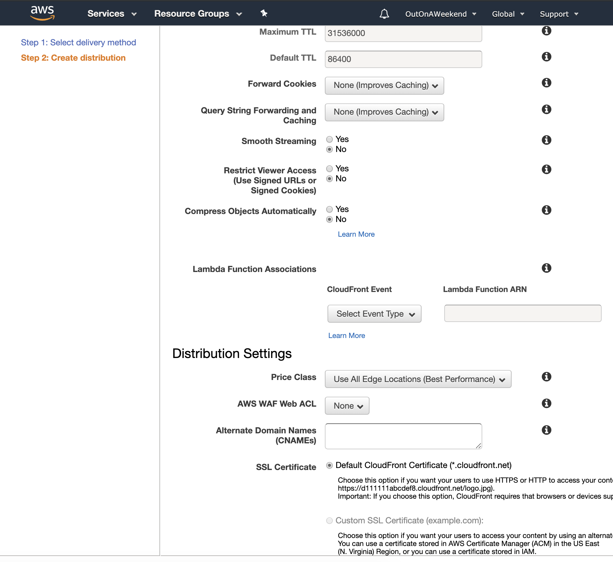
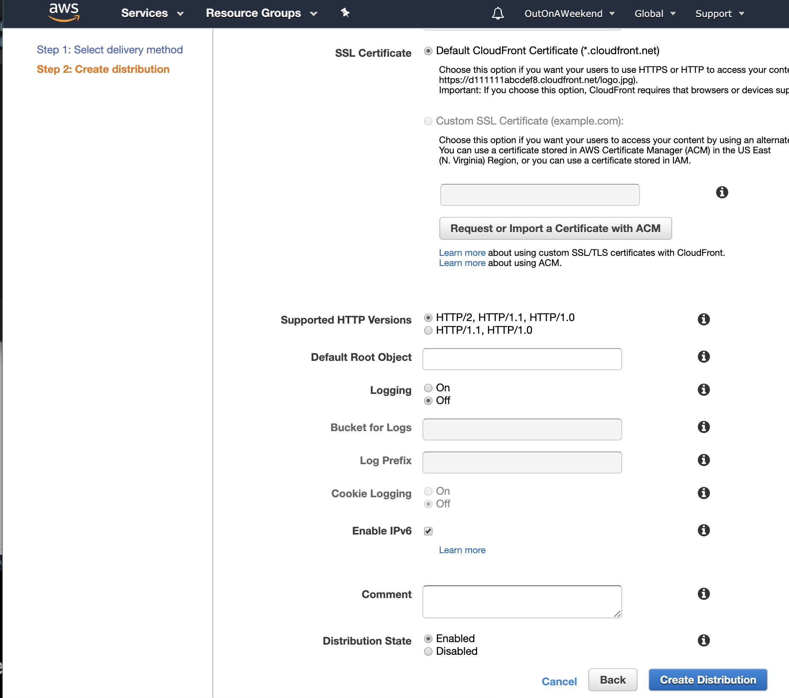
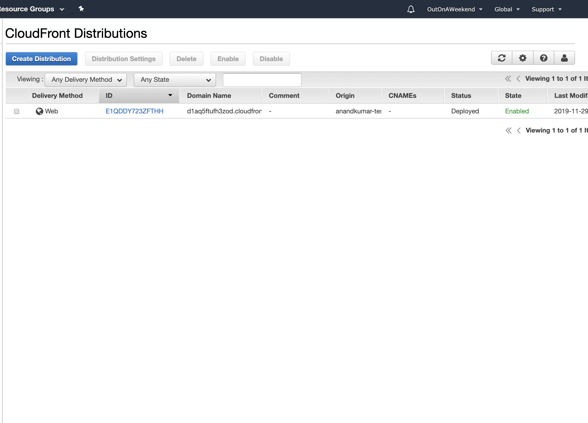
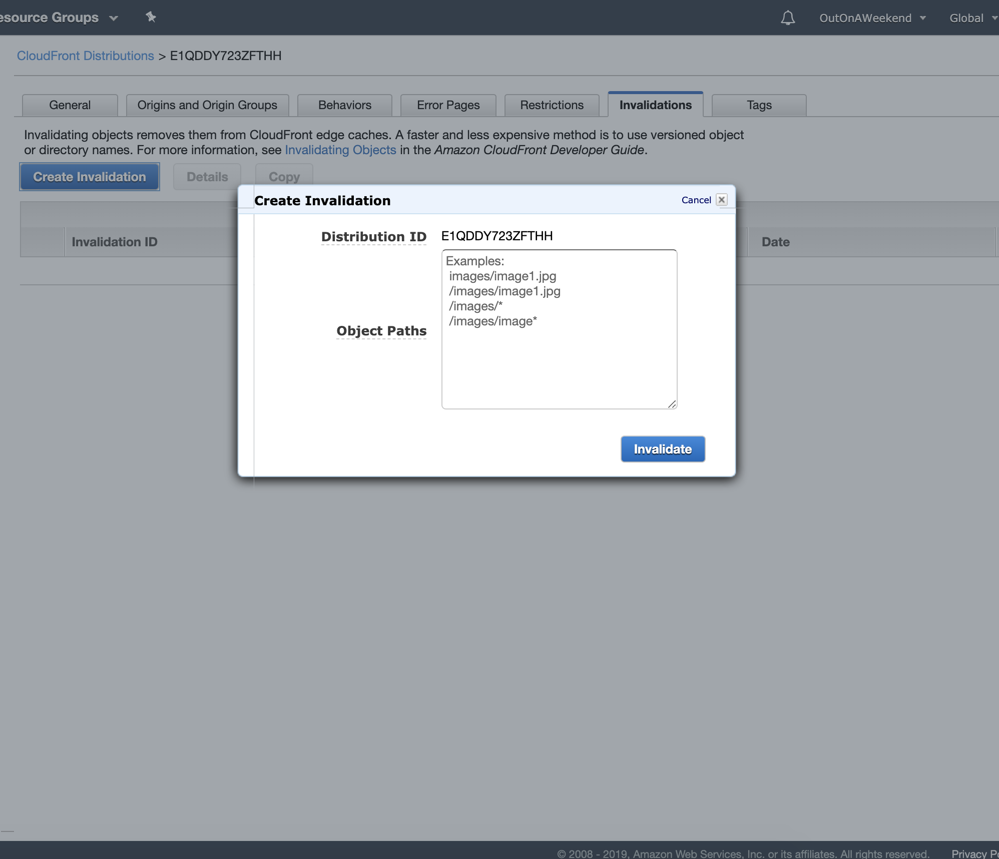

#### CloudFront

`CloudFront` is a CDN (Content Delivery Network), i.e. a system of distributed servers that caches often used content (including webpages) as needed. Cached objects can even be cleared manually (but this is chargeable).

`Edge Location` is where the content is cached. It's different from a Region or AZ. Incoming requests are automatically routed to the nearest edge location. In fact they aren't just for downloading from, things can even be uploaded to them.

`Origin` is the origin of all the files that the CDN distributes. So these can be S3 bucket, EC2 instance, Elastic Load Balancer or Route53.

`Distribution` is the name given to CloudFront or CDN in general.

`TTL (Time to Live)` is the duration for which content is cached in edge locations. It is configurable.

There are 2 kinds of CloudFronts - `Web distribution` (used for websites), `RTMP` (used for media streaming and Adobe)

`CloudFront` service is in Networking category, and not in Storage. And `CloudFront` too is a global service (like IAM).

###### Creating a CloudFront Distribution

 1. CloudFront > Distributions > Create  |   2. Select distribution type 
--- | ---
 | 

And then several things about the CloudFront distribution can be configured.

`Origin domain name` is the origin bucket in question.  
`Origin path` is a sub-folder in the bucket, if applicable.  
`Restrict bucket access` means users can only access S3 content using cloud front URL and not the direct S3 URL.  
The `TTL` too can be configured here.

> Access can also be restricted to only signed URLs (something to do with some cookies being present in the requests).

 |  | 
--- | --- | ---

Creating a CloudFront distribution can take some time (15-20 min), and then it eventually gives a unique domain such as `d1aq5ftufh3zod.cloudfront.net` corresponding to the specified source. The CloudFront URLs for the objects is `http://d1aq5ftufh3zod.cloudfront.net/TestImage1.png`, etc.

 Takes a while to be created  |   Cache invalidation is done via 'Distribution Settings > Invalidation' 
--- | ---
 | 

Invalidation means the corresponding cached copy is cleared. Specifying `/*` as object path invalidates everything. Keep in mind though that invalidation is charged.
