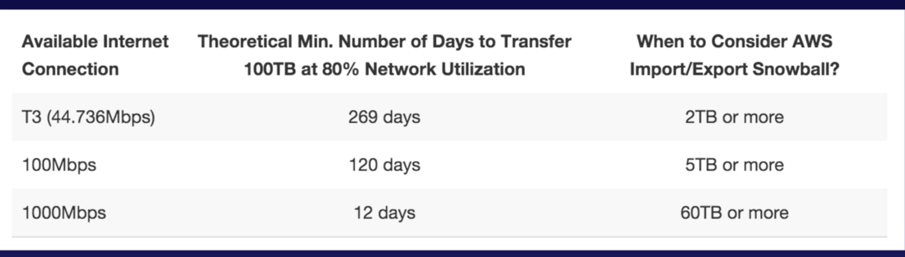
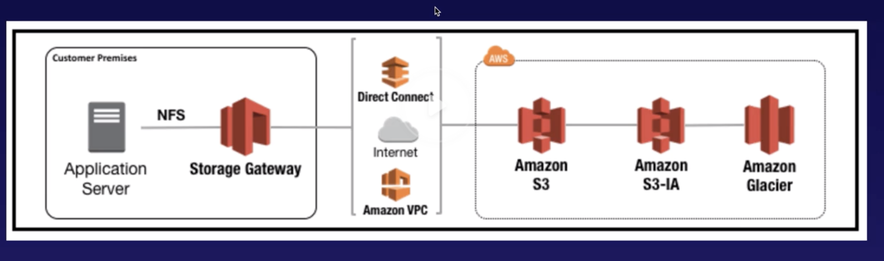

#### Snowball

`Snowball` is a big disk that uses secure appliances to transfer large amounts of data (Petabyte scale) into and out if AWS (it can both export and import to S3). Transferring data with Snowball is simple, secure as well as lot cheaper. While transporting, data is 256-bit encrypted and once transferred data is erased from the appliance.

`Snowball Edge` has a capacity of 100 TB. It even has compute abilities, i.e. Lambda functions. It can hence support local workloads in remote or offline locations.

`Snowmobile` is a Exabyte scale data transfer service, basically a semi-trailer truck.

A diagram that indicates when it makes sense to use Snowball.

#### Storage Gateway

`Storage Gateway` is a service that connects an on-premises software appliance with cloud based storage to provide seamless and secure integration between an organization's on-premises IT environment and AWS storage architecture. It previously only used to be virtual appliance, but is now available as a physical appliance as well.

It can be of 3 different types.

1. `File Gateway (NFS or SMB)` - Stores files in S3, which can then be accessed through Network File System (NFS). Ownership, permissions, and timestamps are stored as object's metadata in S3. Bucket policies, versioning, etc. become automatically available too.

2. `Volume Gateway (iSCSI)` - Stores copies of virtual drives to cloud. Uses iSCSI block protocol. Data written to these volumes get asynchronously backed up as point-in-time snapshots of volumes and is stored in the cloud as EBS snapshots (it probably still is being stored in S3). It has 2 further sub-types.  
a. `Stored volumes` - It lets you store the primary data locally, while asynchronously backing up that data to AWS. This allows low latency access to entire datasets for on-premises applications (as EBS snapshots). Currently 1 GB to 16 TB size is allowed for stored volumes.   
b. `Cached volumes` - It does not do the entire dataset locally, but only the frequently accessed data. They can be up to 32 TiB in size. The Gateway stores this data to S3. This S3 data however cannot be accessed using AWS S3 API or AWS console.

3. `Tape Gateway (VTL)` - It gives ways to archive data in cloud, and hence allows to move away from existing tape based infrastructure.

> `Storage Gateway` used to be used a lot in earlier times, but is probably not much anymore.

