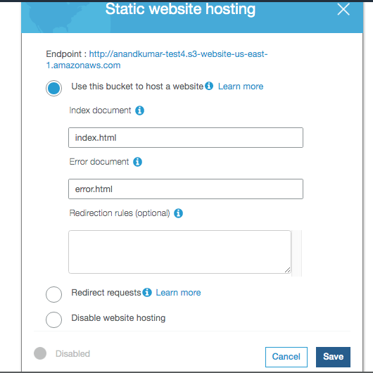

###### S3 static website hosting

If `static website hosting` option is used in S3, then I think it becomes very easy to even have a simple website. You just need to upload a home page html and an error page html.

--------
