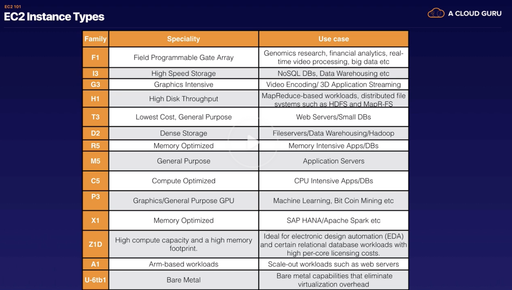

#### Elastic Compute Cloud (EC2)

To put it simply, `EC2` allows you to create and boot new server instances. It provides resizable compute capacity in cloud, i.e. its capacity can be quickly scaled up or down based on requirements. ([reference](https://docs.aws.amazon.com/AWSEC2/latest/UserGuide/concepts.html))

Instances are virtual servers that can run applications. They have varying combinations of CPU, memory, storage, and networking capacity,

So, AMI ~ VM and Instance ~ Virtual server?

EC2 instance ~ Virtual Machine or Server

Amazon Machine Image (AMI) is what is booted to configure an instance.

###### Pricing Model
 

1. `On Demand` - Fixed rate by the hour or second that it runs. Useful for low cost and flexibility without any long term need.

2. `Reserved` - Capacity reservation. Useful for steady state or predictable usage applications. Comes in further sub-types.  
a. `Standard`-  The more you pay upfront, the more discount you get. Can't convert one instance type to another. There are different instance (i.e. VM types) as well.  
b. `Convertible` - Allows to change instance type.  
c. `Scheduled` - Allows to schedule instances for specific time windows.

3. `Spot instances` - Prices increases and drops for excess capacity as it happens, and is hence unpredictable. You bid for the price you want to pay, and if it gores more than that the instance becomes unavailable.

4. `Dedicated hosts` - Dedicated for you. It is especially useful for applications with regulatory requirements with regards to not having multi-tenant virtualization.

> If a spot instance is stopped by Amazon, you are not charged for a partial hour usage but if you stop it yourself, you are charged.

###### Instance Types

There are several different instance type. ([reference](https://aws.amazon.com/ec2/instance-types/))

A mnemonic to remember the above types - `FightDrMcPxzAu`  
Also, the family codes of these instance types are always evolving.
