###### Usual steps

Here are the typical steps while creating a new instance.

The basic AMI type is `Amazon Linux 2 AMI (HVM), SSD Volume Type`.  
The default instance type is `General Purpose > t2.micro`.

 1. Choose AMI  |  2. Choose Instance Type  |  3. Configure Instance Details 
--- | --- | ---
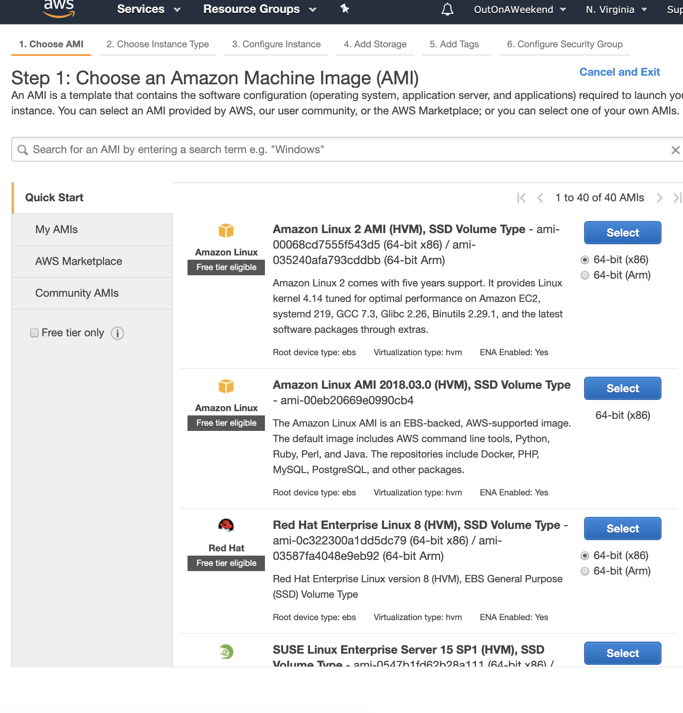 | 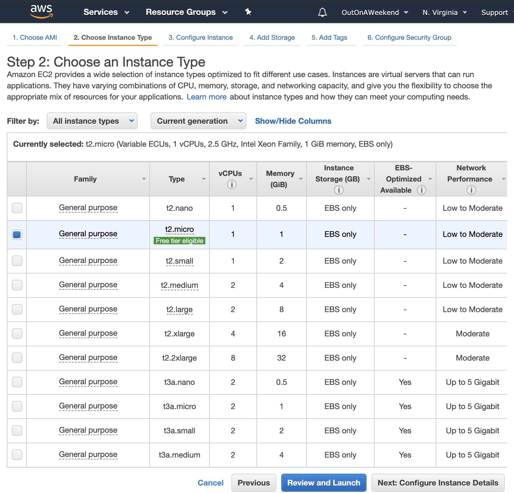 | 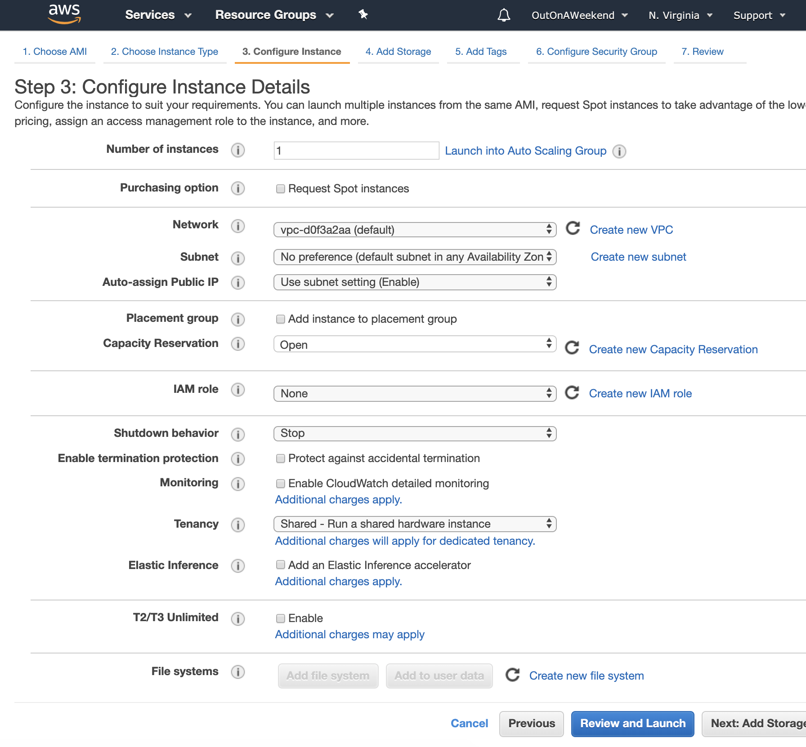

 4. Add Storage  |  5. Add Tags  |  6. Configure Security Group 
--- | --- | ---
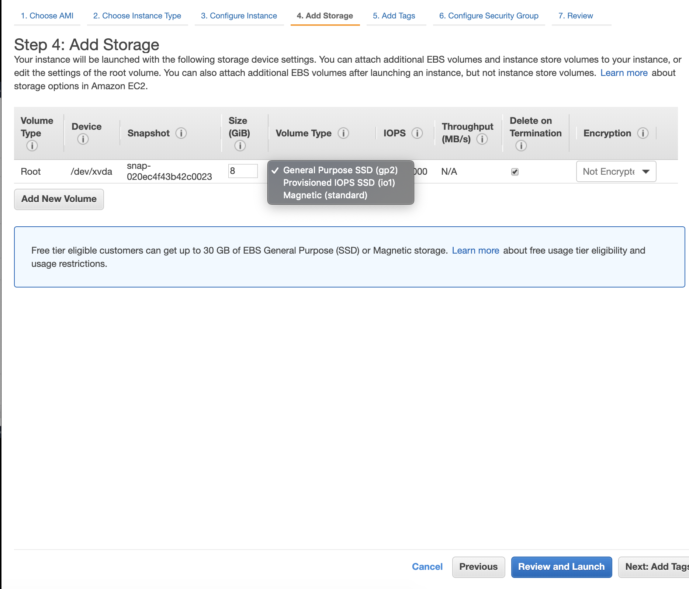 | 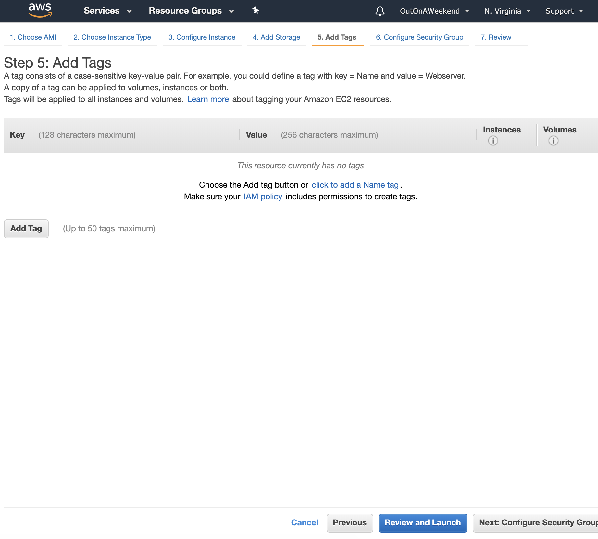 | 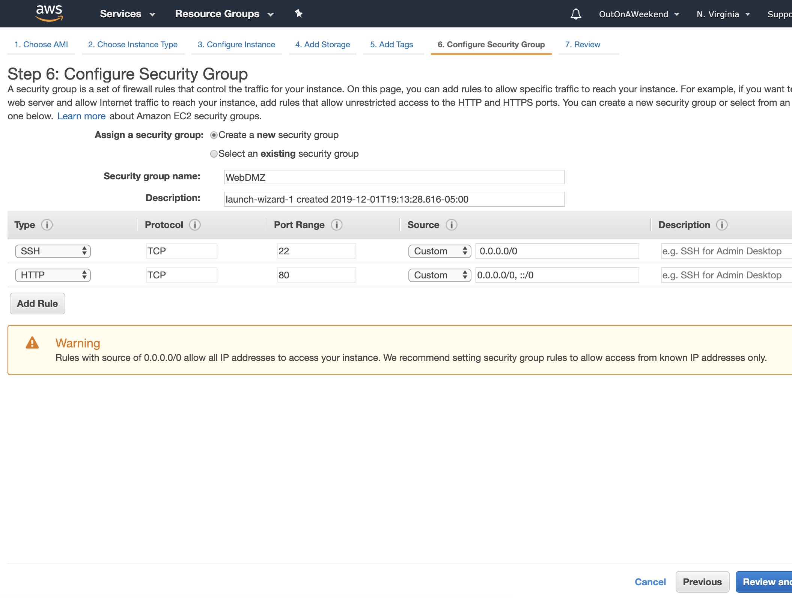

 7. Review  |  8. Launch Instance   (Will need a key pair)  |  9. Launched 
--- | --- | ---
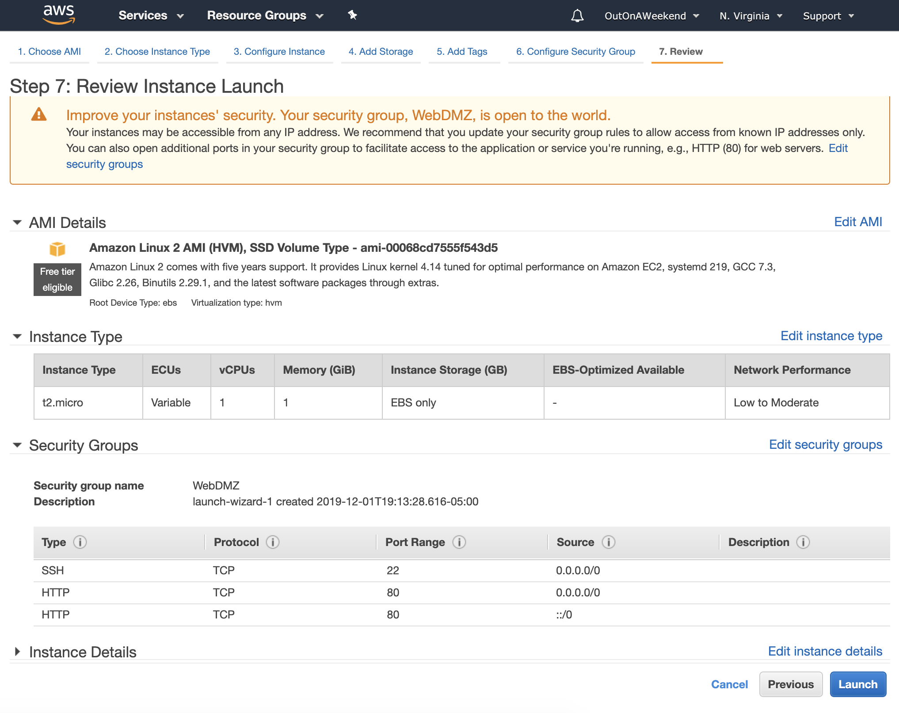 | 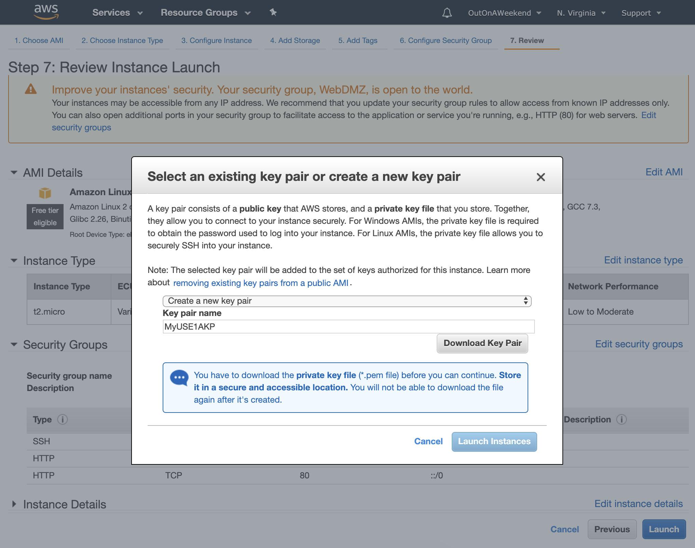 | 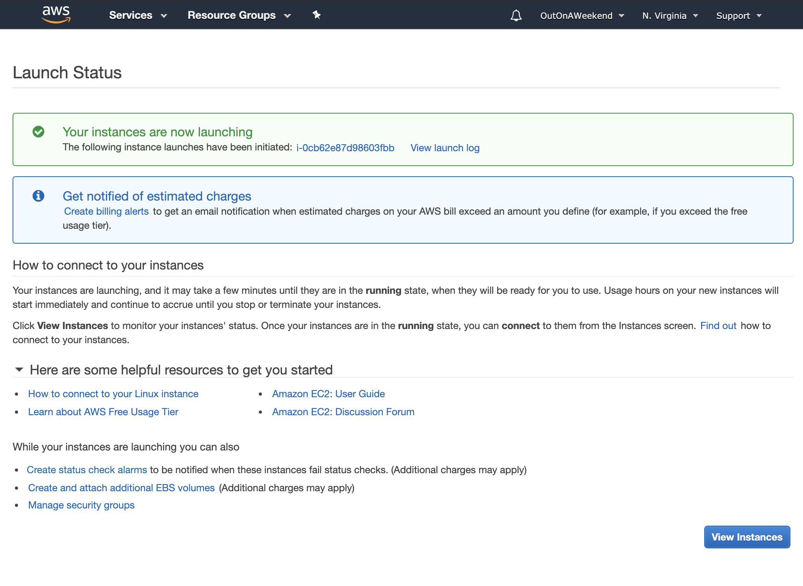

Once instance is created, many of its details such as DNS address, instance ID, public IP address, etc. become visible.

###### Options while configuring instance details

`Subnet` is how you choose what availability zone the instance gets created in. Availability Zones that are shown there are available are totally random.  
`Placement group` is for high performance capacity reservation.  
`Tenancy` type specifies if the instance should be on physical servers fully dedicated for your use.  

`Termination Protection` is turned off by default.

`Shutdown Behavior` can also be specified. The possible values are Stop and Terminate.  
`Advanced Details` is where you can add a bootstrap script.

 Subnet  |  Tenancy 
--- | ---
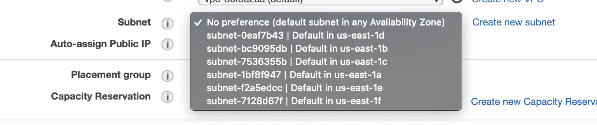 | 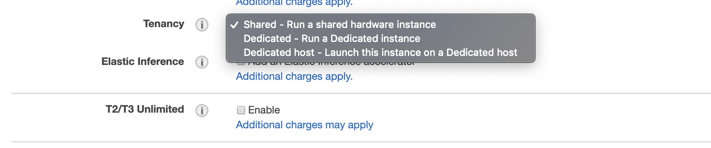

###### Adding Storage

`Storage Type` is where the drives in the instance get specified.  
`Volume Type` options available by default are `General Purpose SSD`, `Provisioned IOPS SSD`, `Magnetic`. Root device volume can only be launched with these types. Additional volumes can also be added, and these get more options.  

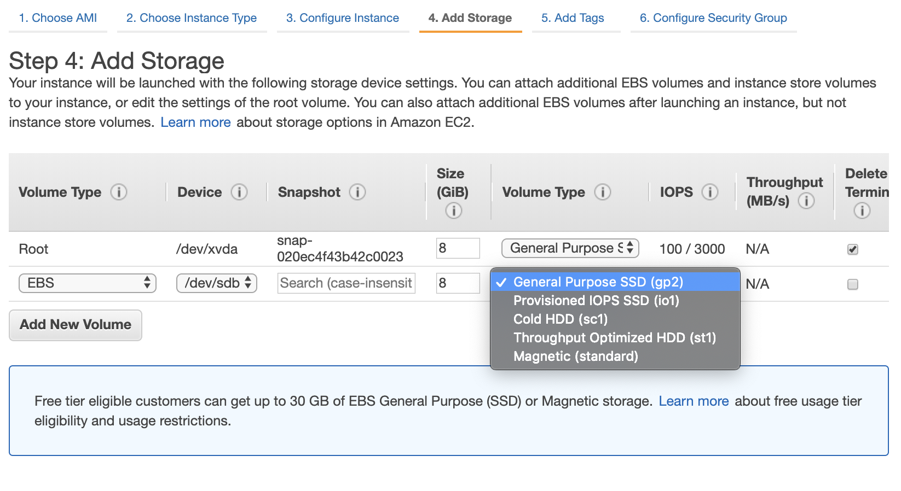

`Root volume` (while specifying storage in instance creation) is where the VM's OS gets installed. That is also where there is an option for enabling 'Delete on Termination'.

It's even possible to have different 'Delete on Termination' behaviors for different volumes of the same EC2 instance.

Encryption to be used too can be specified here. There can probably even be different encryptions used for different volumes.

> `IOPS` means Inputs Outputs Per Second

On an EBS backed instance, the default action is for the root EBS volume to be deleted when the instance is terminated. But any additional volumes will not be deleted (if default options were used while adding the volume).
> What is an EBS backed volume BTW, did not see this term in the screen for adding a volume.

While the EBS root volume of default AMI can be encrypted, it's also possible to do this while creating the AMI itself (in the console or even via the API).

###### Security Groups

`Security Group` is a virtual firewall that controls traffic to EC2 instances (it basically controls which ports allow what kind of communications). For example, HTTP may go over port 80, SSH may go over port 20.

A source of `0.0.0.0/0` in Security Group allows all IP addresses to access the instance.

#### Misc.

All the instances can be seen in the EC2 dashboard.
 
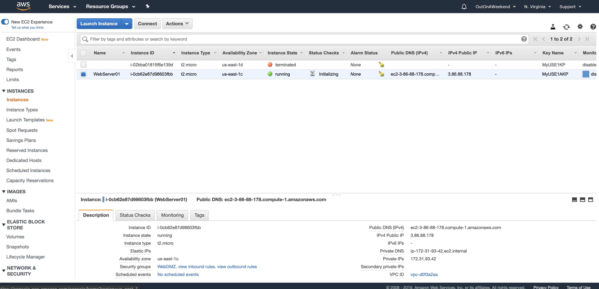

After you terminate an instance, it remains visible in the console for a short while, and then the entry is automatically deleted.
