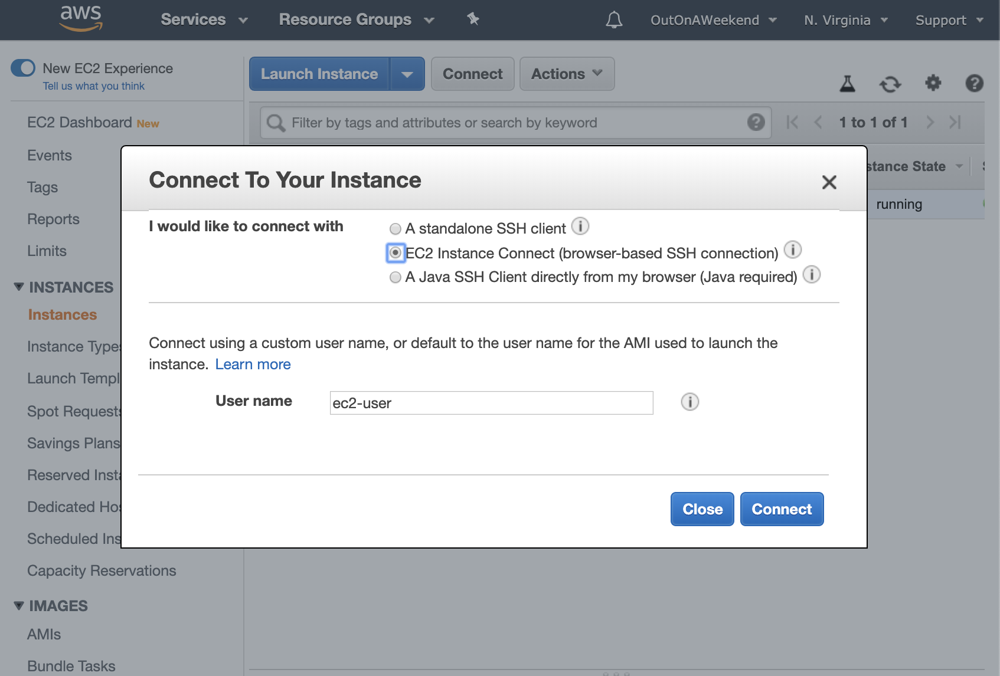
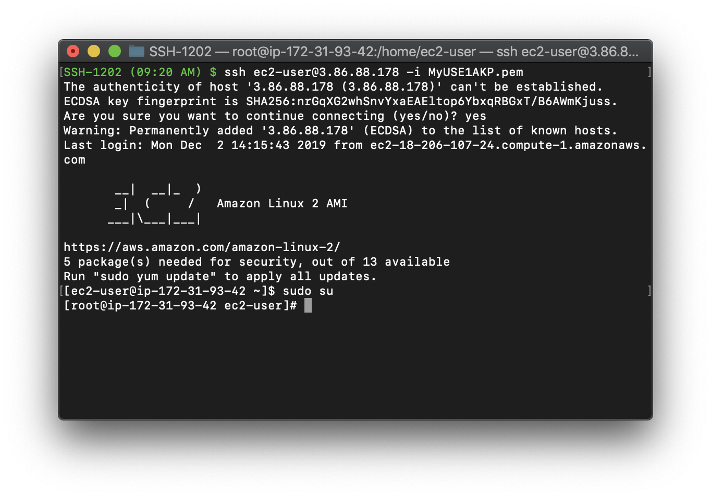
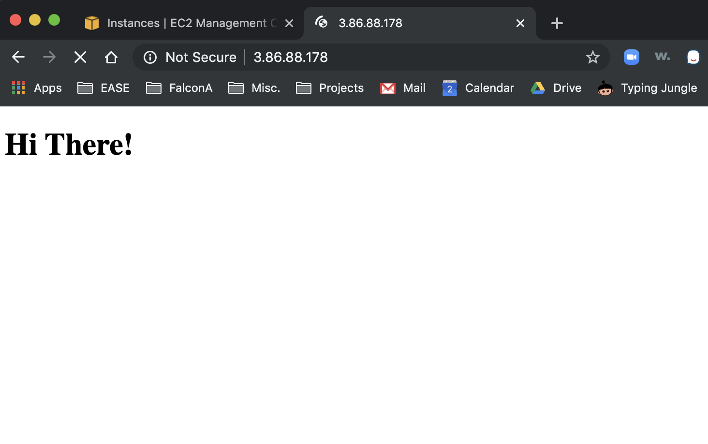
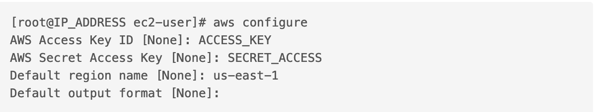
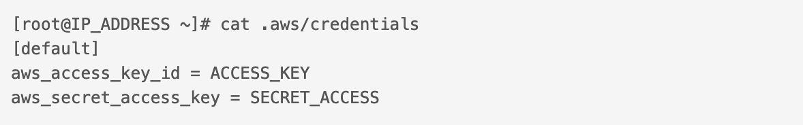
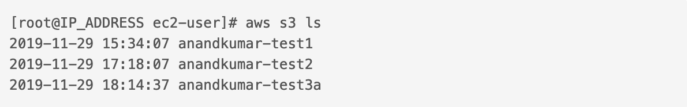
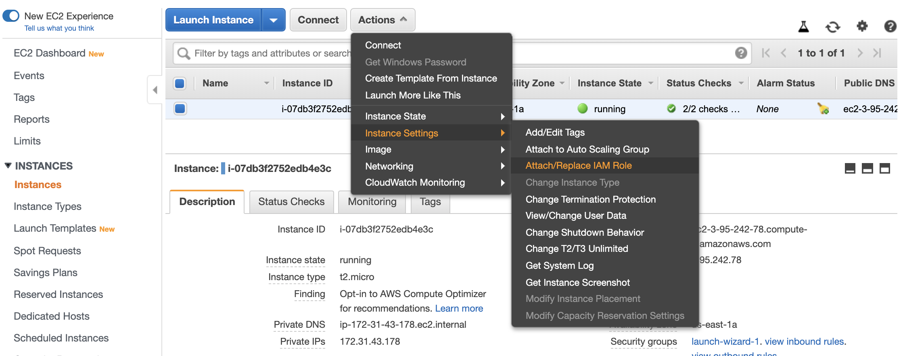
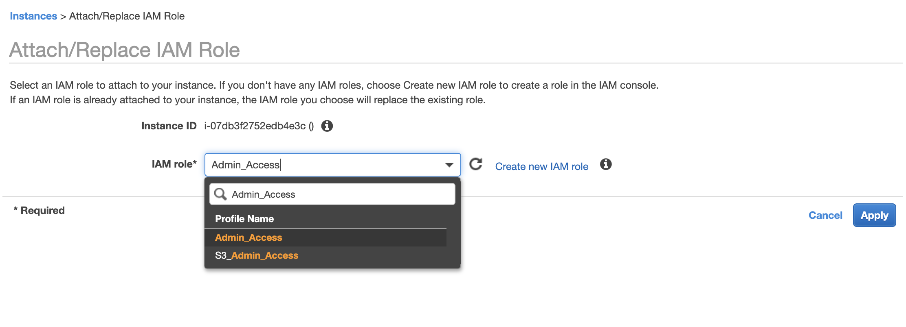
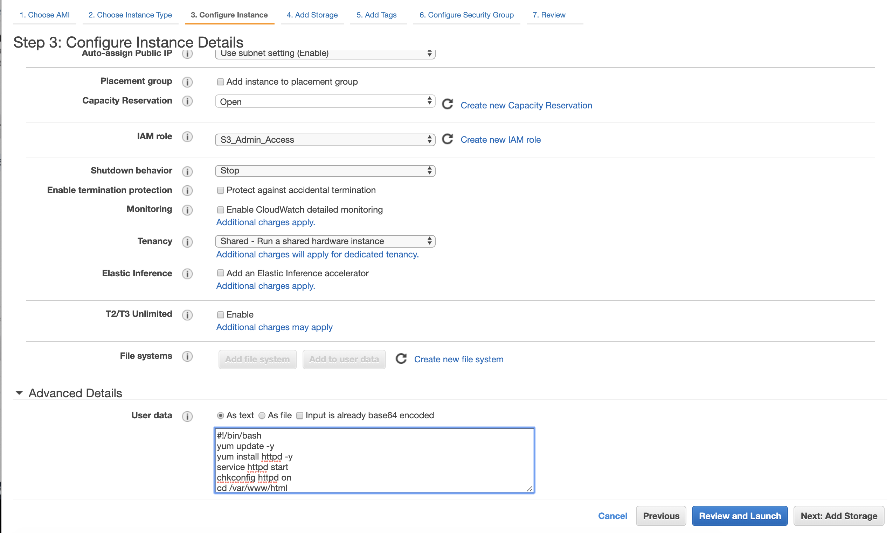

#### Connecting to EC2 Instance

A given EC2 instance can be connected to in 3 different ways.

`Standalone SSH client` is how a SSH connection can be made via Terminal. <br>
`EC2 Instance connect` opens a terminal like interface in the browser itself and that can be used.


[AWS CLI reference](https://docs.aws.amazon.com/cli/latest/reference/)

###### Connecting via command

This is the command to make the connection.
```
ssh ec2-user@THE_IP_ADDRESS -i THE_PEM_FILE_NAME_WITH_EXTENSION
```
Here `THE_PEM_FILE_NAME_WITH_EXTENSION` is the key pair file name for the instance, and `THE_IP_ADDRESS` is the public IP for the instance. This IP is available in Instance > Descriptions.



###### Doing Apache update and adding a html file

Here are some of the typical things that can be done after that.

`sudo su` elevates privileges to be that of root, it gives administrator access across EC2 instance. While this is not a recommended thing, it makes things simpler while learning.

Anything that is then put in `/var/www/html` becomes a website, i.e. is accessible over port 80.

`chmod 400` changes a file's permission so that it gets locked. <br>
`yum update -y` looks for OS updates.

> `yum (Yellowdog Updater, Modified)` is the primary tool for getting, installing, deleting, querying, and managing Red Hat Enterprise Linux RPM software packages

`yum install httpd -y` installs Apache. Apache turns the EC2 instance into a web server.  <br>
`service httpd start` starts the service.  <br>
`chkconfig on` checks if it is on.

```
[root@IP_ADDRESS html]# service httpd start
Redirecting to /bin/systemctl start httpd.service
```

And then the website can be accessed just by entering the EC2 instance's public IP address in a web browser.



###### Configuring AWS after connecting

`aws configure` does some basic configuration that is needed for running further commands.

`

Credentials added this way are saved in `.aws/credentials` file. This is hence not a secure thing to do and credentials should not be stored like this (they should instead be added in IAM roles).



And then command such as this can be run. The below command lists all the S3 buckets under the user.



`aws s3 mb s3://testbucketxyz` - Creates a bucket with that name

###### Using IAM role to run commands

Its lot safer as well as more convenient to run AWS commands by attaching a suitable IAM role to the EC2 instance than by storing the secret access and access key in the EC2 instance. An IAM role with a tied administrator policy such as `AdministratorAccess` is enough for any user with access to that role to be able to run commands after connecting to EC2 instance (and they would need the EC2' pem file to to be able to connect to the instance).

An IAM role can be attached to an EC2 Instance via `Actions > Instance Settings > Attach/Replace IAM Role`.

<span style="font-weight:normal"> 1. Instance Settings > Attach/Replace IAM Role </span> | <span style="font-weight:normal"> 2. Select IAM Role and Apply </span>
--- | ---
 | 

###### Bootstrap scripts

Bootstrap scripts are a way to run some bash commands when the EC2 instance boots. They are put in `Instance Details > Advanced Details`. ([reference](https://docs.aws.amazon.com/AWSEC2/latest/UserGuide/user-data.html))



> Have an appropriate (administrator) IAM role also specified in Instance details for the script to run properly.

A sample script. Here, Apache is run and started. A html file is created and placed in `var/www/html`, a new S3 bucket created, and then the html file is also moved to this S3 for a backup.
```
#!/bin/bash
yum update -y
yum install httpd -y
service httpd start
chkconfig httpd on
cd /var/www/html
echo "<html><h1>Hi you</h1></html>" > index.html
aws s3 mb s3://testsabacus1234
aws s3 cp index.html s3://testsabacus1234
```
