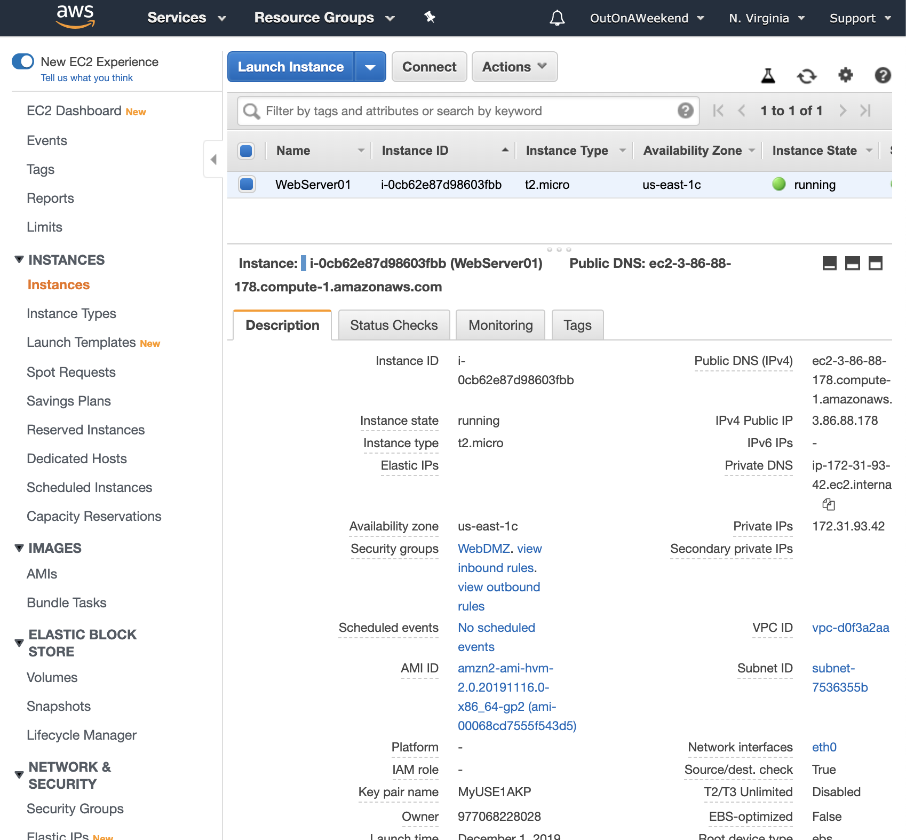
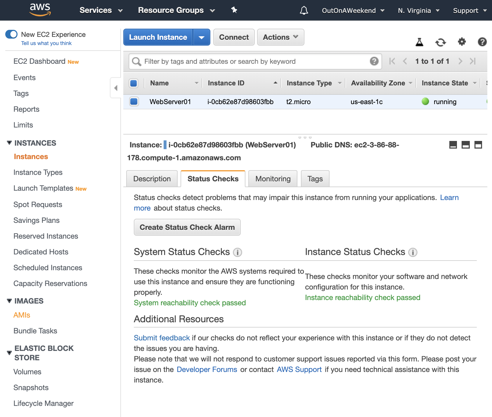
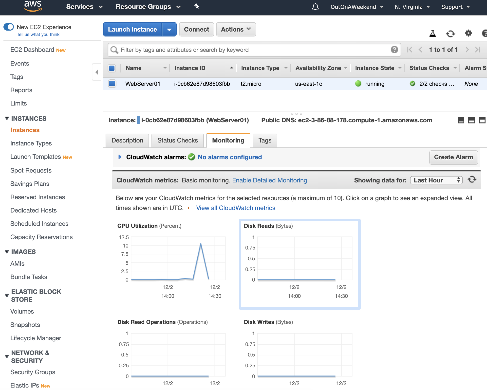
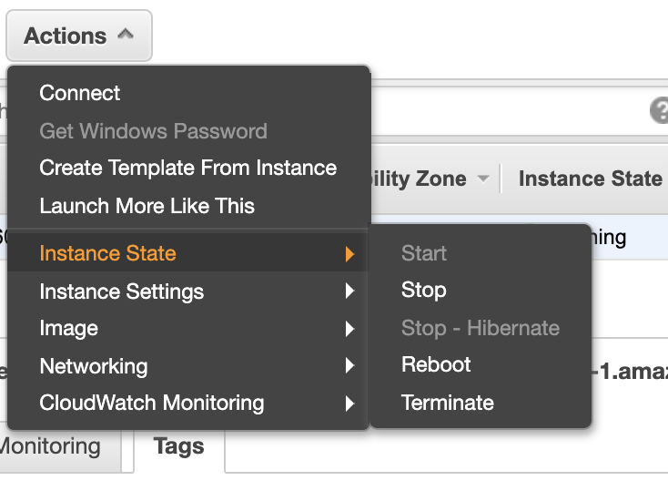
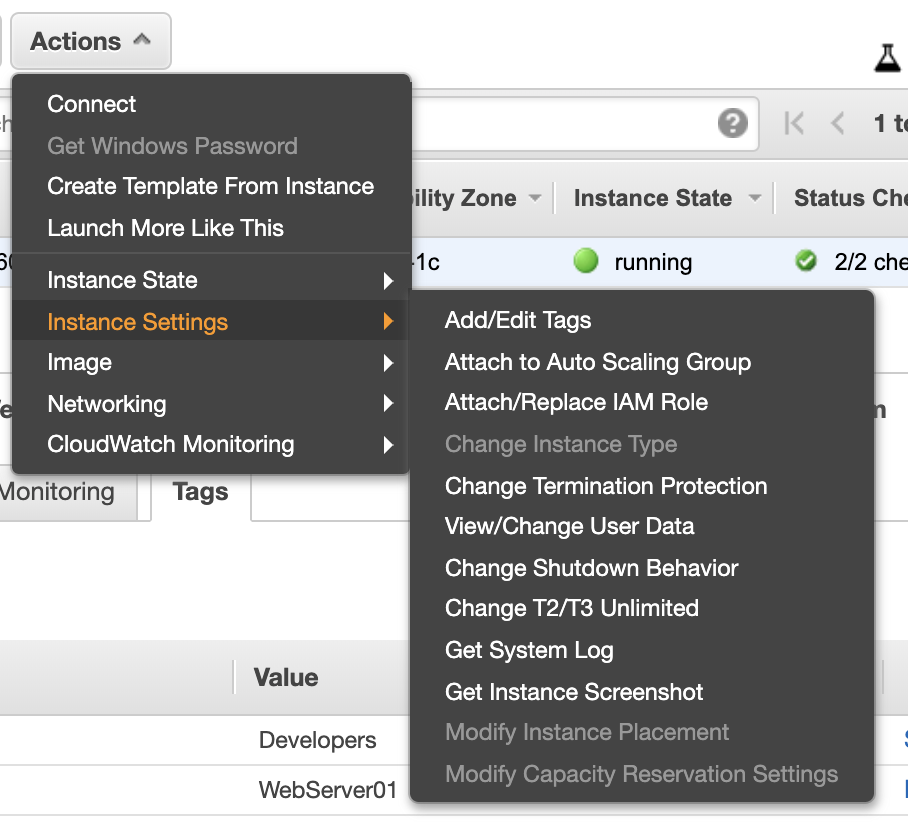
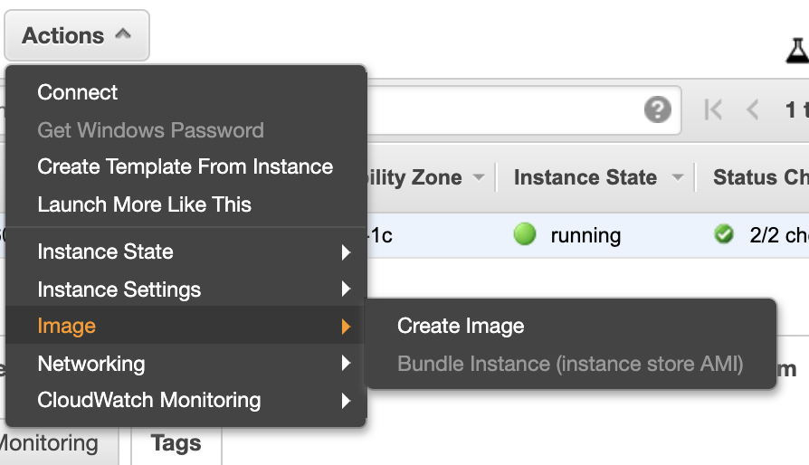
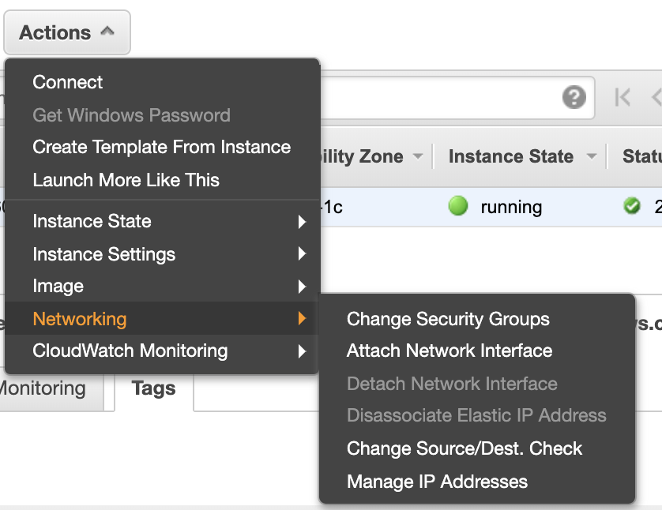
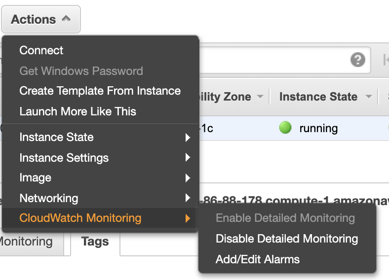

#### Checking Instance Details

Any time an instance is highlighted in the Instances screen, a lot of its details are shown in the bottom pane.

###### Description

`Description` gives key information such as public IP address, public DNS, key pair tied to the instance and various other attributes that were set at the time of instance creation.

###### Status Checks

`System Status Checks` checks the underlying hypervisor, i.e. the underlying hardware (but wasn't hypervisor something else?). In simpler words it checks if the instance is reachable.

`Instance Status Checks` checks the instance itself, i.e. it checks if the instance's OS is accepting traffic.

###### Monitoring

Monitoring gives details such as CPU utilization, disk read/write operations, etc.

#### Possible Actions on Instance

Several different actions are possible. It includes things like changing instance state, changing security groups, pausing monitoring, creating image, etc.

`Instance State` is where an instance can be started, stopped, etc.

 Instance State  |  Instance Settings  |  Image 
--- | --- | ---
 |  | 

 Networking  |  CloudWatch Monitoring 
--- | ---
 | 
