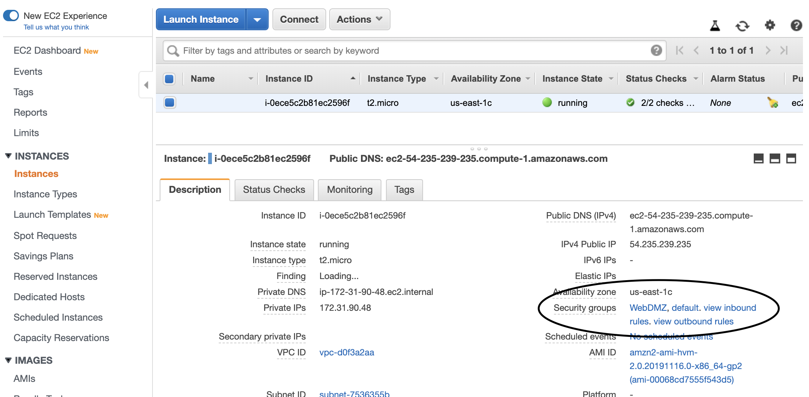
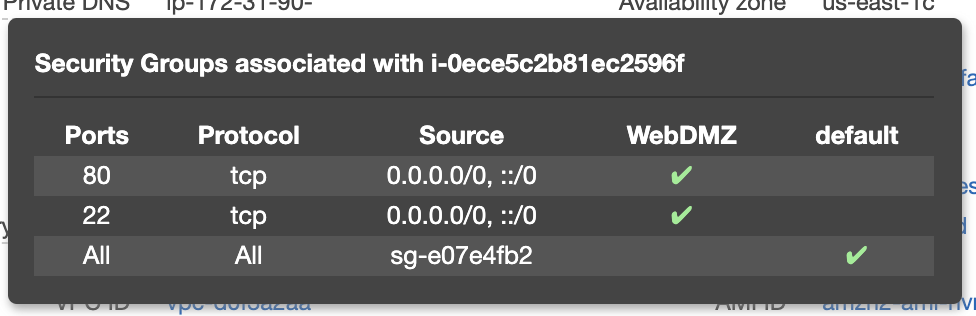
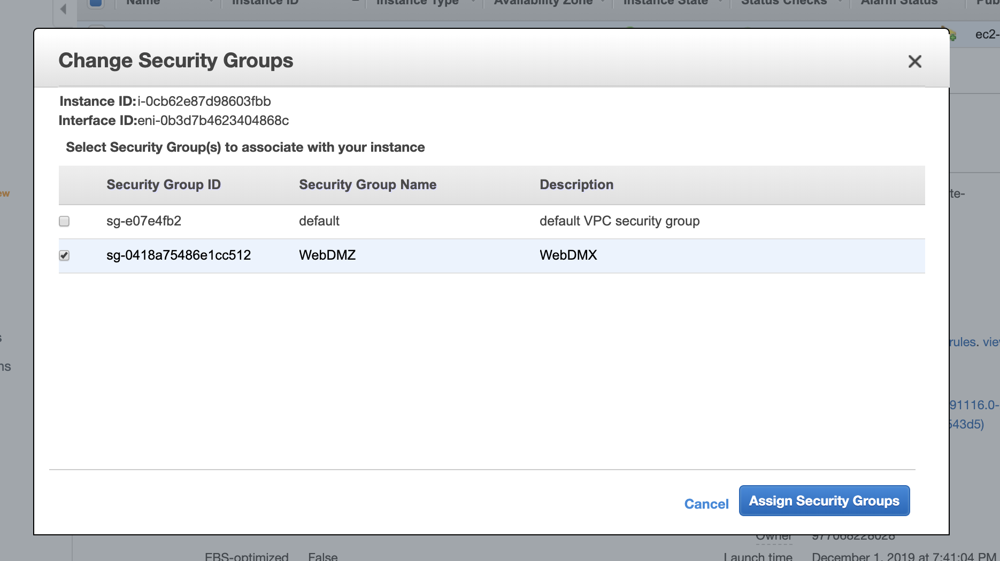
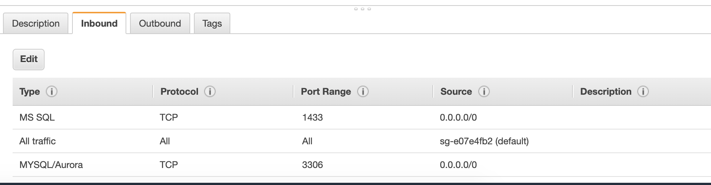
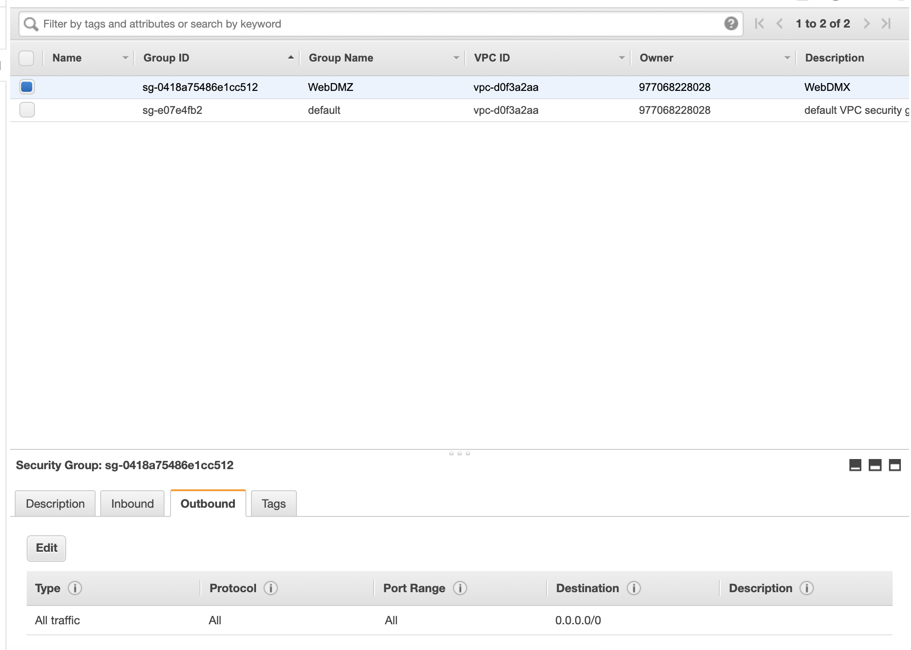
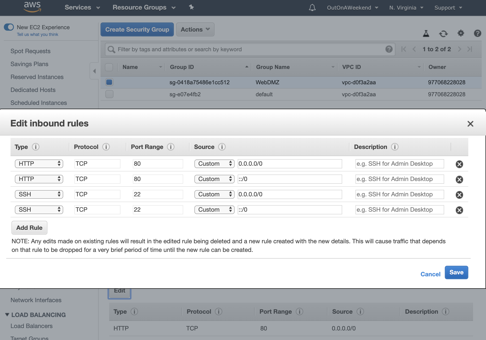
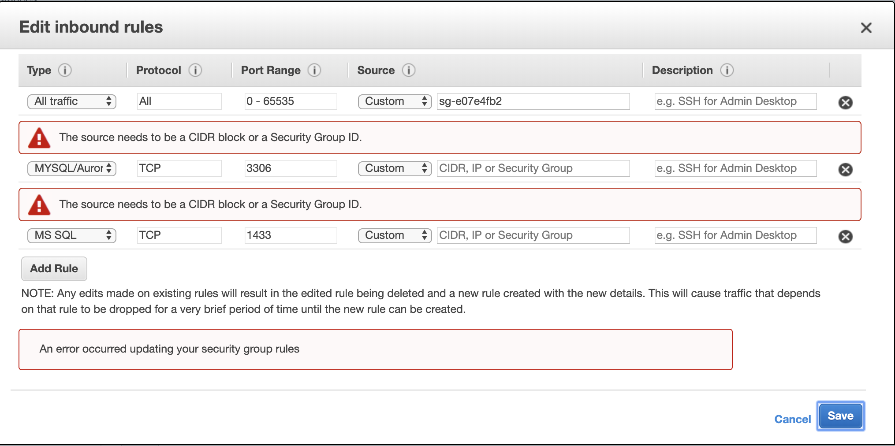

###### What is a Security Group

Security Groups are virtual firewalls. They are associated with EC2 instances and provide security at the protocol and port access level. ([reference](https://docs.aws.amazon.com/vpc/latest/userguide/VPC_SecurityGroups.html))

Any EC2 instance can have up to 5 security groups associated to it. They can be seen in `Instance > Description > Security Groups` pane. It in fact even shows the cumulative inbound and outbound rules there. The Inbound Rules used are a union of the rules in all the security groups. A security group however can of course be tied to multiple instances.

The security groups for an instance can be changed via `Instance > Actions > Networking > Change Security Groups`.

 Security Groups shown in Description  |  Viewing Inbound Rules  |  Changing Security Groups 
--- | --- | ---
 |  | 

> If Incoming traffic from specific IP addresses needs to be blocked, it cannot be done using Security Groups. That is instead done using `Network Access Control Lists`.

###### Inbound Rules and Outbound Rules

When a security group is created, everything is blocked by default. So you have to go in and start adding rules for traffic to be allowed into the EC2 instance.  

Any security group has a set of inbound rules and a set of outbound rules. These can be viewed in `Security Group > Inbound Rules, Outbound Rules`.

Typical things that need to be specified in a rule - Traffic type (i.e. HTTP, SSH, TCP, etc.), incoming request's IP or CIDR

 Inbound Rules  |  Outbound Rules 
--- | ---
 | 

Rules are edited via `Security Group > Actions >  Edit Inbound Rules, Outbound Rules`. Any changes made in security groups takes effect immediately.

 Editing Inbound Rules  |  IP address range or CIDR needs to be specified 
--- | ---
 | 

> What is a CIDR block?

###### Security Groups are stateful

Security Groups are said to be 'stateful'. You do not need to add rules for the return path. Any inbound rule that allows traffic into an EC2 instance, will automatically allow responses to pass back out to the sender without an explicit rule blocking it in the Outbound rule set.
