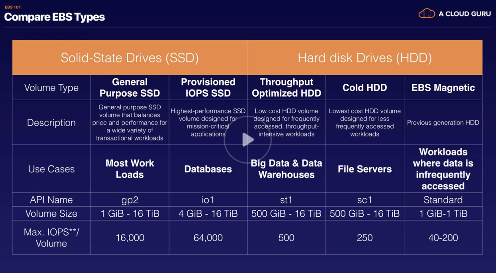
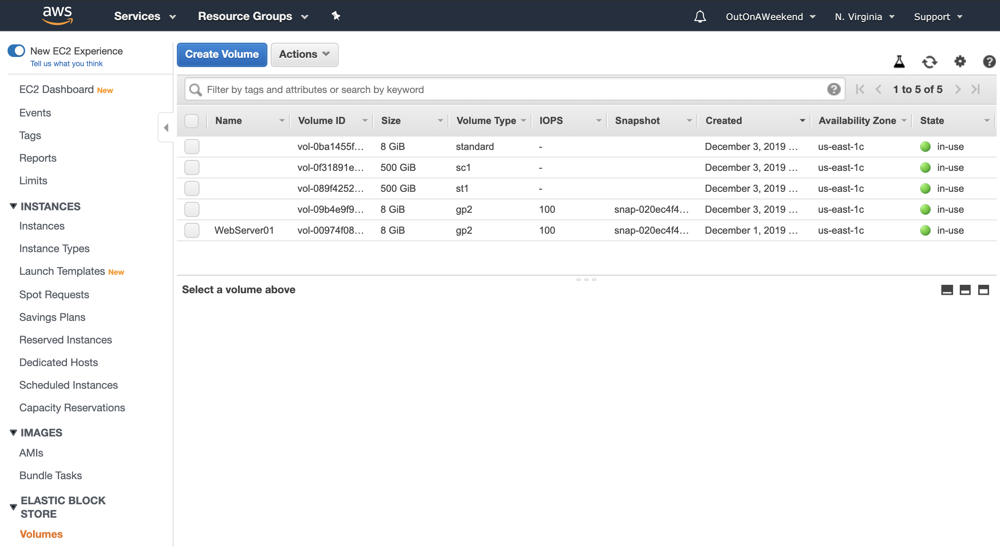
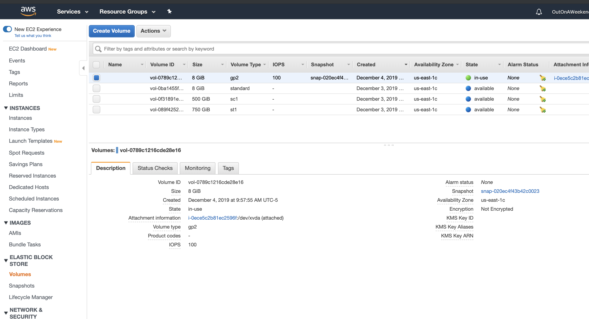
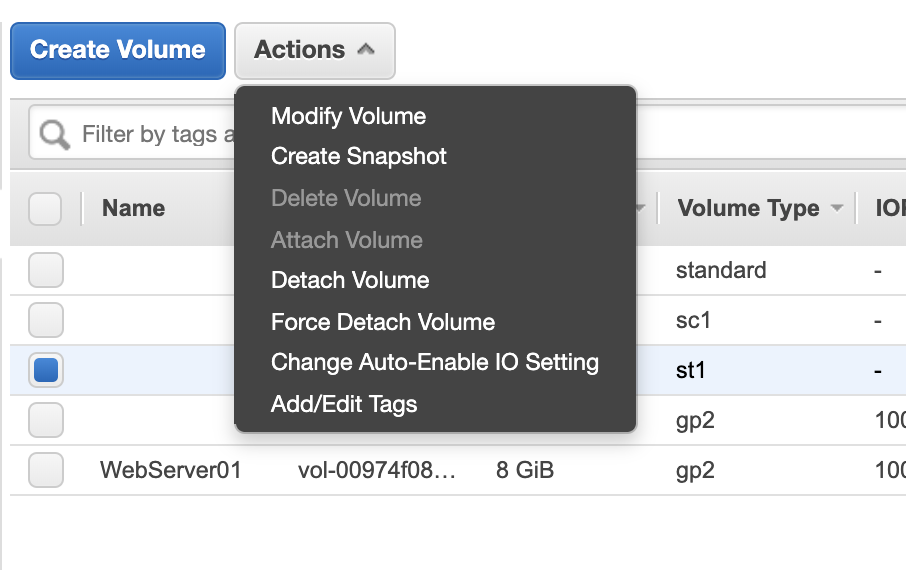
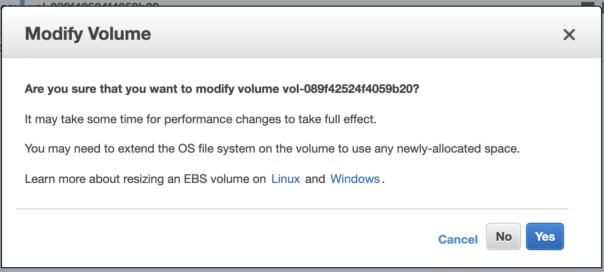

###### What is Elastic Block Store (EBS)

It's like a hard disk for the VM (i.e. EC2 instance). ([reference](https://docs.aws.amazon.com/AWSEC2/latest/UserGuide/AmazonEBS.html))

To state it more technically, EBS provides persistent block storage volumes for use with EC2 instances. EBS volumes behave like raw, unformatted block devices. These volumes can be mounted as devices on instances. Multiple volumes can be mounted on the same instance, but each volume can be attached to only one instance at a time. A file system can be created on top of these volumes, or can be used them in any way you would use a block device (like a hard drive).  The configuration of a volume attached to an instance can also be dynamically changed.

Also, each EBS volume is automatically replicated within its Availability Zone to protect from component failure.
> If this replication is done automatically, where can these availability zones be seen?

It is probably commonly used for `RDS` (Amazon Relational Database Service).

###### Different types of EBS volumes

There are 5 different types of EBS storage. They all have some associated code names known as `api names` (mentioned in box brackets below). <br>
```
1. General Purpose (SSD) [gp2]
2. Provisioned IOPS (SSD) [io1]
3. Throughput Optimised Hard Disk Drive [st1]
4. Cold Hard Disk Drive [sc1]
5. Magnetic [Standard]
```


`Provisioned IOPS (SSD)` is highly performant and is meant for mission critical applications. <br>

`Throughput Optimised Hard Disk Drive` is used in big data and data warehouse.

`Cold Hard Disk Drive` is low performant drive and is suited for less frequently accessed workloads.

`Magnetic` is previous generation drive and can still be used, For example, for archiving (if S3 Glacier is not to be used for any reason).

###### Root Volume is deleted when instance is deleted

The EBS volume is always in the same AZ as the EC2 instance.
If an EC2 instance is terminated, root EBS volume is deleted. The remaining volumes though still remain.
When additional volumes are added, 'delete on termination' is not automatically enabled.

###### Checking all the Volumes

All the EBS volumes across all instances are shown Volumes section.

<span style="font-weight:normal"> Volumes </span> | <span style="font-weight:normal"> Volume Description  </span>
--- | ---
 | 

> The way to tell a volume is the root volume is that would show as having been created off a snapshot (i.e. it will have something in the snapshot field). Need to verify this though, not sure.

###### Modifying a Volume

A volume can be modified (i.e. size or type changed) using the option `Actions > Modify volume`.

Volume size can be changed and this takes some time to come into effect. However even after that the OS needs to be instructed to able to see the increased size by running a command (the command effectively does a re-partitioning).

Volume type can also be changed. This too may impact the volume's performance for some time.

<span style="font-weight:normal"> Actions > Modify Volume </span> | <span style="font-weight:normal"> Changes take time  </span>
--- | ---
 | 
