#### Snapshots

`Snapshots` are point-in-time copies of EBS volumes. They are stored in S3 and are incremental backups, which means that only the blocks on the device that have changed after the previous snapshot are saved. Each snapshot contains all of the information that is needed to restore the data (from the moment when the snapshot was taken) to a new EBS volume. ([reference](https://docs.aws.amazon.com/AWSEC2/latest/UserGuide/EBSSnapshots.html))

Snapshots can be found in Snapshots section.

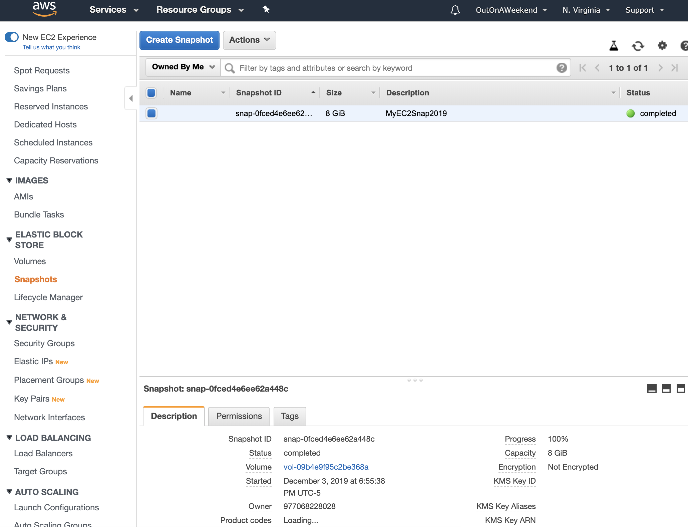

###### Creating Snapshot

A snapshot can be created off a volume as well as EC2 instance.
> In case of EC2 instance, it probably creates a snapshot if its root volume?

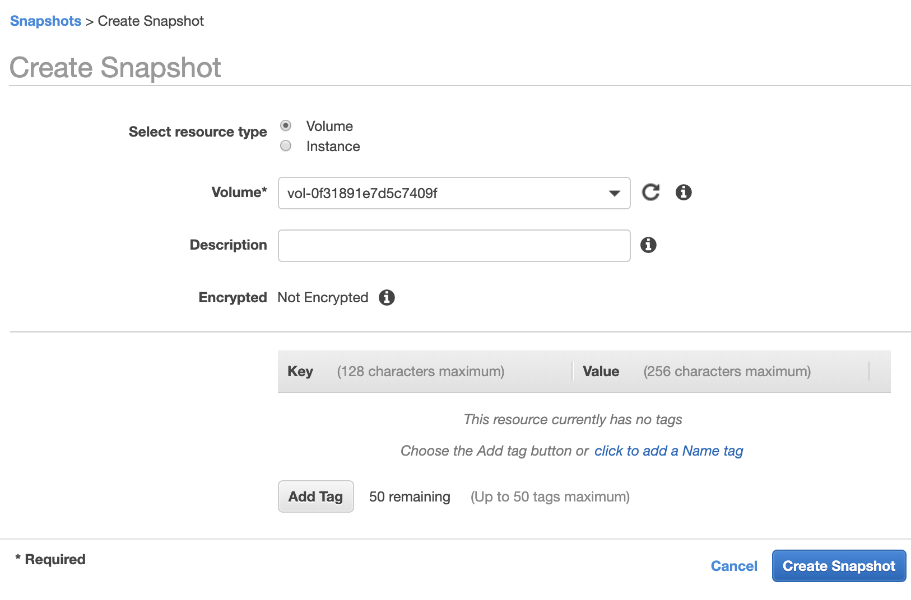

To create a snapshot for root volumes, the instance should be stopped before taking the snapshot. This basically ensures that snapshots are consistent.

###### Moving an EBS Volume to another Availability Zone

It isn't that a volume itself can be moved, but instead its copy can be. A snapshot needs to be created from the volume. And then from the snapshot a new image can be created. This image can then be deployed to another AZ. In this new AZ when a new EC2 instance is created, it can use this new image (AMI).

First create an image from the snapshot.

 1. Snapshot > Actions > Create Image  |  2. Create Image from Snapshot modal  |  3. Select Virtualization Type 
--- | --- | ---
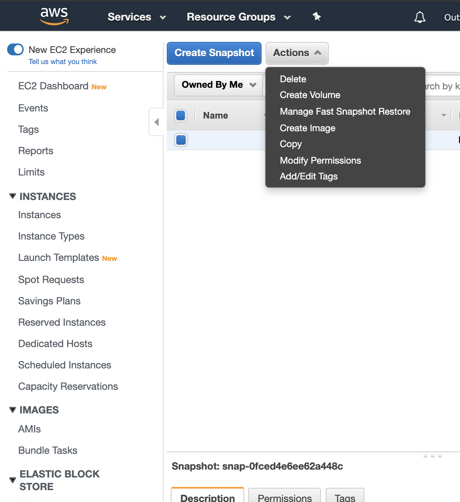 | 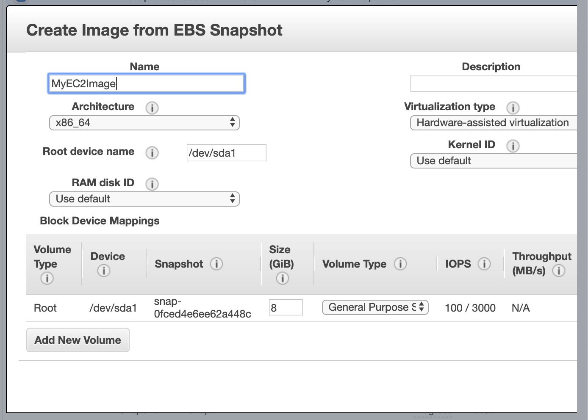 |  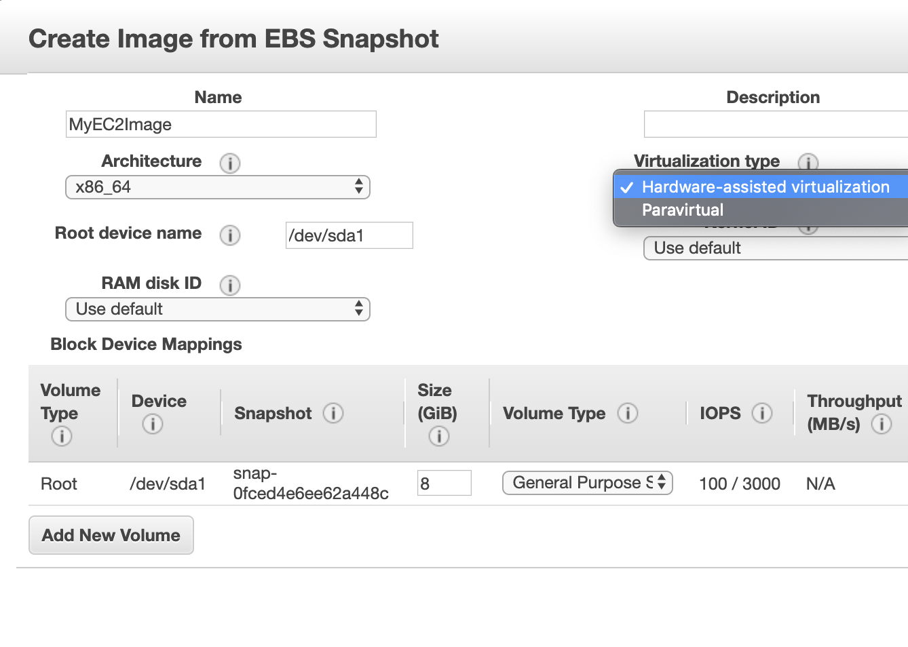

Then launch the image (i.e. launch an instance using that image) and specify a different subnet (AZ).

 1. New image shows in AMIs  |  2. Change subnet (AZ) while creating new instance 
--- | ---
 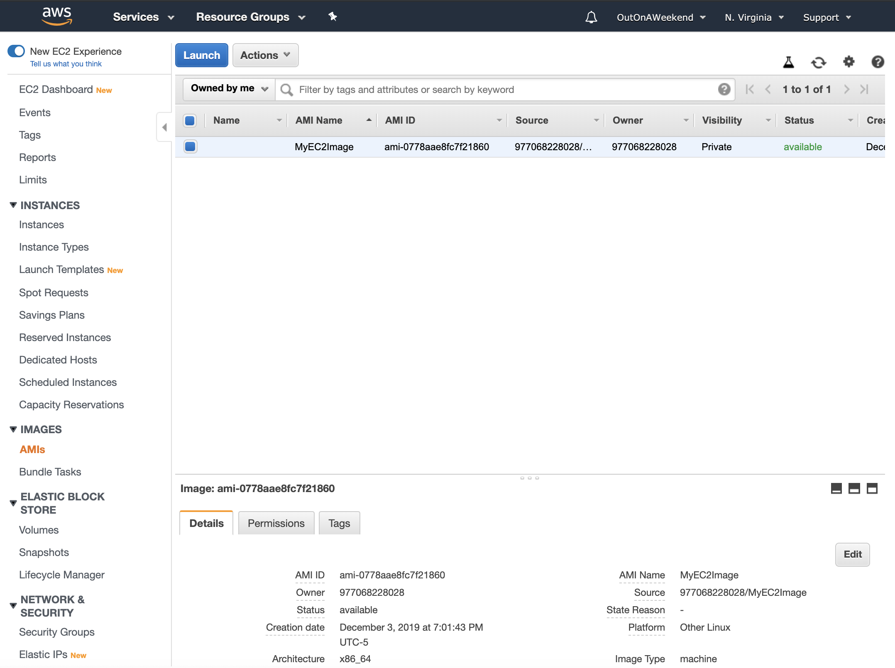 | 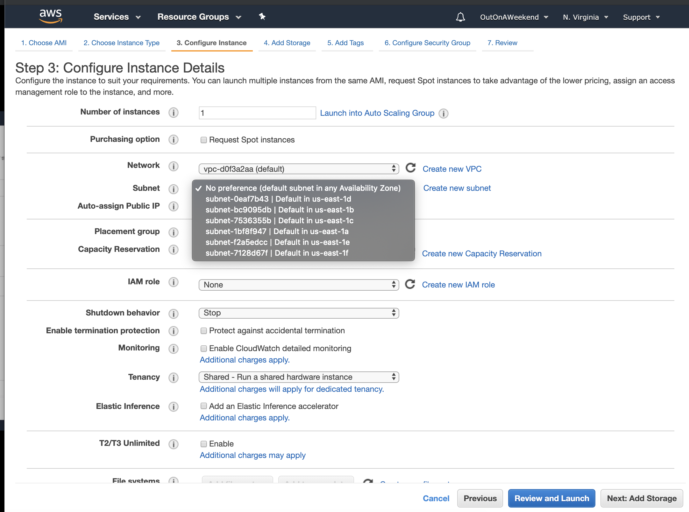

###### Moving an EBS Volume to another Region

This is a further continuation on previous steps. The created AMI can even be copied to a different region via the AMI option `Actions > Copy EMI`, which can then be used to launch a new instance.

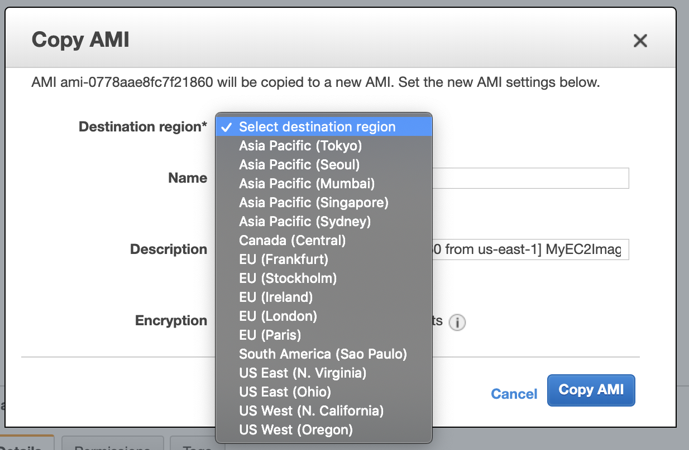

###### Virtualization Type

While creating an image, `Virtualization Type` needs to be selected as well.

There are 2 virtualization types offered by AWS - `Hardware-assisted virtualization (HVM)`, `Paravirtual`.

With HVM virtualization, the guest VM runs as if it were on a native hardware platform, except that it still uses PV network and storage drivers for improved performance. Some instance types support both PV and HVM while others support only one or the other.
> What does all this actually mean?

Some instances support both virtualization types, while some support only one. HVM is the one that is supported by most instances.

#### AMI types

While launching an instance, AMI can be selected based on many different factors - region, OS, architecture (32-bit or 64-bit), launch permissions, as well as storage type for root device. It can be of two types.

1. `Instance store (ephemeral storage)` - Root device is a volume created from a template stored in S3.

2. `EBS backed volume` - Root device is an EBS volume created from EBS snapshot.

An `Instance store` provides temporary block-level storage for your instance. This storage is located on disks that are physically attached to the host computer. Instance store is ideal for temporary storage of information that changes frequently, such as buffers, caches, scratch data, and other temporary content, or for data that is replicated across a fleet of instances, such as a load-balanced pool of web servers. ([reference](https://docs.aws.amazon.com/AWSEC2/latest/UserGuide/InstanceStorage.html))

###### Only some instance types are compatible with Instance Store AMI

Usually the AMI type selected is EBS backed volume, but Instance store AMI can also be selected. However, only some instance types are compatible with an Instance store AMI.

 1. Selecting Instance Store AMI (Community AMIs > Root device type)  |  2. Only some instance types are available for Instance store AMI 
--- | ---
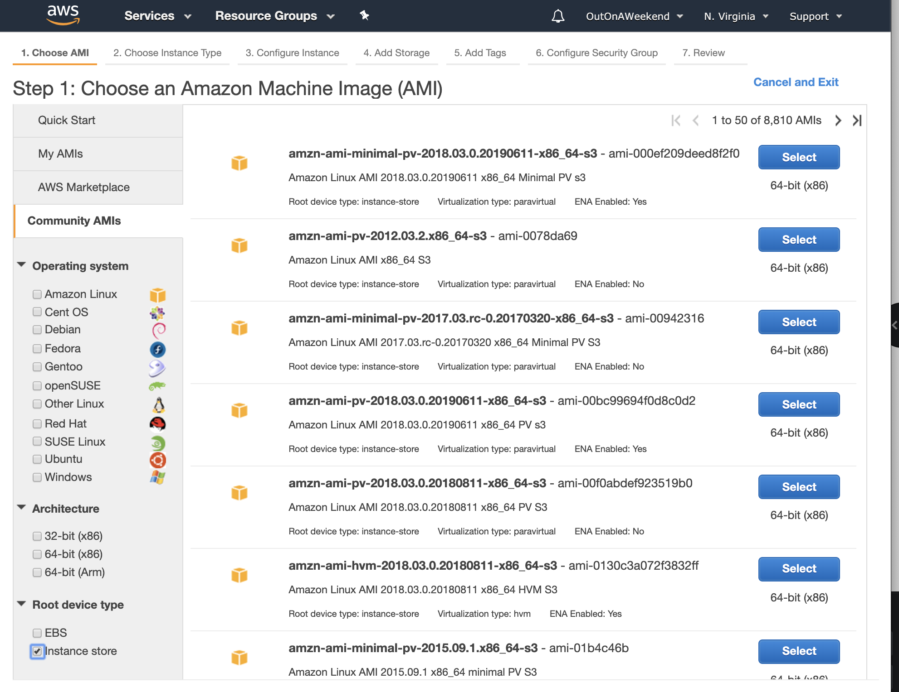 | 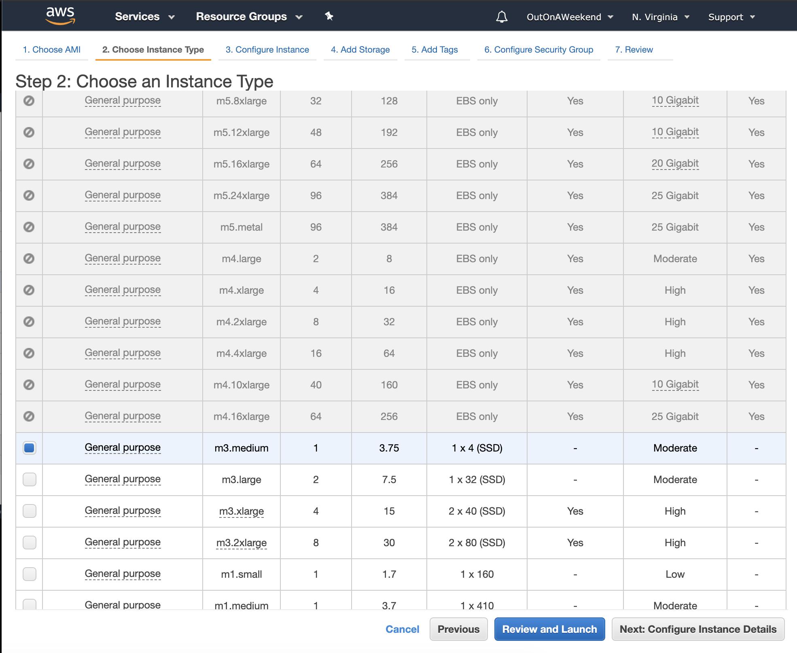

###### More Instance store volumes can't be later added for Instance Store AMI

In Add Storage section, volume type then shows up as Instance Store. However, with instance store AMI additional instance store volumes cannot be attached to it later on. They have to be added right then (where is the option). Additional EBS backed volumes can be added later on as well.

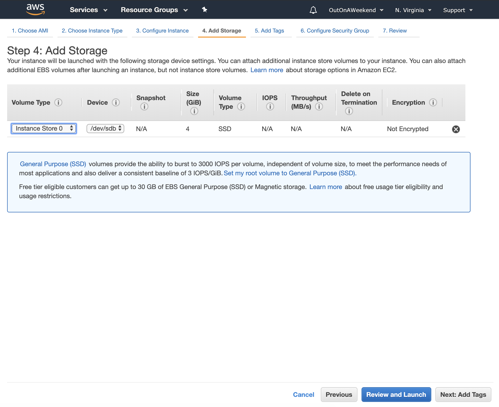

> Instance stored volume cannot even be seen in `Volumes` section.

###### Instance Store AMI and possible data loss

If an instance store volumes is stopped or if its underlying host fails, the data is lost.
EBS backed instance can be stopped without any loss of data.

Both AMI types can be rebooted though, without data loss.

If instance is deleted/terminated, root volume is deleted if its an instance store volume. This behavior can't be disabled.

#### Encrypting a Volume

It's possible to encrypt a volume (including root volume) even at the time of instance creation. Previously it wasn't possible to encrypt the root device volume while creating the instance. But now it is.

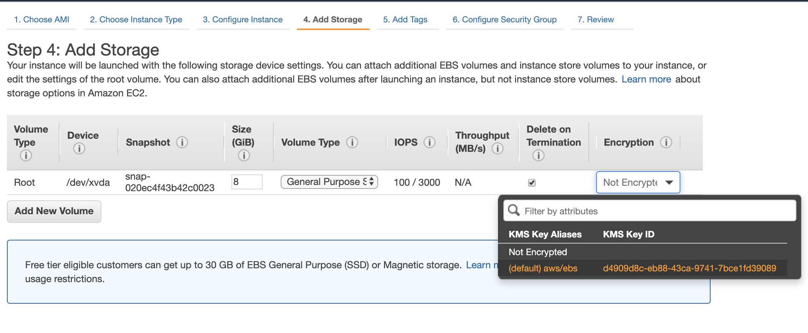

###### Encrypting an unencrypted volume

The way to do it is ti create a snapshot from the volume, copy it and mark it as encrypted, create an image from this encrypted snapshot, and finally launch a new instance with this new encrypted snapshot.

 1. Volume > Actions > Create Snapshot  |  2. Create Snapshot 
--- | ---
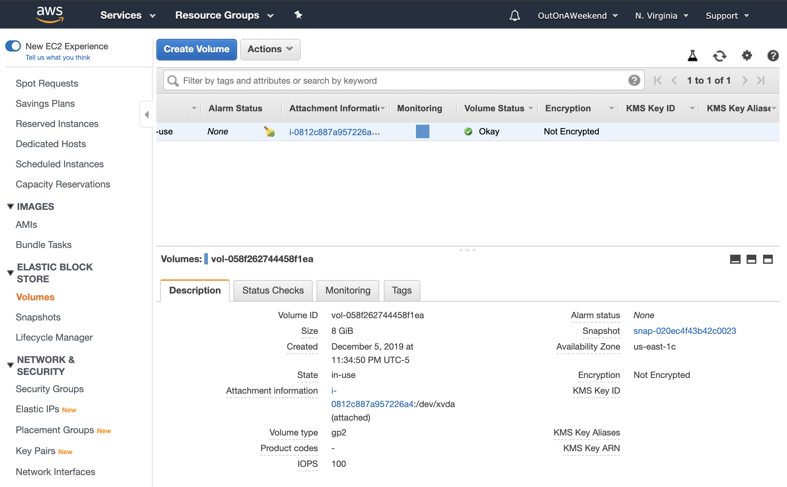 | 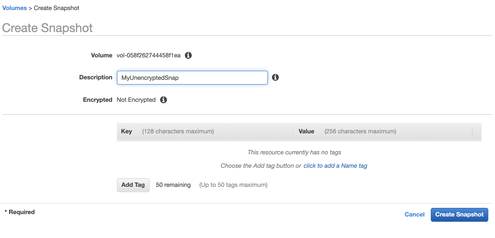

 3. Copy Snapshot and mark as Encrypted  |  4. Snapshots > Create Image 
--- | ---
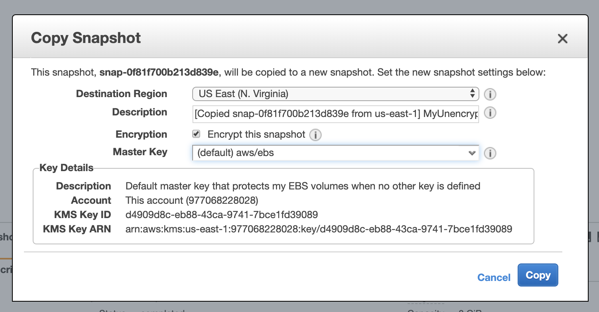 | 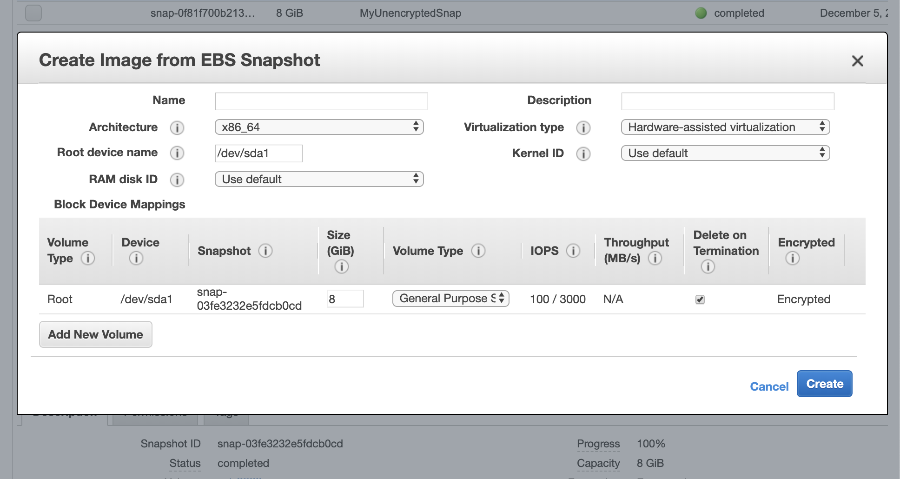

###### Misc.

Snapshots of encrypted volumes are encrypted automatically.  
Volumes restored from encrypted snapshots are encrypted automatically.  
Snapshots can be shared (with what?) if they are unencrypted.  
