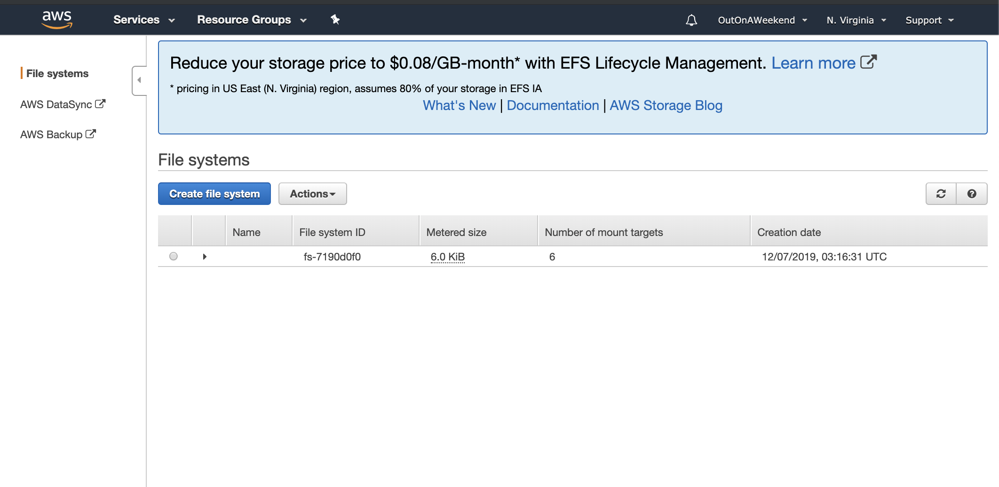
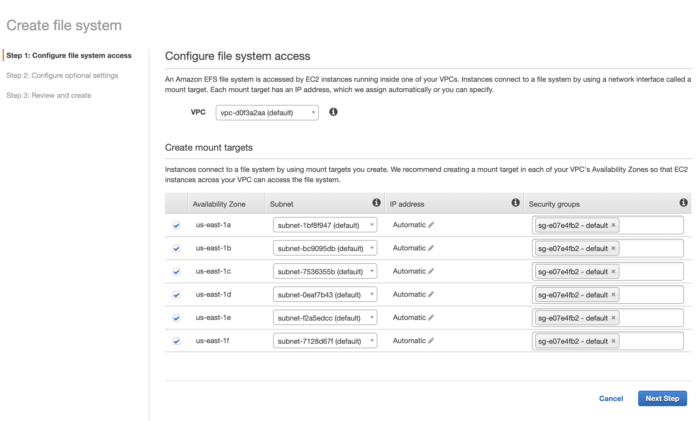
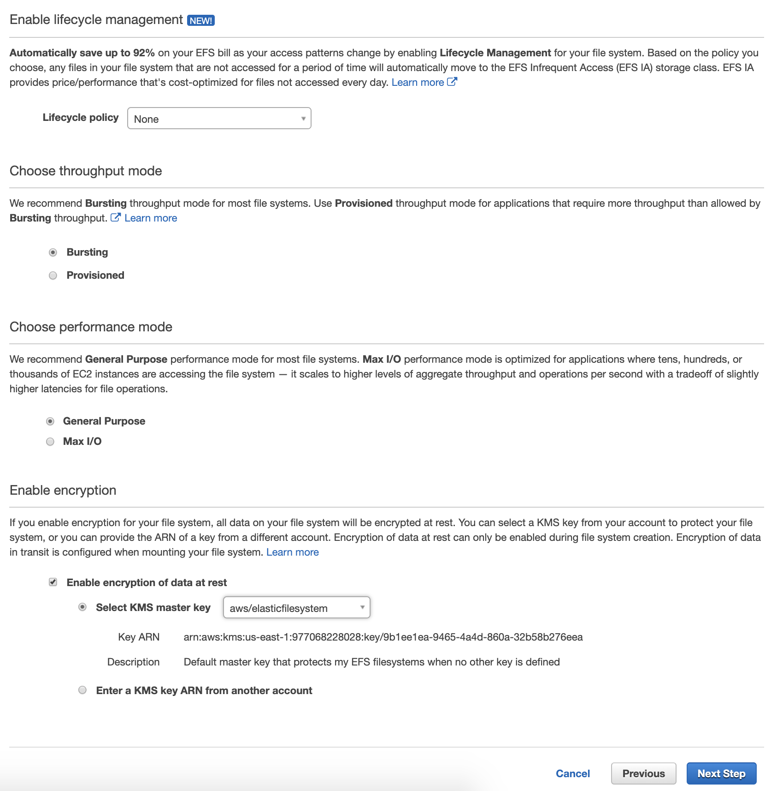
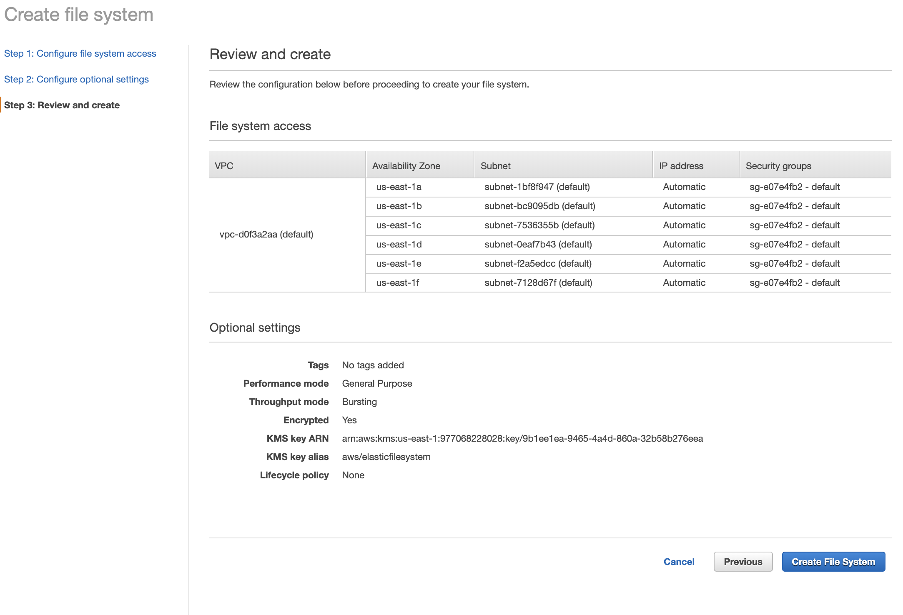
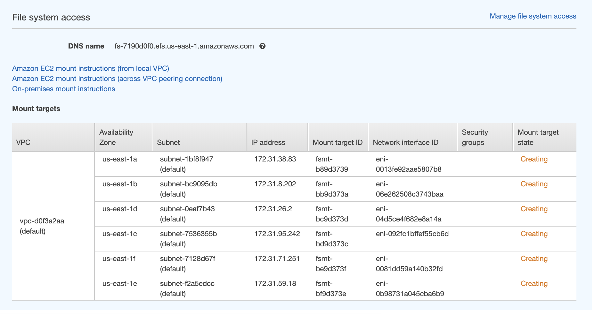
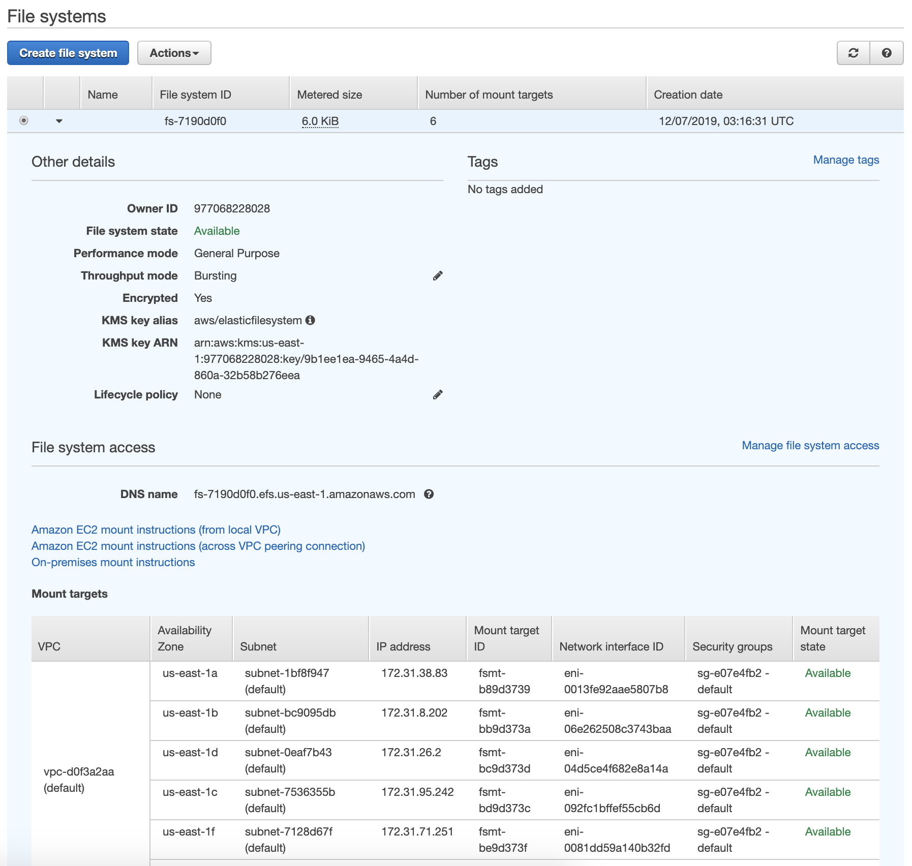

##### What is Elastic File Store (EFS)

`Elastic File Store (EFS)` is a file storage for EC2. It is similar to EBS, but while a EBS volume can be mounted to only one EC2 instance multiple EC2 instances can point to the same EFS volume. Also, the storage capacity of an EFS volume is elastic, growing and shrinking as needed. Storage does not need to be pre-provisioned with it. ([reference](https://aws.amazon.com/efs/))

###### Some facts about EFS

It supports NFSv4 protocol. You only pay for the storage you use and there is no pre-provisioning required. It can scale up to patabytes and can support thousands of concurrent NFS connections. Data is stored across multiple AZs within same region. It has Read After Write consistency.

###### Creating an EFS volume

<span style="font-weight:normal"> 1. Storage > EFS > Create File System </span> | <span style="font-weight:normal"> 2. Configure File System Access </span> | <span style="font-weight:normal"> 3. Configure Optional Settings </span>
--- | --- | ---
 |  | 

 <span style="font-weight:normal"> 4. Review and Create </span> | <span style="font-weight:normal"> 5. EFS volume starts getting created </span> | <span style="font-weight:normal"> 6. EFS volume created </span>
 --- | --- | ---
 |  | 

> EFS volume gets split across multiple AZs while its created, they are all shown during configuration itself.

###### Mounting EFS volume to EC2 Instances

The EFS volume can then be mounted to EC2 instances using command line. The instructions are on the same screen as to where EFS volume is created.

However before that the EC2 instances need to have this in their bootstrap to be able to mount EFS volumes.
```
yum install -y amazon-efs-utils
```

Also, web servers correspond to EFS volume using NFS protocol. So the security group used by EFS volume must allow NFS traffic in their inbound rules.

Finally the mounting is done using this command (there are some other possible commands too).
```
mount -t efs -o tls fs-7190d0f0:/ /var/www/html
```

> I could really see that once the same EFS store has been mounted to the 2 EC2 instances, the same file is accessible through both instances (as it should be).

Here is one set of complete commands on a EC2 instance.
```
[ec2-user@ip-172-31-44-172 www]$ sudo su
[root@ip-172-31-44-172 www]# mount -t efs -o tls fs-7190d0f0:/ /var/www/html
[root@ip-172-31-44-172 www]# ls
cgi-bin  html
[root@ip-172-31-44-172 www]# cd html
[root@ip-172-31-44-172 html]# ls
[root@ip-172-31-44-172 html]# echo "<html><h1>1</h1></html>" > index.html
[root@ip-172-31-44-172 html]# ls
index.html
[root@ip-172-31-44-172 html]# cat index.html
<html><h1>1</h1></html>
[root@ip-172-31-44-172 html]#
```
