#### Usual steps

###### 1. Create a RDS MySQL Database instance

While creating the database instance, both a `database identifier` and a `database name` needs to be entered. This is important to keep in mind.

<span style="font-weight:normal"> 1. Database > RDS > Create Database </span> | <span style="font-weight:normal"> 2. Enter database identifier </span> | <span style="font-weight:normal"> 3. Create username and password </span>
--- | --- | ---
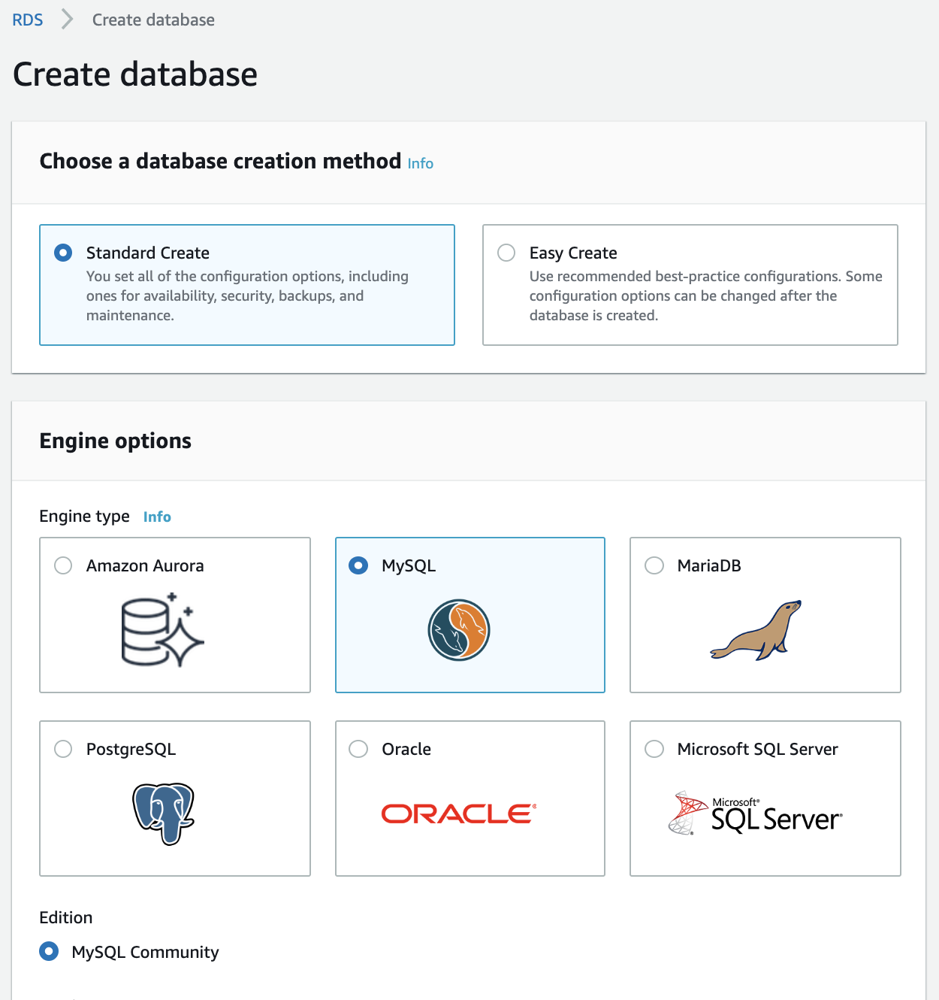 | 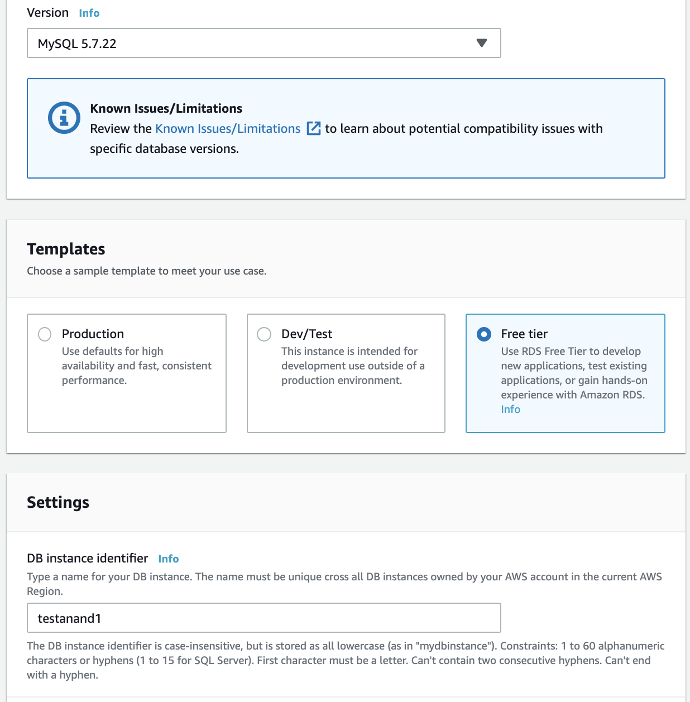 | 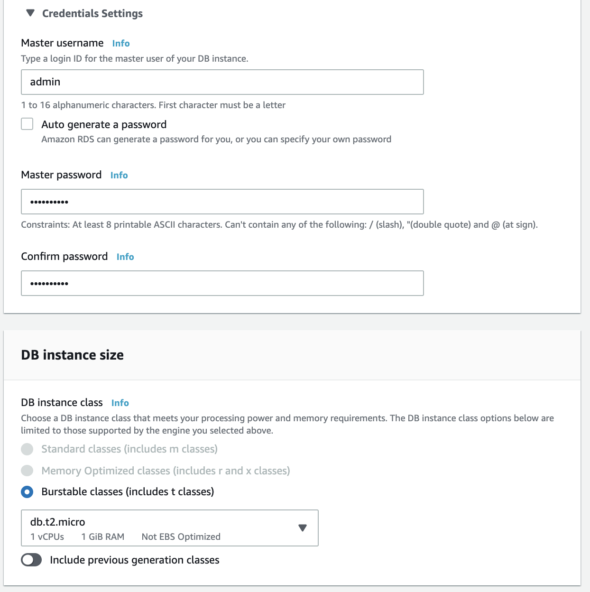

<span style="font-weight:normal"> 4. Verify Storage, Multi-AZ deployment is not available in free tier </span> | <span style="font-weight:normal"> 5. Create new Security Group and enter its name </span> | <span style="font-weight:normal"> 6. Enter database name (this is important) </span>
--- | --- | ---
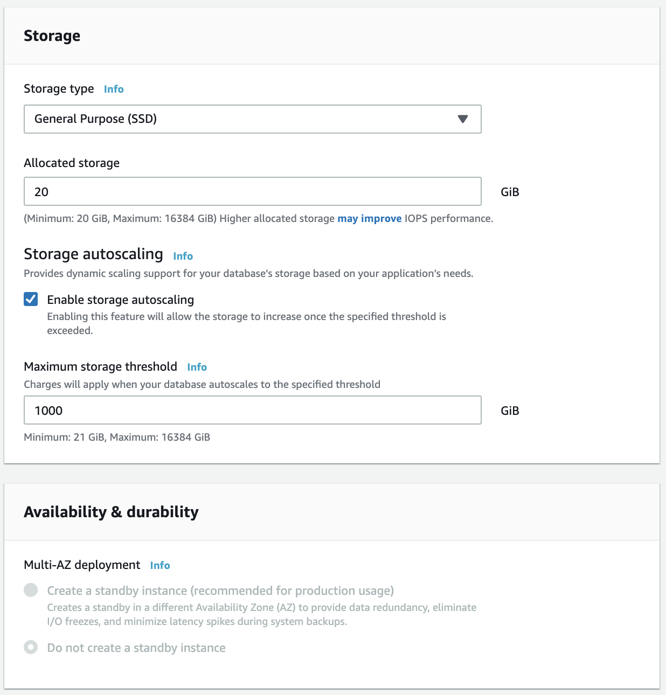 | 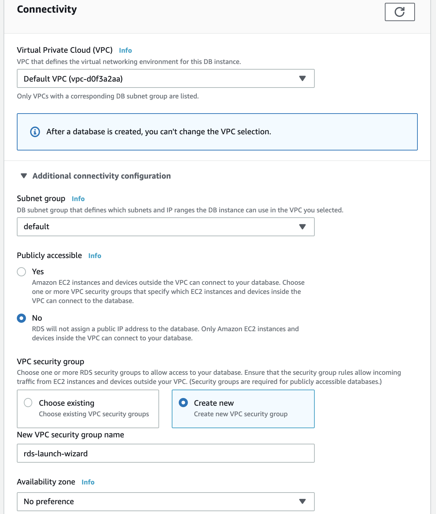 | 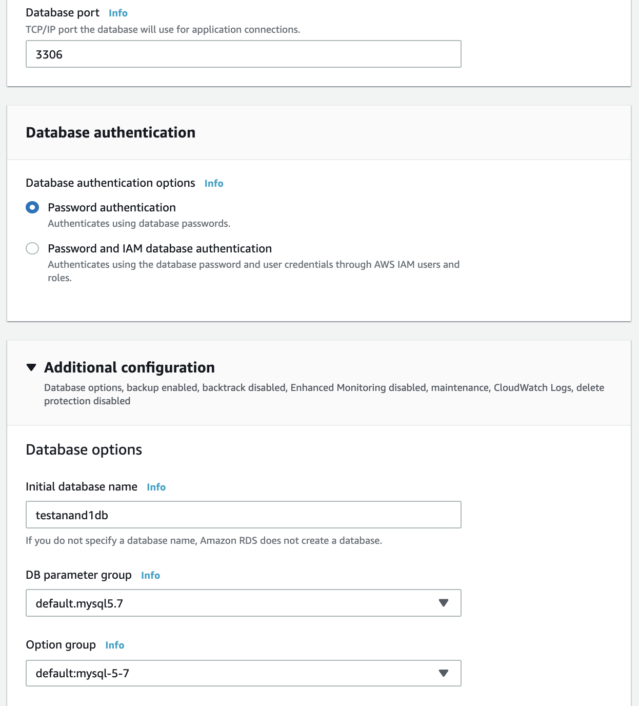

Production template gives high availability, performance, Multi-AZ. <br>
The database that comes with free tier has only one instance size type, i.e. db.t2.micro and is is not EBS optimized. <br>
Storage autoscaling means storage can be added on the fly as storage starts getting full. <br>

It takes some time for the database to be created, and once done its details can be seen in the Databases' RDS dashboard. Notice that it also shows the `database connection endpoint`.

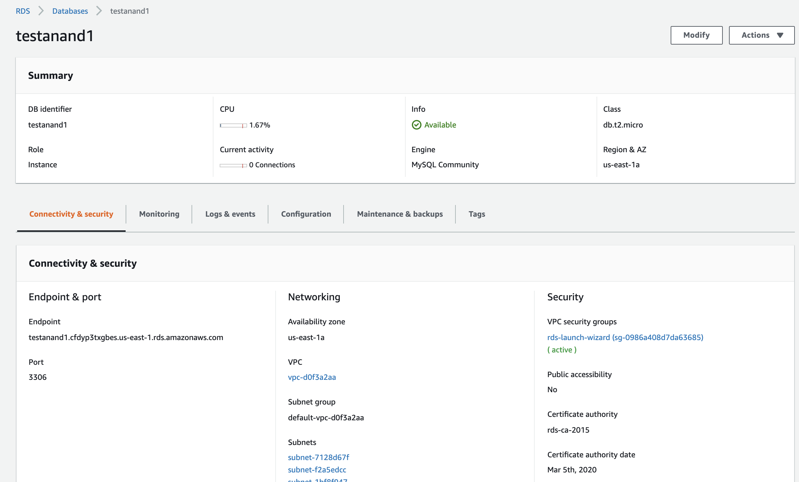

###### 2. Create EC2 instance

Create a normal EC2 instance and enter this bootstrap script in its configuration options. This is needed for configuring WordPress on it.

This script installs PHP MySQL, Apache, then downloads latest copy of WordPress to `var/www/html`, unzips it, installs it and finally changes its directory permissions appropriately.

```
#!/bin/bash
yum install httpd php php-mysql -y
cd /var/www/html
wget https://wordpress.org/wordpress-5.1.1.tar.gz
tar -xzf wordpress-5.1.1.tar.gz
cp -r wordpress/* /var/www/html/
rm -rf wordpress
rm -rf wordpress-5.1.1.tar.gz
chmod -R 755 wp-content
chown -R apache:apache wp-content
service httpd start
chkconfig httpd on
```

###### 3. Update Security Group of the RDS instance

Now, the `Create new security group` instance actually creates a new security group here, which can then be seen in `EC2 > Security Groups` (it is typically named 'rds-launch-wizard').

This security group is the one that comes into play when an EC2 instance tries to connect into the RDS instance, and hence its inbound rules must be edited to allow incoming traffic from the EC2 instance. This can be done by just selecting the security group name of the EC2 instance in RDS instance's security group's inbound rules (for the type MySQL, protocol TCP and typically 3306 port).

<span style="font-weight:normal"> 1. There is a security group for RDS instance </span> | <span style="font-weight:normal">  2. RDS instance's security group should allow incoming traffic from EC2 instance </span>
--- | ---
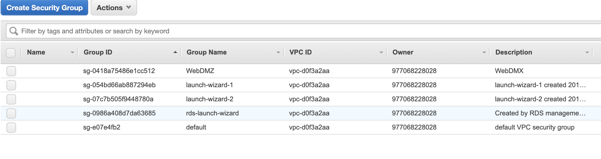 | 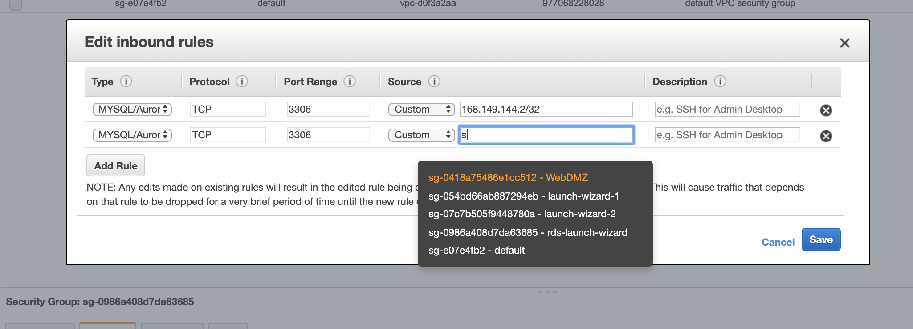

###### 4. Connecting the RDS instance to EC2 instance via WordPress installed on EC2

Here are the steps.

1. Now enter the EC2 instance's IPv4 address in the browser.

2. As it has Wordpress installed on it, it will show a page which instructs to enter the database connection details. Tapping on the button then shows a form. On this form, care must be taken to enter the database name (and not the database identifier), username and password as entered during RDS instance creation. The database host will be the database connection endpoint as shown in the RDS instance's details.

> Keep in mind that the `database name` should be entered with exact case as it actually is.

3.  Then it shows a message that this can't write to `wp-config.php` file and the file must be created (the contents are provided).

4. This file then needs to be created by connecting to the EC2 instance (after connecting use the `nano` command).

5. Then , tap the `Run the Installation` button, and it then shows a successful welcome screen where the the site title, username etc. can be created.

<span style="font-weight:normal"> 1. Enter EC2 instance's IP in browser </span> | <span style="font-weight:normal"> 2. Enter database connection details </span>
--- | ---
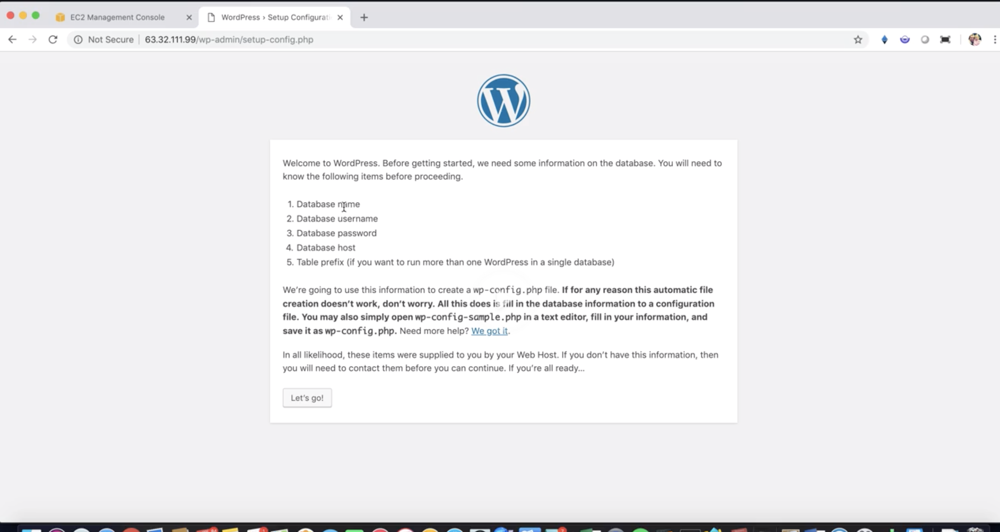 | 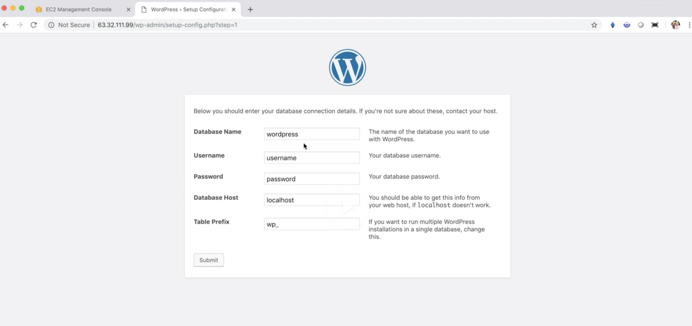

<span style="font-weight:normal"> 3. Copy suggested contents for `wp-config.php` </span> | <span style="font-weight:normal"> 4. Connect to EC2 instance, create the config php file, and then Run the installation </span> | <span style="font-weight:normal"> 5. Wordpress site gets created </span>
--- | --- | ---
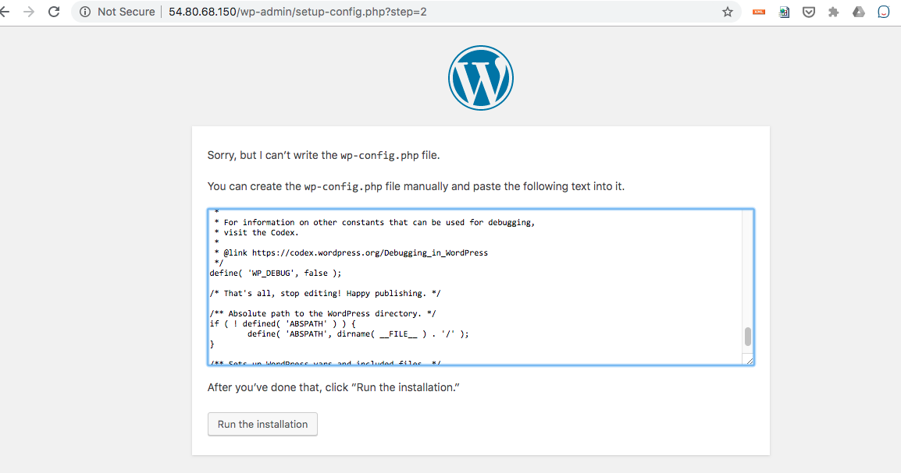 | 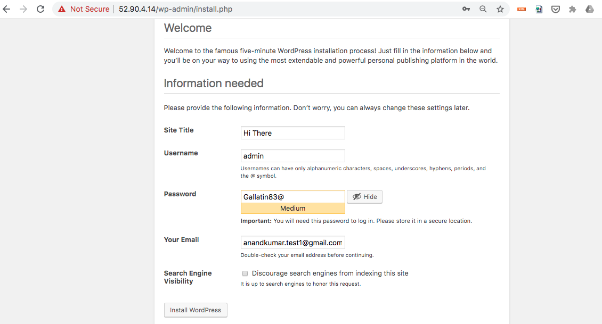 | 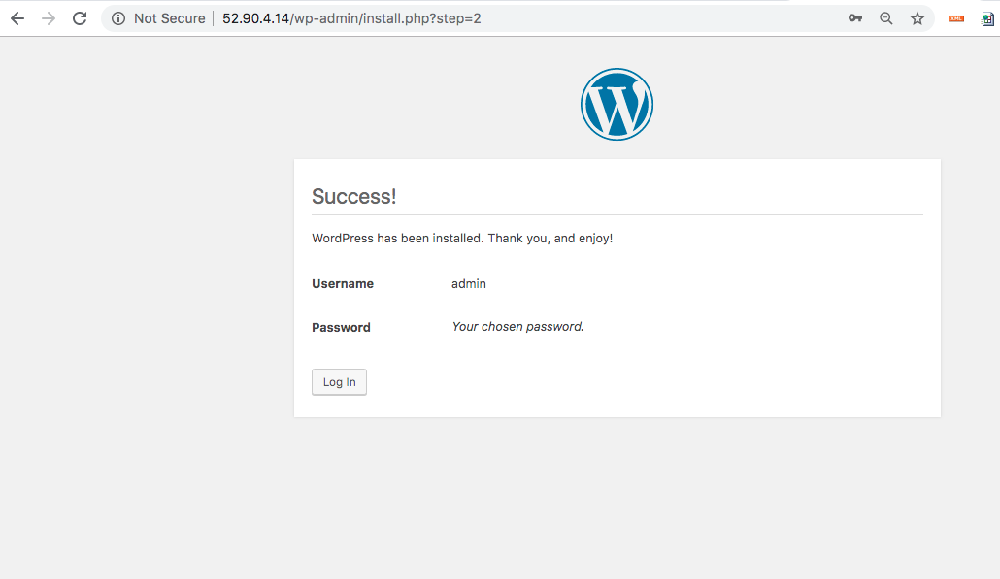

> `WordPress` is a content management system based on PHP and MySQL that is usually used with the MySQL or MariaDB database servers but can also use the SQLite database engine. Features include a plugin architecture and a template system, referred to inside WordPress as Themes

#### Summary

Create RDS instance. Create EC2 instance and install php on it via a bootstrap script. Update RDS instance's security group to accept incoming traffic from EC2 instance's security group.

Access EC2 instance via browser, it prompts for database connection details. Then create a config file by connecting to EC2 instance via SSH. And then come back to the browser and run the installer. We now have an EC2 instance running Wordpress, which can talk to a RDS instance.
