#### Backups in RDS

There are 2 types of backups that can be taken for RDS.

`Automated backups` - Allows to recover database to any point in time within a retention period, which can be within 1 and 35 days. They take a full daily snapshot and also store transaction logs throughout the day.  
They are enabled by default, and the backup data is stored in S3. You get the storage space equal to the size of the db. The backups are taken during defined window, during which the storage I/O may be suspended.

`Database Snapshots` - They are taken manually, and are kept even after the original RDS instance.

> Whenever a backup is restored, the restored version is a new RDS instance with a new DNS endpoint.

Encryption At Rest is supported for MySQL, Oracle, SQL Server, PostgreSQL, MariaDB, and Aurora. It is done using AWS Key Management Service. Once the RDS instance is encrypted, the subsequent automated backups, read replicas and snapshots also are encrypted.

#### MultiAZ and Read Replicas

###### MultiAZ

`MultiAZ` allows you to have an exact copy of the RDS instance in another AZ. In the event of a failure of the main RDS instance, the failover to standby happens automatically. It is meant to be used for disaster recovery only, and not for improved performance.

MultiAZ is available for SQL Server, Oracle, MySQL Server, PostgreSQL, and MariaDB.

###### Read Replicas

`Read Replicas` allow you to have read only copies of your database. And they must have automated backups turned on for them to work.

Read Replicas are available for MySQQL PostgreSQL, MariaDB, Oracle, and Aurora. You can even have Read Replicas of Read Replicas. Each Read Replica has its own DNS endpoint. And a Read Replica can itself have multi-AZ deployment. They can even exist in a different region.

Read Replicas do automatically not become the primary database if needed. They need to promoted to be a database manually, on doing which the replication breaks.

> Keep in mind that they are used for scaling, and not for disaster recovery.

So `MultiAZ` and `Read Replicas` may possibly always function as back-up instance for automatic continuation if needed and simultaneous read-only RDS instance (respectively). Whereas backups are just backups, they are not actually operational when the primary RDS instance is already running, but do serve as the foundation of Read Replicas.

###### How to turn on MultiAZ deployment for a RDS instance

 1. Database details > Modify  |  2. Turn on Multi-AZ deployment  |  3. Enter new Database identifier 
--- | --- | ---
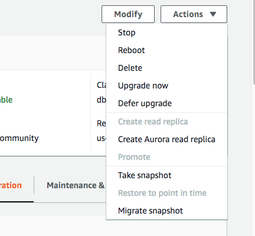 | 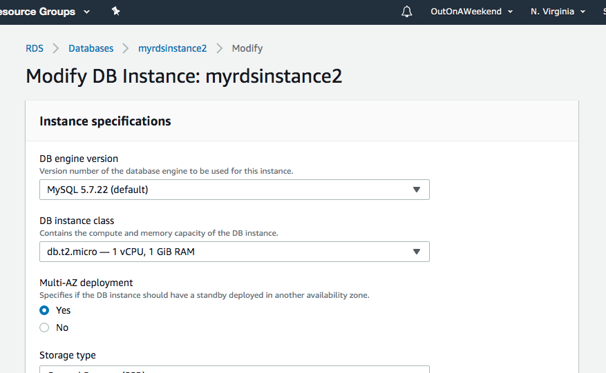 | 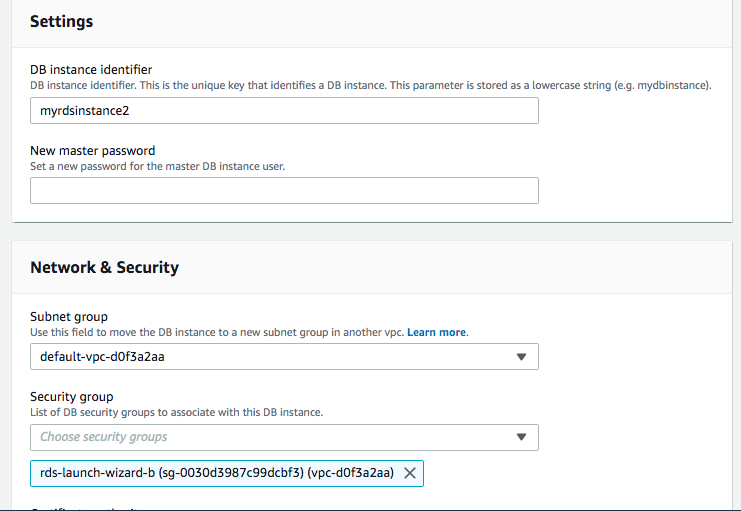

And then the fact that instance has MultiAZ deployments enabled shows in its details.  
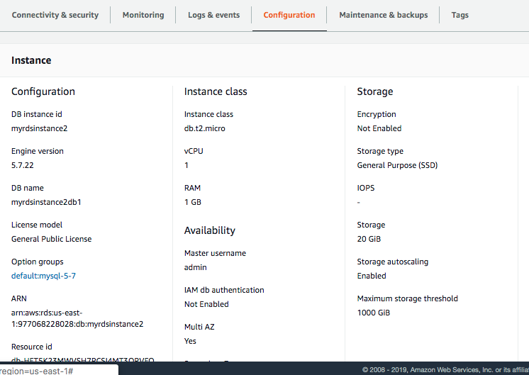

One way of forcing the RDS instance to start using one of its MultiAZ deployment, is rebooting the RDS instance with failover. This can be done via 'Database Actions > Reboot'

 Actions > Reboot  |  Reboot with Failover 
--- | ---
 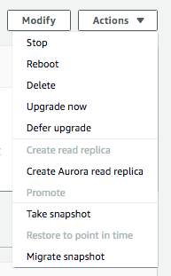 | 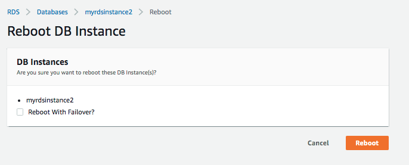

###### How to create Read Replica

If the RDS instance has backups enabled, then it's as simple as using the menu option 'Database > Actions > Create Read Replica'.

 1. Actions > Create Read Replica  |  2. Do not mark as 'MultiAZ' 
--- | ---
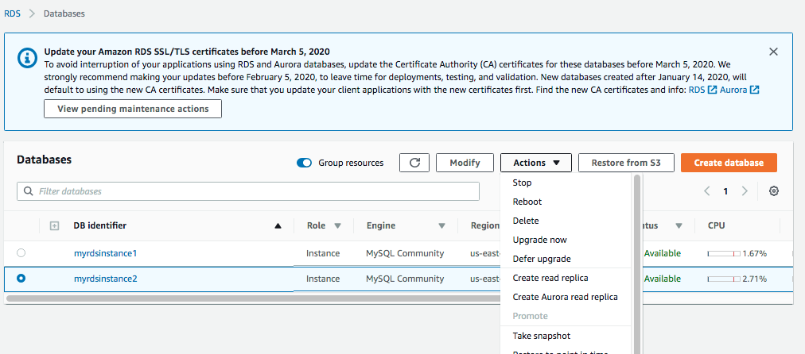 | 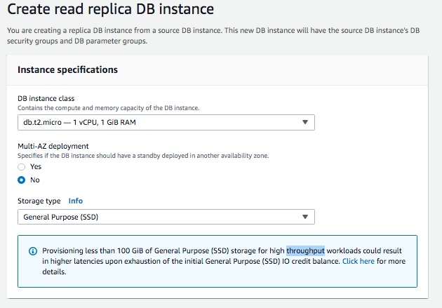

 3. Can change region  |  4. Specify Database identifier  |  5. Gets created 
--- | --- | ---
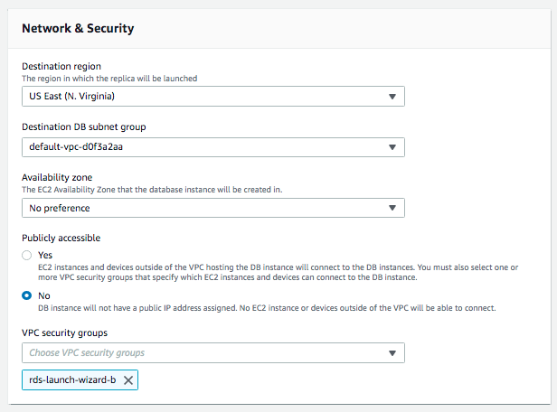 | 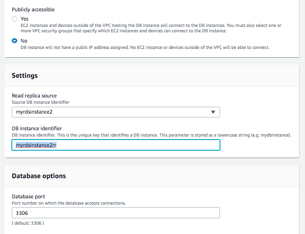 | 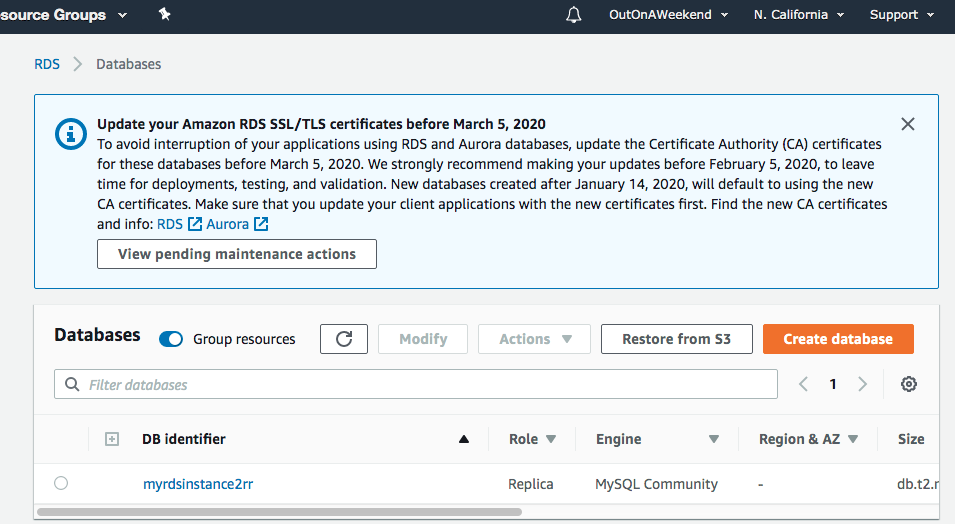
