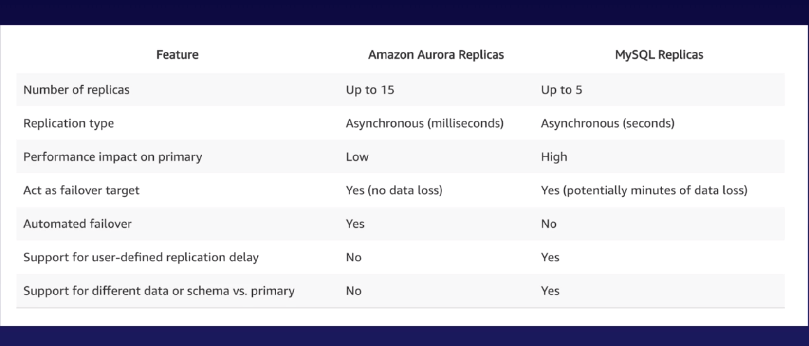
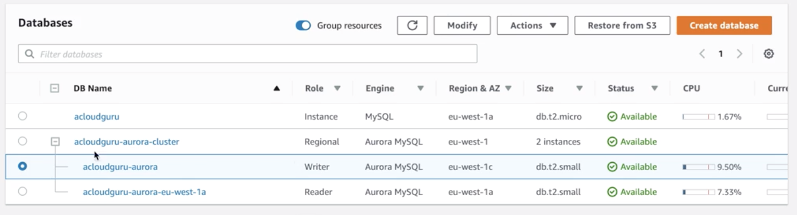

#### DynamoDB

`DynamoDB` is AWS's NoSQL database solution. It provides single-digit millisecond latency at any scale, and supports both document and key-value data models. It's stored on SSD storage and is spread across 3 different geographical distinct data centers.

It supports 2 different read models.
1. `Eventually consistent` - Consistency across all copies of data is usually reached within within a second. This is the default.  

2. `Strongly consistent` - Returns a result that reflects all writes that received a successful response prior to the read.   

#### Amazon Aurora

`Aurora` is Amazon's own MySQL-compatible, relational database engine. It's based on open source databases but is still fast and highly available, and provides 5 times better performance than MySQL at a price point one tenth that of a commercial database.

It is completely compatible with MySQL as well as PostgreSQL.

It can start with 10 GB size and then scales in 10 GB increments to 64 TB. Its compute resources can scale up to 32vCPUs and 244 GB of memory.

It always maintains 2 copies of data in each AZ, with a minimum of 3 AZs. It is further designed to handle the loss of up to 2 copies of data without affecting write availability and up to 3 copies without affecting read availability. Data blocks and disks are continuously scanned for errors.

###### Read Replicas, Backups and Snapshots

Aurora supports 2 types of Read Replicas - `Aurora Replicas` (15), and `MySQL Read Replicas` (5).

In case of a failure, an automated failover (i.e., move) can happen from one Aurora DB to an Amazon Aurora Read Replica. but not in case of MySQL read replicas.

Aurora replicas are created using the menu option 'MySQL DB > Actions > Create Aurora Read Replica'. Once created, nodes show up as `Writer` and `Reader`.

All nodes get different DNS endpoints, and any of the replicas can then also be promoted via 'Promote Read Replica' option.

Automated databases are always enabled for Aurora. Snapshots too can also be taken, which can then also be shared with other AWS accounts. The menu option is ' > Actions > Take Snapshot'.
