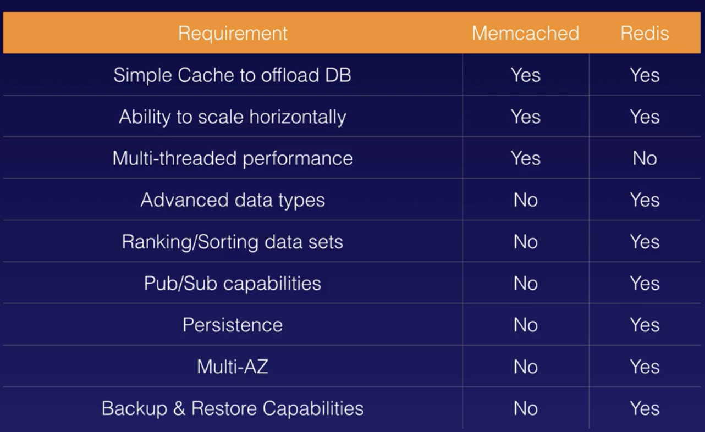

#### Redshift

`Redshift` is a petabyte-scale data warehouse service in the cloud.

It can be configured as `Single Node` or `Multi-Node`. In case of multi-Node, there is a `Leader Node` which manages client connections and receives queries, and `Compute Nodes` which store data and perform queries and computations. There can be up to 128 compute nodes.

Redshift uses very advanced compression techniques. Instead of compressing individual records, it compresses entire columns as a column typically contains same amount of data in each row. It also does not require indexes or materialized views and hence uses lesser space than traditional database systems.

Redshift also comes with massive parallel processing (MPP), i.e it automatically distributes data and query load across all nodes.

It has backups enabled by default with a 1 day retention period, and the maximum retention period is 35 days. It always attempts to maintain at least 3 copies of the data (the original and replica on compute nodes and a backup in S3).

It's priced based on compute node hours. Leader node hours are not charged, backups and data transfers are charged.

Its encrypted in transit using SSL and at rest using AES-256 encryption. RedShift itself takes care of its key management.
Redshift is currently available in only 1 AZ, and its snapshots can be restored into a new AZ if needed.

#### Elasticache

`Elasticache` is a web service for in-memory caching in the cloud. It supports 2 open source caching engines - `Memcached`, and `Redis`.

`Memcached` - Simpler, scales horizontally and offers multi-threaded perofrmance.

`Redis` - More advanced, supports advanced data types, offers backup and restore capabilities, Multi-AZ availability.

