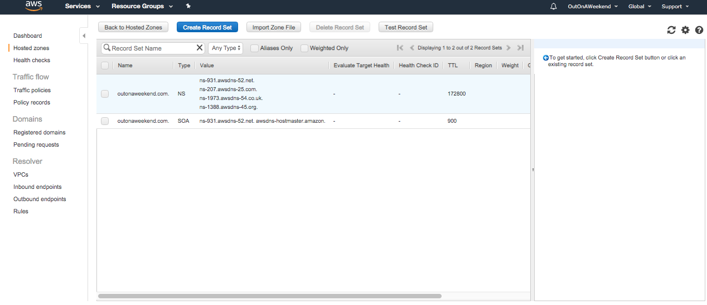
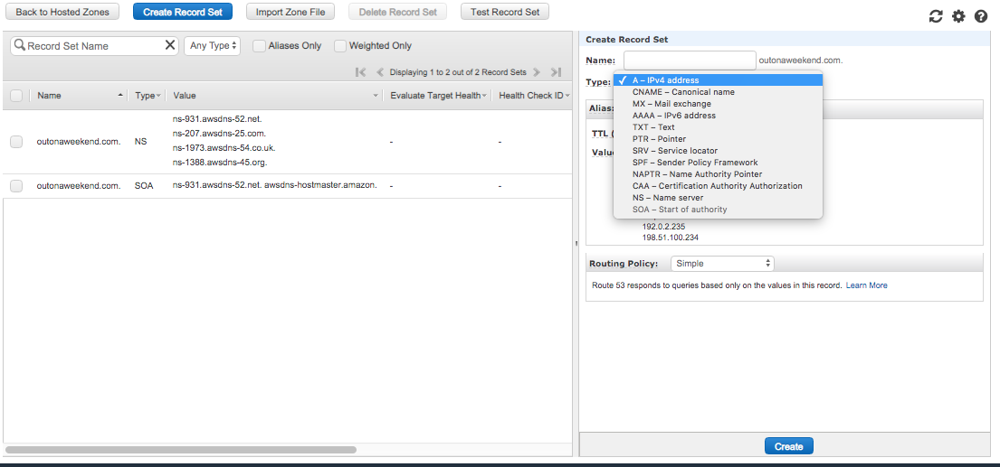
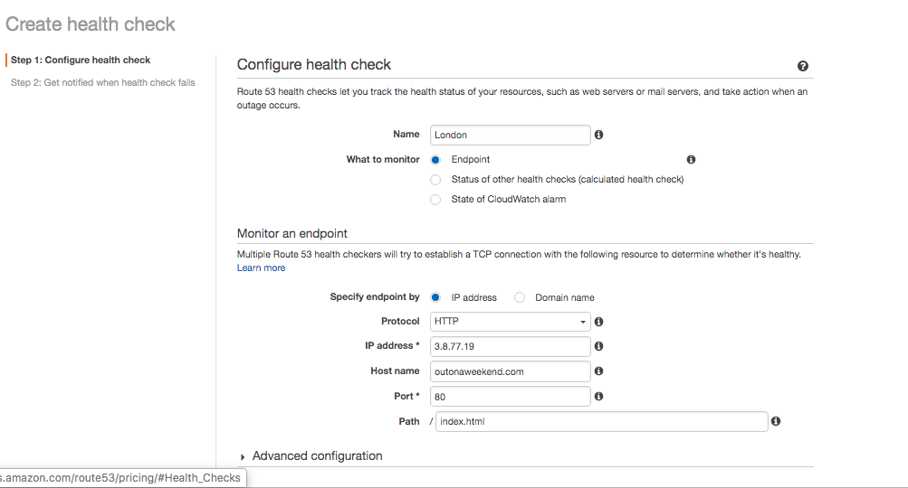
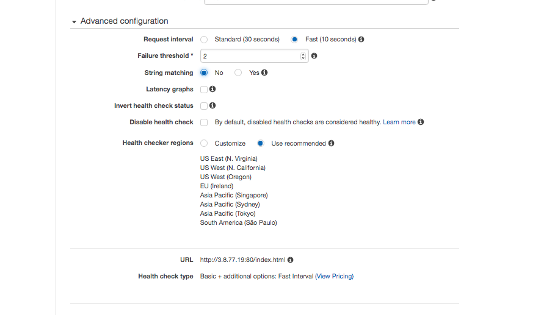
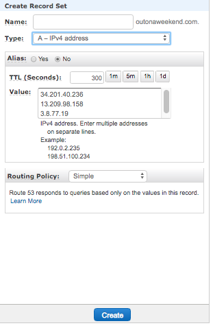
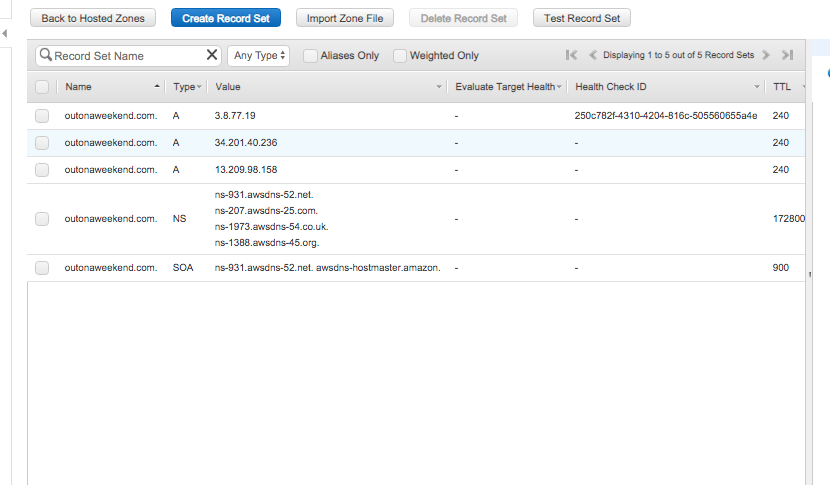
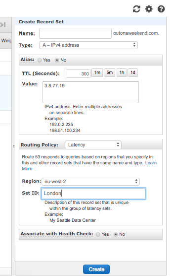
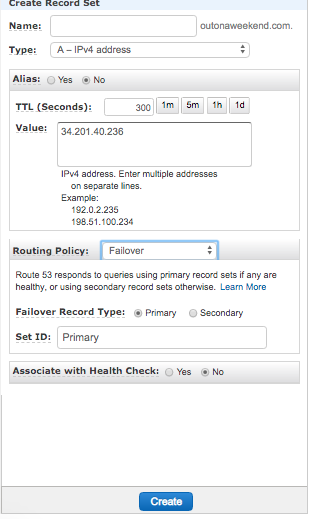
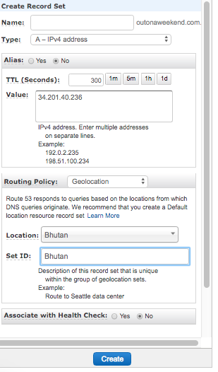
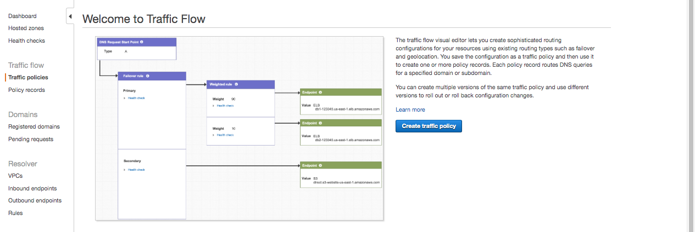

###### Domain name registration and Hosted Zone
A domain name needs to be first registered (this is a paid service and is not free). The moment this domain is registered successfully, a `hosted zone` gets automatically created. There are also a bunch of NS and SOA records that get created in the hosted zone and are shown in it.

###### Creating Record Sets to point to IP address

Just having a domain name registered, along with its hosted zone created is not enough for there to be a functioning website. It needs to point to at least some instance (i.e. an IP address). It could be an EC2 instance, an ELB, a CloudFront, etc. This is done using the menu option `Hosted Zone > Create Record Set`. The record type then selected can be anything, for example an `A record` which would correspond to an IP address.

And then the IP address(es) can be specified along with the routing policy to be used. TTL too is specified here.

Also, if `Associate with Health Check` option is enabled (shown for some of the routing policies), then the instances are failing a health check are automatically removed from the DNS. These Health Checks can be created in Route53.

###### Health Checks

Route53 also has a section called `Health Check` that can be used to get the health of an instance, and configure the checking in a few ways. Once a health check is created for an instance, it can be enabled while creating a routing policy that routes traffic to that instance. Not all routing policies support this, however most actually do.

 | 
--- | ---

#### Routing Policy

There can be multiple IP addresses in Route53 for a given domain name, a `Routing Policy` is something which decides which of those IP address should be used to service the incoming request. There are several different kinds of Routing Policies.

`Simple Routing Policy` allows you to have only one record with multiple IP addresses. If a request is made to the domain, Route53 picks the IP address (i.e. EC2 instance, etc.) in a random order.

`Weighted Routing Policy` allows you to split your traffic based on different weights assigned.
> Screenshot for Weighted?

 Create Simple Routing Policy  |  Multiple A records get created 
--- | ---
 | 

`Latency Based Routing` allows to route the traffic based on the destination that is expected to give least network latency for the end user.
So a latency resource record set needs to be created for the EC2 (or ELB) resource in each region that hosts the website. And then when Route53 receives a query for the site, it automatically selects the latency resource record set for the region that is expected to give the lowest latency.

`Failover Routing Policy` is used when you want to create an active/passive setup. Route53 monitors the health of the primary site using a health check, and in case of a failure at the primary IP address it automatically fails over to the passive IP address.

`Geolocation Routing Policy` allows to set rules for where should the traffic be routed based on the geographic location of the user.

 Latency Routing Policy  |  Failover Routing Policy  |  Geolocation Routing Policy 
--- | --- | ---
 |  | 

`Multivalue Answer Policy` is like Simple Routing, but then also allows to add health check for each resource.

`Geoproximity Routing Policy` is something lot more complicated and gives a lot of control on how traffic is routed. It's not one of the routing policy options while creating a record set, only available in something known as `Traffic Flow` mode.

###### Geoproximity Routing Policy

If you use multiple resources, such as web servers, in multiple locations, it can be a challenge to create records for a complex configuration that uses a combination of Amazon Route 53 routing policies—failover, geolocation, latency, multivalue answer, and weighted. It gets difficult to keep track of the relationships among the records when you're reviewing the settings in a table in the console.

There is a visual editor that can be used to create something known as `Traffic Policy`. It includes information about the routing configuration that needs to be created: the routing policies that you want to use and the resources that you want to route DNS traffic to, such as the IP address of each EC2 instance and the domain name of each ELB load balancer.

You then create a `policy record`. This is where you specify the hosted zone (such as example.com) in which you want to create the configuration that you defined in your traffic policy. It's also where you specify the DNS name (such as www.example.com) that you want to associate the configuration with. You can create more than one policy record in the same hosted zone or in different hosted zones by using the same traffic policy.

> Resources are given values by you, termed as `bias`. A bias expands or shrinks the size of a the geographic region from which the traffic is routed to a resource.
