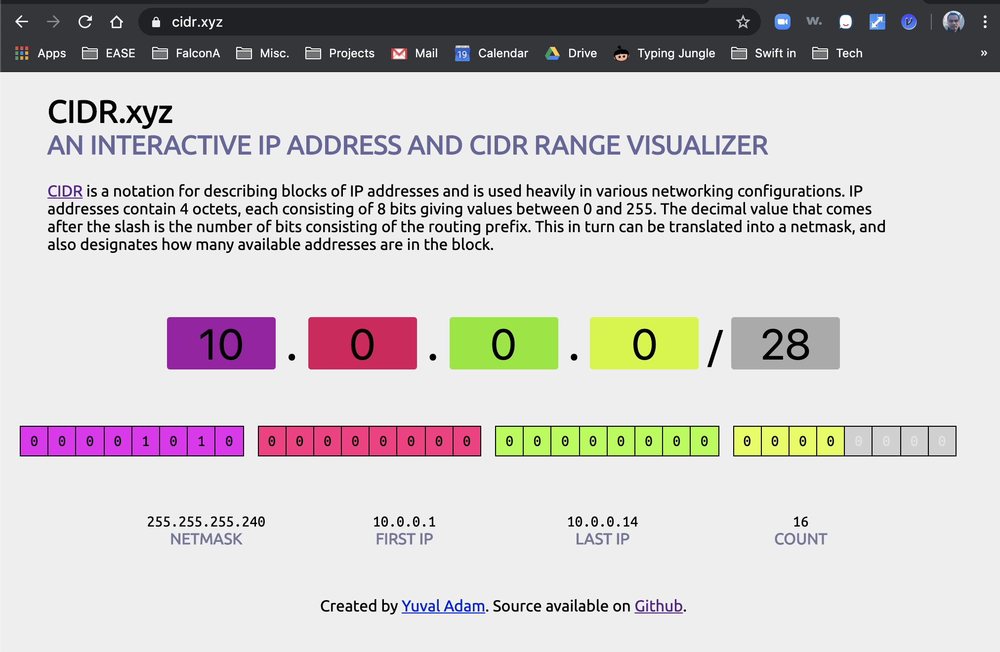

###### Uniqueness of IP addresses

Each IP address must be unique in its own network, and networks can be isolated from one another. Hence an IP need not be unique in the entire wold and it is instead enough if it just unique in its one network. This is also what avoids a quicker exhaustion of address space.

###### IPv4 notation

IPv4 is 32 bits (i.e. 4 bytes) long. Each byte (or 8 bits) is also known as an `octet`. For easier readability, in common notation every byte is separated by a period and is shown in decimal. Hence every octet can theoretically be from 0 (00000000) to 255 (11111111).

A typical IPv4 address - `192.168.0.5`

###### IPv6 notation

IPv6 is 128 bits (i.e. 16 bytes) long. It is generally written as 8 segments of 4 hexadecimal digits. Keep in mind that binary `11111111` is `FF` in hexadecimal.

A typical IPv6 address - `1203:8fe0:fe80:b897:8990:8a7c:99bf:323d`

Leading zeroes in any octet can be removed. And if there are successive groups with only zeroes, then they can just be denoted as `::` (only once per address). So `...:18bc:0000:0000:0000:00ff:...` can be written as `...:18bc::ff...`.

###### Classes of IPv4 addresses

While it's a slightly dated classification, IPv4 addresses are grouped into 5 different classes. Each of them have designated uses. For example, Class D is assigned only for multi-casting protocols, which allow a packet to be sent to a group of hosts in one movement

Classification | Pattern of first 4 bits | IP Ranges
--- | --- | ---
Class A | 0xxx | 0.0.0.0 - 127.255.255.255
Class B | 10xx | 128.0.0.0 - 191.255.255.255
Class C | 110x | 192.0.0.0 - 223.255.255.255
Class D | 1110 | 224.0.0.0 - 239.255.255.255
Class E | 1111 | 240.0.0.0 - 255.255.255.255

###### Network portion and Host portion

An IP address has a `network portion` and then a `host portion`. For example, for Class C addresses first 3 octets are by default supposed to be network portion and the last octet the host portion. What it means is that if there is a Class C address, then it can be assumed that all other possible IP address with same bits in 1st 3 octets can be assumed to be belonging to same organization or group. All the remaining possible IP addresses for that organization will just have the bits in last octet changing. They all denote a `host`, i.e. individual nodes in the same network.

###### Reserved Private Ranges

Some IP addresses are reserved and do not get assigned to any host. `127.0.0.0` to `127.255.255.255` is one such range is somehow used by each host to test networking to itself.

Each of the normal classes also have a range within them that is used to designate private network addresses. For instance here are those for some of the classes.
```
10.0.0.0 - 10.255.255.255 (Class A. 10/8 prefix?)
172.16.0.0 - 172.31.255.255 (Class B. 16/12 prefix?)
192.168.0.0 - 192.168.255.255 (Class C. 168/16 prefix?)
```

###### Subnets, Netmasks, CIDR notation

Subnet is the idea that there can be a sub-network or internal group. It's a way of classifying your internal groups. For example, let's say an organization has an IP address `11000000.10101000.00000000.00000101` and also says that its `subnet bits` are 23rd and 24th bits. Then what it probably means is that the 23rd and 24th bits will be used to denote different organizations. `00` may denote HR, `01` may denote finance, and so on

A `netmask` denotes the address bits that are used for the network portion. All the 'network' bits are marked as `1` and `host` bits as `0`.

`CIDR` (Classless Inter-Domain Routing) notation is another way of indicating subnet bits. For example, the idea that the IP address `10.0.0.0/28` would indicate that the just the last 4 bits (i.e. 32 minus 28) can be used as host bits.

Look below how with `10.0.0.0/28` just 16 different IP addresses are possible, which can happen only if there are just 4 bits to work with.



> Though I have a rough idea, my entire understanding of the is still quite sketchy.
