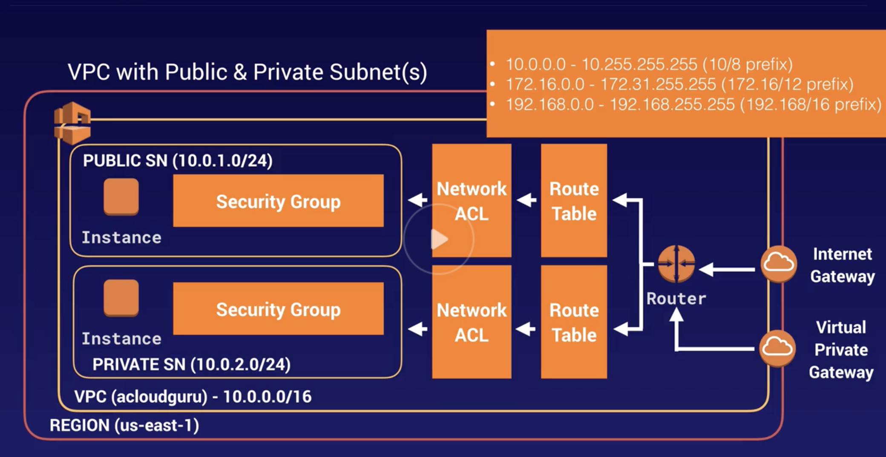
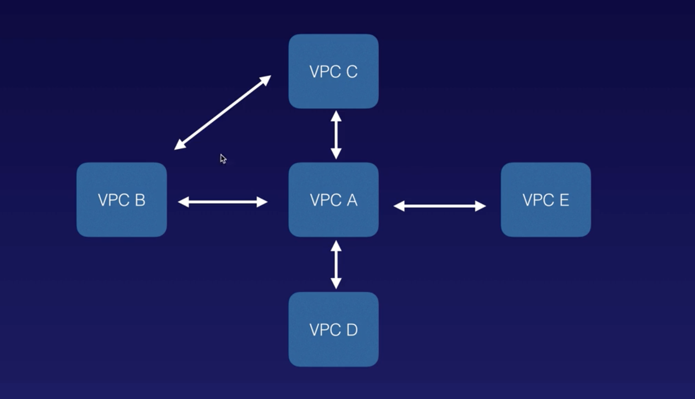

###### What is VPC

`VPC (Virtual Private Cloud)` is like a virtual data center. It's a logically isolated section of AWS where you can launch your resources and have complete control over the virtual networking environment. This includes selection of your own IP address range, creation of subnets, and configuration of route tables and network gateways.

For example, with VPCs it's possible to create a public facing subnet for the web servers and a private subnet for database servers.

It's also possible to create a hardware VPN connection between the corporate data center and the VPC, and leverage AWS as an extension of the corporate datacenter.

There is a default VPC that exists in AWS, it does not require any setup on user's part and allows to immediately deploy instances. All subnets in the default VPC have a route out to the internet. And each E2 instance gets both a public and private IP address.
Even if default VPC is deleted, it can be recovered.

###### What does a typical VPC setup look like

This is how a VPC setup may typically look. The layers to be traversed before a public instance can be reached is `Gateway > Router > Route Table > Network ACL > Security Group > Instance`.

###### Internet Gateways

An `Internet Gateway` serves two purposes. It provide a target in the VPC route tables for internet-routable traffic. And it performs network address translation (NAT) for instances that have been assigned public IPv4 addresses.

###### Route Tables

A `Route Table` contains a set of rules, called routes, that are used to determine where network traffic from your subnet or gateway is directed. A subnet can only be associated with one route table at a time, but multiple subnets can be associated with the same subnet route table.

Each subnet in the VPC must be associated with a route table, which controls the routing for the subnet

[Reference](https://docs.aws.amazon.com/vpc/latest/userguide/VPC_Route_Tables.html)

###### Network ACLs

 A `Network Access Control List (Network ACL)` is an optional layer of security for a VPC that acts as a firewall for controlling traffic in and out of one or more of its subnets. It has separate inbound and outbound rules, and each rule can either allow or deny traffic.

Unlike Security Groups, Network ACLs are stateless. What it means is that responses to allowed inbound traffic are subject to the rules for outbound traffic.

> Not clear on what 'stateless' really means here.

[Reference](https://docs.aws.amazon.com/vpc/latest/userguide/vpc-network-acls.html)

###### Bastion Hosts

There can be public as well as private subnets.

A `Bastion Host (Jump Box)` is just an EC2 instance in a public subnet, which can be used to SSH into an EC2 instance belonging to a private subnet within the same VPC.

###### Allowed Subnet Range

AWS doesn't allow `/8` subnets, i.e. what it possibly means is that 3 last octets cannot together used as host bits (that will be too many). The max that is allowed is `/16`, i.e. last 2 octets for host bits. The min that is allowed seems to be `/8`, i.e. just the last octet for host bits (anything even lesser may be too less to require a subnet).

Largest subnet that can be used in a VPC - 10.0.0.0/16  
Smallest subnet that can be used in a VPC - 10.0.1.0/28

One subnet always corresponds to one AZ. A single subnet cannot be stretched across multiple AZs. However, there can be multiple subnets in a single AZ.

###### Typical things that cane done using custom VPCs

Here are some of the typical things that are done using a VPC.

* Launch instances into a specific public or private subnet.
* Assign custom IP address ranges in each subnet.
* Configure route tables between subnets.
* Create internet gateways and attach it to the VPC.
* Better security controls.
* Instance specific security groups.
* Subnet specific Network ACLs

###### VPC Peering

VPC peering allows to connect one VPC to another via a direct network route using private IP addresses. Once done, instances behave as if they were on the same private network.

VPCs can even be peered with other VPCs belonging to different account or region.

Also peering is always done in a star configuration, i.e. 1 central VPC peers with 4 others. There can't be `transitive peering` done. Transitive peering means being able to connect from one VPC to another through an interim VPC.

