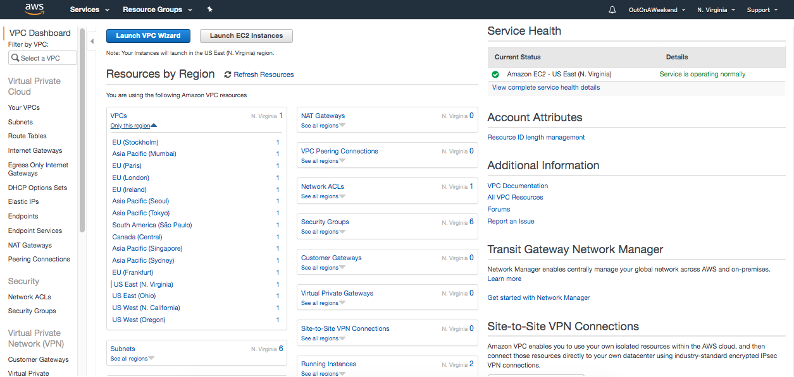
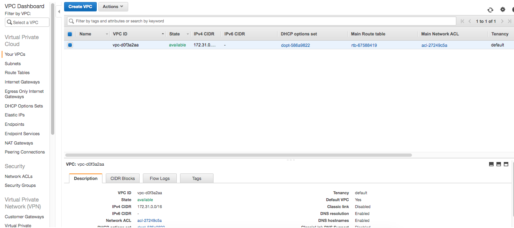
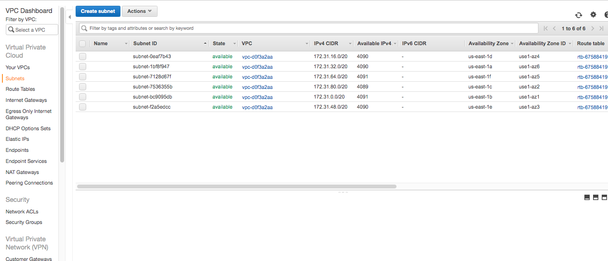
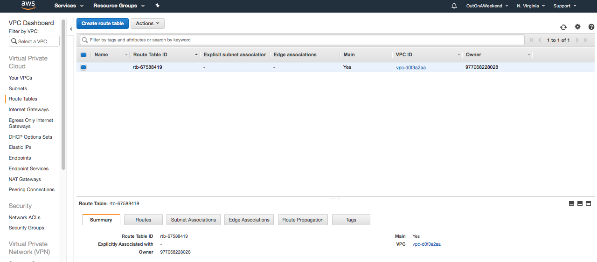
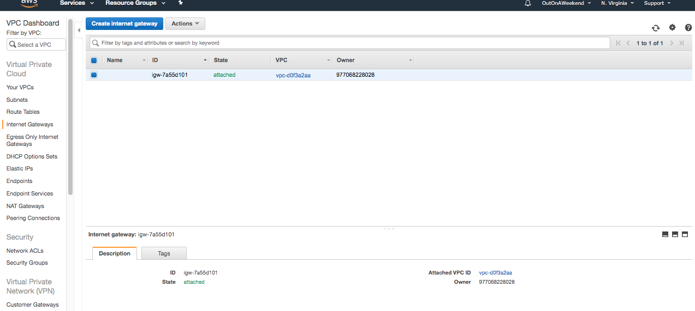
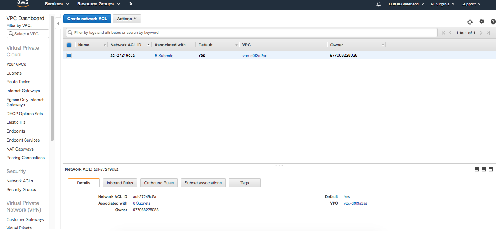
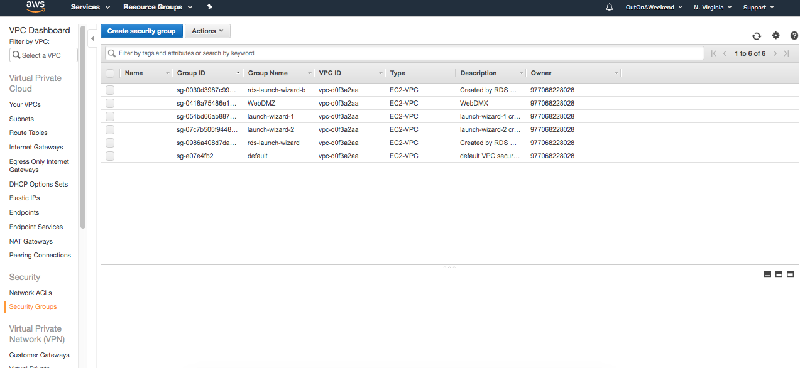

#### Sections in VPC service

##### Dashboard

##### Your VPCs

All the VPCs are shown here. It also shows the default VPC which AWS already creates, and will always be there unless manually deleted.

##### Subnets

All the subnets are shown here. The IPv4 CIDR, and hence the available number of IP addresses in each of the subnets is also shown.

Each subnet belongs to only one AZ, which is also shown here. And typically, for US-East region there are 6 AZs and hence 6 subnets too automatically there.

##### Route Tables

The route tables are shown here. This also includes the default route table.

##### Internet Gateways

##### Network ACLs

##### Security Groups

