###### NAT Instance and NAT Gateway

NAT (Network Address Translation) instances and gateways can be used to enable instances in private subnets to download software from internet.

Out of the two, it is much better to use NAT gateways. NAT instance is an individual EC2 instance that perform the gateway's work, whereas NAT gateway is a collection of several instances and is hence highly available.

#### NAT Instance

###### Creating a NAT Instance

Create an EC2 instance using a NAT AMI.

 1. Use Community AMIs and search for NAT, select the first one  |  2. Select the custom VPC and public subnet |  3. A SSD related prompt shows for this AMI 
--- | ---
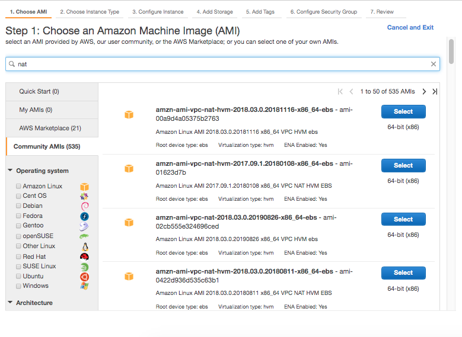 | 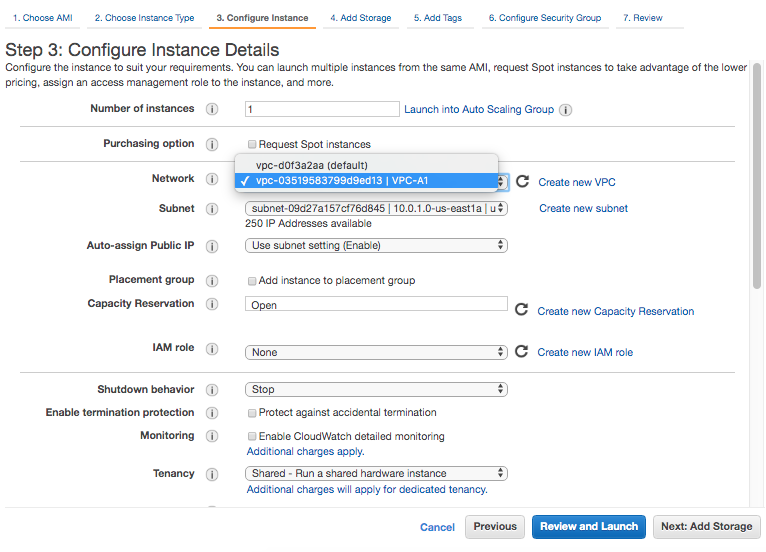 | 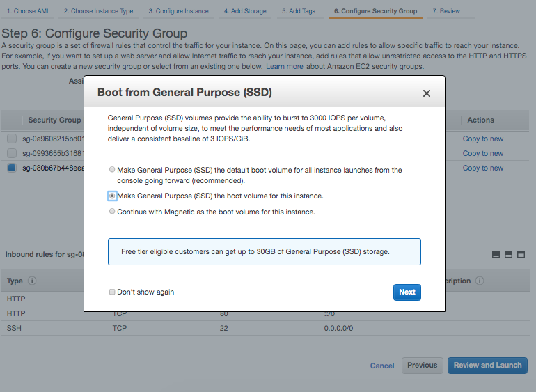

Each EC2 instance performs a source and destination check by default. This means that the instance must be the source or destination of any traffic it sends or receives (not quite clear on this, does it mean that an instance should be an end in itself). Anyway, this does need to be disabled for NAT instances. This can be disabled via `EC2 Instance Actions > Networking > Change Source/Dest. Check`.

Now the private EC2 instance needs to talk to the newly created NAT instance. For this a new route needs to be created in Route Table. Go to Main Route Table for the custom VPC. Then go to its `Edit Routes` and add a route with destination `0.0.0.0/0` and target being the NAT instance.

 4. Disable Source/Destination check for the instance  |  5. Edit Main Route Table and add a rule to talk to NAT Instance 
--- | ---
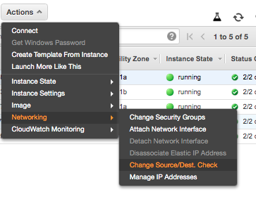 | 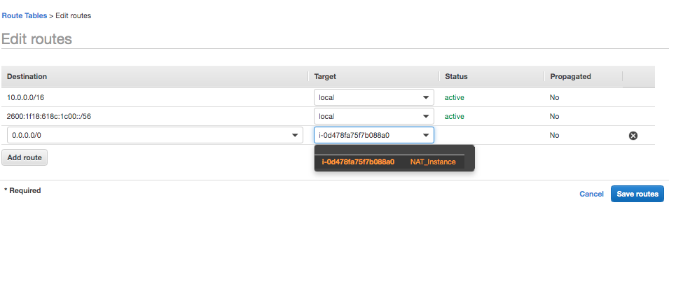

> eni in the acronym stands for Elastic Network Interface

And now if you ssh into the public EC2 instance, and then from there ssh into the private EC2 instance, and then try to do a `yum update` there, it works.

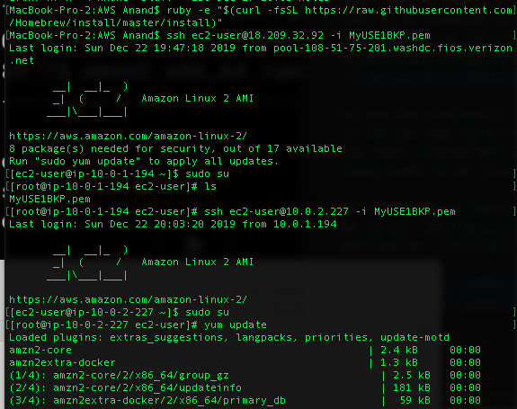

###### NAT Instances are not recommended

NAT Instances are quite unreliable, as if for any reason the NAT EC2 instance goes down then updates will fail. And in fact this will even show in the route table route's status.

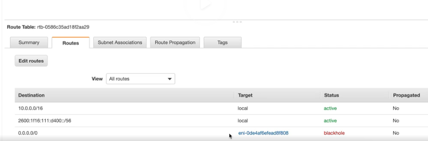

###### Misc.

NAT instances are always behind a security group.

#### NAT Gateway

In VPC service, there is a separate section itself for `NAT Gateways`.

While creating the NAT gateway, the public subnet must be selected. However, the dropdown currently does not make it obvious that which one is the public subnet (you ought to know the ID yourself from subnets).
Also for 'Elastic IP Allocation ID', the `Create New EIP` option can be used.

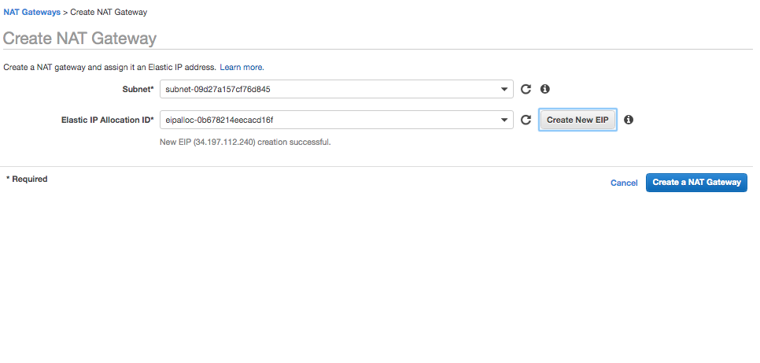

The NAT gateway gets created, and then the main route table would need to be edited to add a route to this NAT gateway.
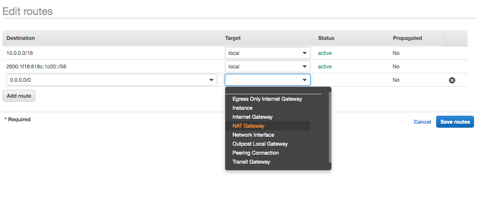
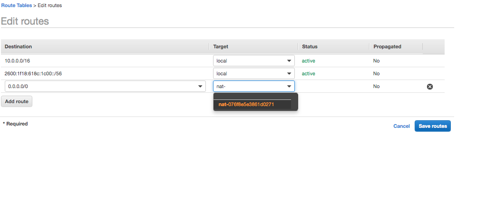

And that's it, software can now be installed on the private EC2 instance this way.

NAT Gateways can't span AZs, it has to reside in a single AZ. They start with a throughput of 5GBPS and sale automatically. They need not be patched, as AWS handles it automatically. They aren't associated with security groups, and are automatically assigned public IP addresses. Also, with NAT gateways there is no need to disable source/destination checks.

At this stage, the custom VPC looks like this.

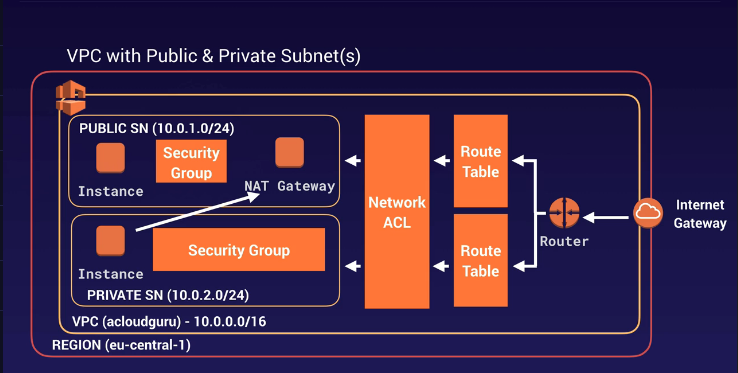
