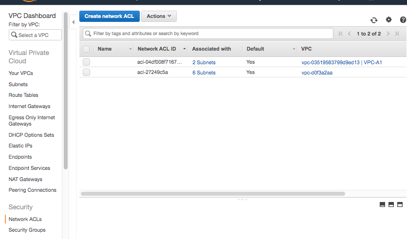
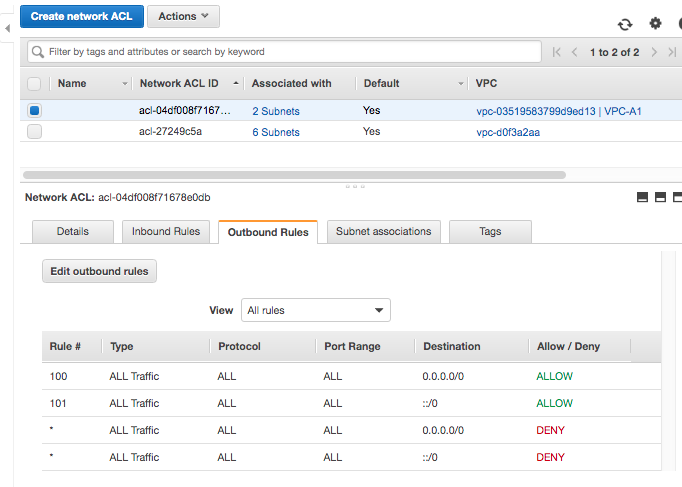
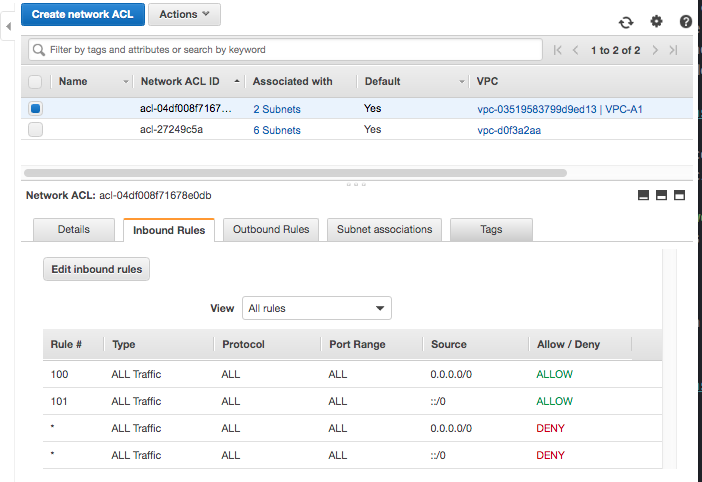
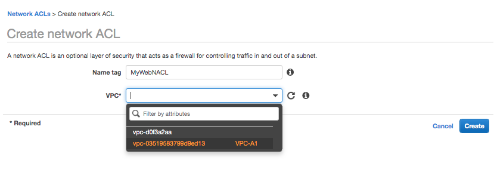
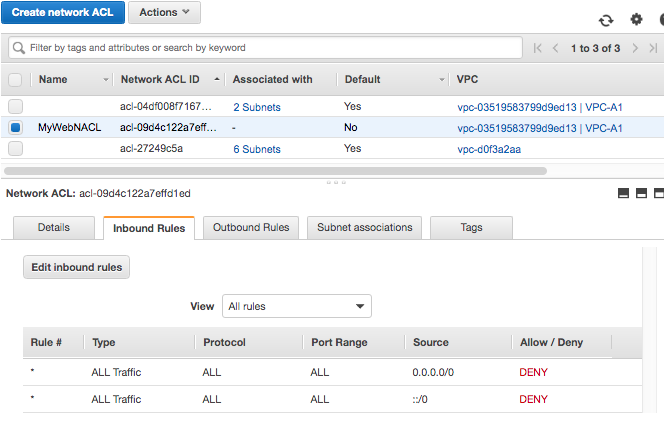
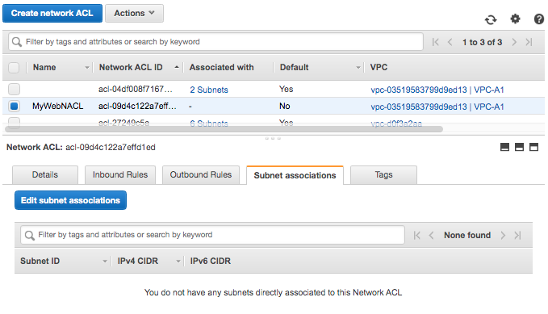
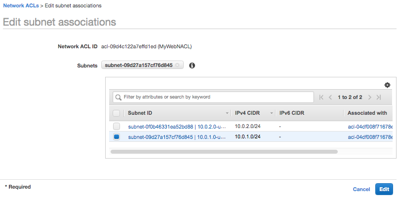
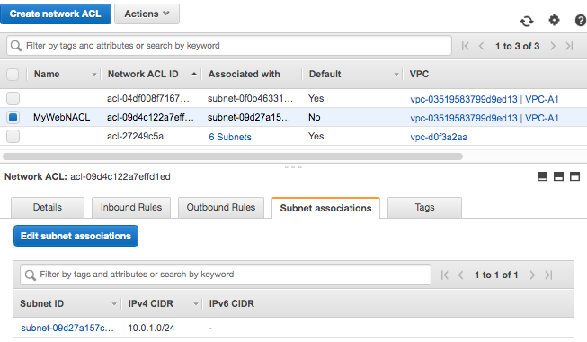
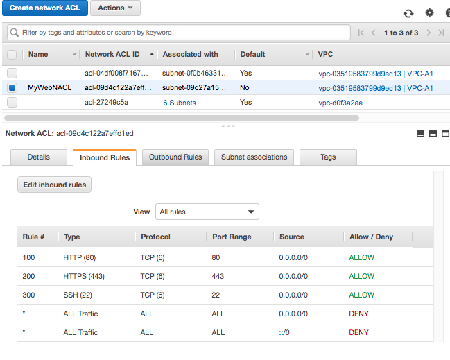
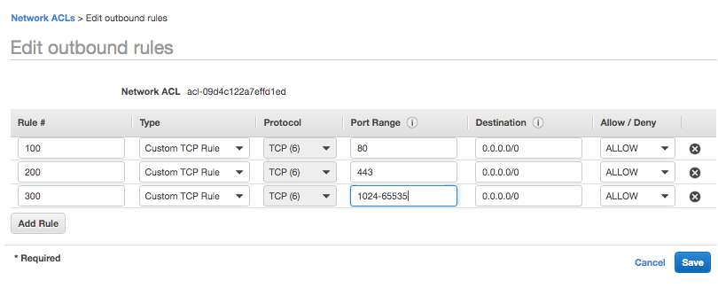

A `Network Access Control List (NetworkACL)` is an optional layer of security for the VPC, it acts as a firewall for controlling traffic in and out of one or more subnets. ([reference](https://docs.aws.amazon.com/vpc/latest/userguide/vpc-network-acls.html))

When a custom VPC is created, a `Network ACL` also gets created by default. Hence if a custom VPC is created and a default VPC is already there, there will be 2 Network ACLs shown in the Network ACLs section.

The console also shows how many subnets is a VPC associated with.

###### Inbound and Outbound Rules

`Network ACL Details > Inbound Rules` and `Network ACL Details > Outbound Rules` shows the various rules in that Network ACL.

 Inbound Rules  |  Outbound Rules 
--- | ---
 | 

Rules can be `ALLOW` or `DENY`.

As per the typical convention, rules are numbered in increments of 100.

Rules are evaluated in order, i.e. 100 gets precedence over 200. So if a 100 has DENY, but 200 has ALLOW for same thing, the 100 will take precedence.

NetworkACLs are stateless. So I think all this means is that for any connection both the inbound rules as well as outbound rules get applied.

###### Creating NetworkACL

While creating a new Network ACL, the VPC it is meant for needs to be selected. By default, a newly created Network ACL denies all inbound and outbound traffic.

 1. Select VPC while creating NetworkACL  |  2. NetworkACL is created 
--- | ---
 | 

###### Associating a subnet in the VPC with the NetworkACL

For a given IP to fall under the purview of a NetworkACL, the IP's subnet must first be associated with that NetworkACL. And when a subnet is associated with one NetworkACL, it is automatically disassociated from the previous NetworkACL it was associated with.

 1. Edit Subnet Associations  |  2. Select Subnet  |  3. Subnet shows up as associated 
--- | --- | ---
 |  | 

###### Adding Ephemeral ports

Ephemeral ports are ports that are randomly assigned in a port range to be used for a particular connection, and once the request-response has happened the port is released. It seems that for some reason, they need to be added in outbound rules of a NetworkACL.

  |  
--- | ---
 | 

###### NetworkACLs and Security Groups

NetworkACLs come into play before Security Groups. IP addresses can be blocked using NetworkACLs, and not Security Groups.

A NetworkACL can be associated with multiple subnets, but a subnet can only be associated with only one NetworkACL at a time.
