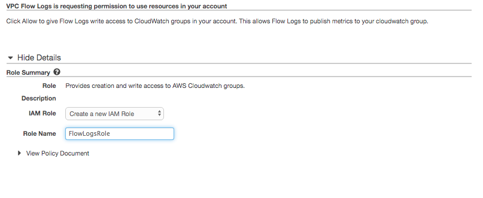
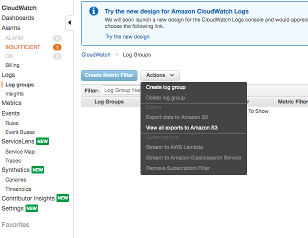
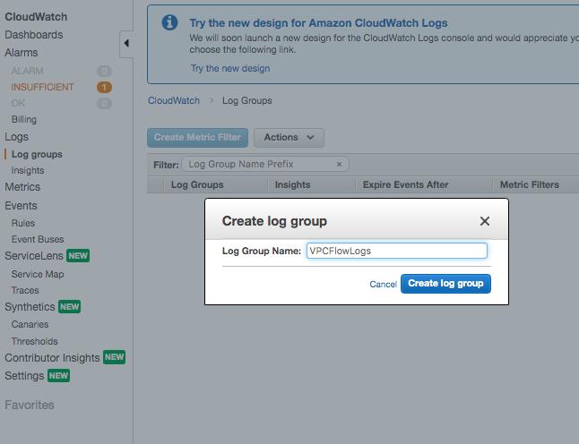
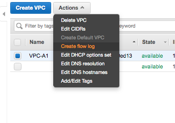
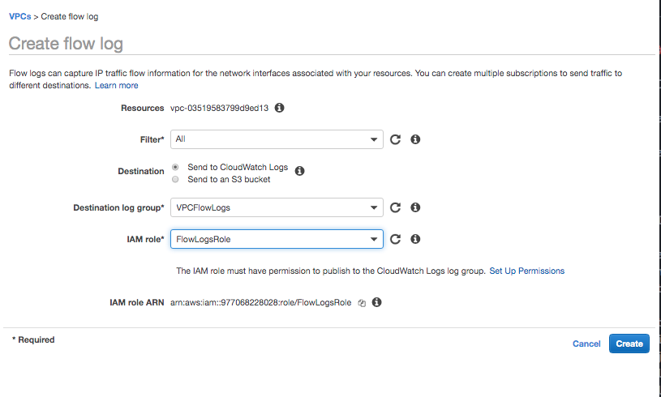
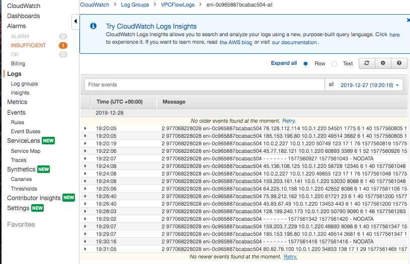

#### VPC Flow Logs

VPC Flow Logs are a way to capture details about the IP traffic going through the VPCs. The details are then typically logged in CloudWatch.

The can be created at 3 different levels.
1. VPC
2. Subnet
3. Network Interface (i.e. something low-level called ENI)

> Where to specify these types in flow log creation

VPC logs cannot be enabled for VPCs that are peered unless the peered VPC is also in the same account.

###### Create IAM Role

A suitable IAM role for gathering logs will be needed during flow log creation. If needed this there is a button to navigate to IAM in the flow log creation interface itself.

###### Create CloudWatch Log Group

If the logs need to be stored in CloudWatch, first create a CloudWatch log group if needed. CloudWatch service is in Monitoring section.

 1. Logs > Actions > Create Log Group  |  2. Enter name
--- | ---
 | 

###### Create Flow Log

 1. Actions > Create flow log  |  2. Select the options 
--- | ---
 | 

Using `Filter` it's possible to record just accepted, or rejected traffic, or even both.

Once a flow log is created, its configuration cannot be changed. For example, its IAM role cannot be modified.

###### Captured Traffic

Once the flow log is properly set up, the logs show up like this.

However, not all IP traffic can be monitored. For example, traffic generated by instances when they contact the AWS DNS server are not logged.

#### Bastion Host

It seems that Bastion host is basically a special-purpose computer specifically designed to be robust against attacks. They generally just host a single application and are typically used as a proxy server before traffic gets propagated further.

In AWS, a bastion hosts are "instances that sit within your public subnet and are typically accessed using SSH or RDP. Once remote connectivity has been established with the bastion host, it then acts as a ‘jump’ server, allowing you to use SSH or RDP to log in to other instances (within private subnets) deeper within your VPC.

There are specific AMIs for bastion hosts.

> So a bastion host seems to be accomplishing the same thing as what you could do by SSH-ing into a public EC2 instance, and then SSH-ing into a private EC2 instance from there. So what is the difference?
