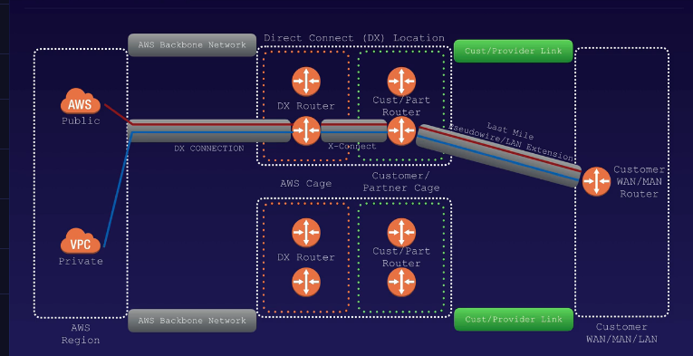
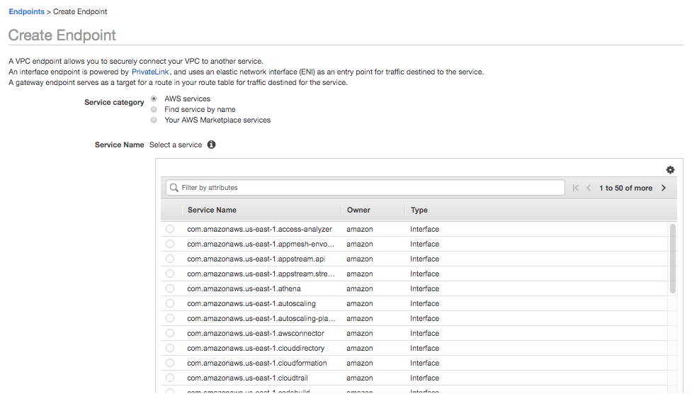

#### Direct Connect

`Direct Connect` is a way to establish direct connectivity between AWS and your datacenter, or other co-location. This can reduce network costs and increase bandwidth throughput.

There are certain `DirectConnect locations` that are spread throughout the world where there are `Cages` dedicated for AWS and the customer (or a trusted AWS partner). They both have their own set of routers and talk between themselves using `Cross Connect cables`.

AWS cages talk to AWS regions using `Backbone networks`. Customer cages talk to customer locations using `Last Mile connection`.

#### VPC Endpoints

A `VPC endpoint` is something that connects a VPC to certain AWS services and VPC endpoint services without requiring an internet gateway, NAT device, VPN connection, or AWS Direct Connect connection. The instances in VPC do not require public IP addresses to communicate with resources in the service, and the traffic never leaves Amazon network. They allow communication between instances and other services without having any availability risks.

There are 2 kinds of VPC endpoints - Instance endpoints, Gateway endpoints

An `Interface endpoint` is an elastic network interface with a private IP address that serves as entry point for traffic destined to a supported service.

A `Gateway endpoint` is lot like NAT gateways, and is currently supported for S3 and DynamoDB.

###### Creating a Gateway endpoint for putting a file in S3 from a private EC2

First ensure that there is an IAM role for having admin access to S3. Then attach this role to the EC2 instance via `Actions > Instance Settings > Attach/Replace IAM Role`. Then add the main subnet to the NACL via `Default NACL > Subnet Associations` (why was this step needed?).

Create an endpoint via `Endpoints > Create Endpoint`. Select service, VPC, route table, etc.

And then it will be possible to put a file into the S3 service from the EC2 instance even if there is route for it.

> Watch this chapter again, and make better notes on what exactly gets accomplished.
